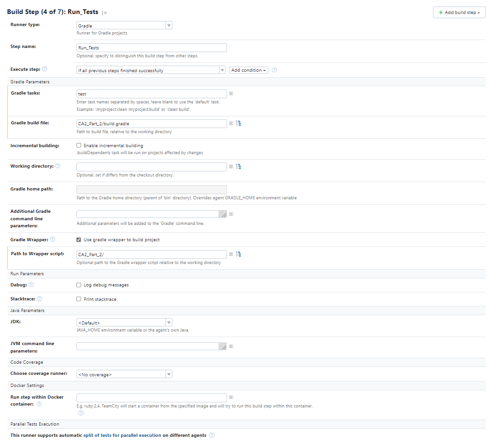
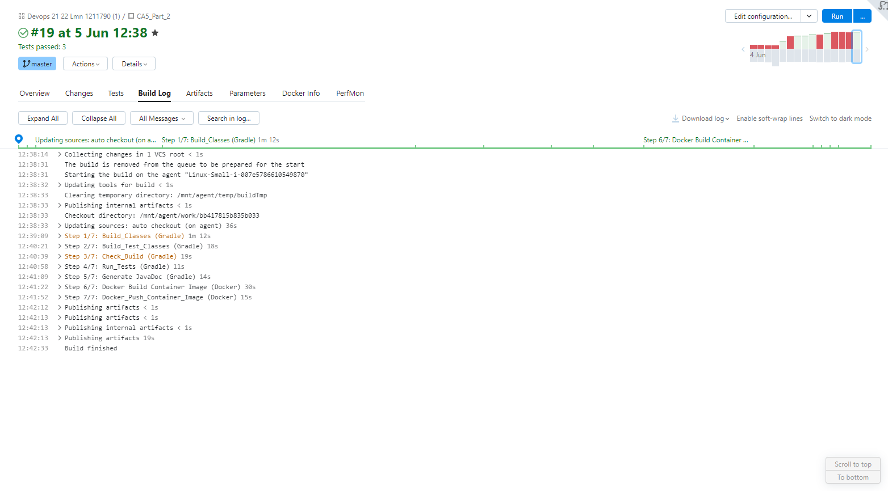

# DevOps
# Class Assignment 5 - Part 2
# CA5 - Continuous Integration / Continuous Delivery

---

## Overview

In the present assignment, CA5, we take on continuous integration and delivery from the perspective of pipelining.
"Pipelining is a continuous delivery service that automates the building, testing, and deployment of your software into 
production. Continuous delivery is a software development methodology where the release process is automated. Every software 
change is automatically built, tested, and deployed to production. Before the final push to production, a person, an automated 
test, or a business rule decides when the final push should occur. Although every successful software change can be immediately 
released to production with continuous delivery, not all changes need to be released right away. <br>
Continuous integration is a software development practice where members of a team use a version control system and frequently integrate their 
work to the same location, such as a main branch. Each change is built and verified to detect integration errors as 
quickly as possible. Continuous integration is focused on automatically building and testing code, as compared to continuous 
delivery, which automates the entire software release process up to production." <br>
In short “Continuous integration (CI) is the practice of merging all developer working copies to a
shared mainline several times a day.”, and “Continuous delivery (CD) is a software engineering approach in which teams produce
software in short cycles, ensuring that the software can be reliably released at any time.”
In this assignment we will learn how to script our pipeline, that is, a set of strategies that allows organizations to 
deliver new features faster and efficiently create an efficient and repeatable process to develop software.
We will be continuing this subject but now we will make use of containers also, that is, we will also script for a 
container image to be built and pushed to docker hub using Docker. <br>
On the other han we will also develop the assignment with an alternative to Jenkins. For this i choose Teamcity from JetBrains.
The goal of Part 2 is to pipeline with Jenkins using CA2_Part_2 project developing the following tasks:

```
1 - Define the following stages in your pipeline:
    1.1 - Checkout. To checkout the code from the repository
    1.2 - Assemble. Compiles and Produces the archive files with the application.
    1.3 - Test. Executes the Unit Tests and publish in Jenkins the Test results.
    1.4 - Javadoc. Generates the javadoc of the project and publish it in Jenkins.
    1.5 - Archive. Archives in Jenkins the archive files (generated during Assemble, i.e., the warfile)
    1.6 - Publish Image. Generate a docker image with Tomcat and the war file and publish it in the Docker Hub.
```


For configuring the pipeline we will be using Jenkins and TeamCity.

---

## Analysis

Jenkins is an open source automation server. It helps automate the parts of software development related to building, 
testing, and deploying, facilitating continuous integration and continuous delivery. It is a server-based system that
runs in servlet containers such as Apache Tomcat. It supports version control tools, including AccuRev, CVS, Subversion, 
Git, Mercurial, Perforce, ClearCase and RTC, and can execute Apache Ant, Apache Maven and sbt based projects as well as 
arbitrary shell scripts and Windows batch commands. <br>
[TeamCity](https://www.upguard.com/blog/teamcity-vs-jenkins-for-continuous-integration) is a build management and continuous 
integration server from JetBrains. And it is very similar to Jenkins. It has a free trial period of 14 days that will be used to develop this assignment.
We will be using Jenkins and TeamCity to pipeline our CA2_Part_2 Project. I scripted stages in a Jenkinsfile for the assignment tasks
for Jenkins, and for teamCity I configured Build Steps also for the tasks.<br>
"Jenkins is an open source continuous integration tool, while TeamCity is a proprietary offering from JetBrains. 
TeamCity is easier to configure and more straightforward to use, while Jenkins has a rich plugin ecosystem and integrations." 
After using the two I liked TeamCity better because I was faster than Jenkins. With Jenkins we have to know how to script our stages
and that has bigger learning curve than with TeamCity that as a GUI with all the options tha we have to set up build steps.
We just have to read the options an easily we can make our set up faster. But Jenkins is a open source tool and TeamCity 
is paid service and this can be a drawback for some companies. In the end I found easier to use TeamCity than Jenkins. Capabilities
wise they are very equivalent. For the scope of this assignment I found that non of them are lacking for the tasks at hand.


---

##Implementation - Pipelining With Jenkins

---

## Step 1 - Install Jenkins

Like it was mentioned before Jenkins is a open source automation server, that means that it needs to be deployed before using it.
For that we have two options. We can deploy it in a container or use a .war file to deploy it. The first option implies the use
of Docker and there for more Disk space, the other less disk space. Since I am running low on physical space for this assignment
I will be using the .war file. We can download the official Jenkins.war from:

```
https://updates.jenkins.io/download/war/
```

Now for using it we have to start the server using the following command at the Jenkins.war location:

```
java -jar jenkins.war --httpPort=9090
```

The **--httpPort=9090** forces the deployment at http://localhost:9090. The default value will be port 8080.

I will be running it in port 9090 because 8080 is the port we are running the springBoot tomcat server  for the SWitCH
main project. For more information we can visit:

```
https://www.jenkins.io/doc/book/installing/war-file/
```

When we access http://localhost:9090/ for the first time we will have to configure our credentials for Jenkins. After
this we are ready for starting to configure our [Pipeline](https://www.jenkins.io/doc/book/pipeline/).


## Step 2 - Configuring Jenkins Pipeline ([18e072d](https://bitbucket.org/pmonteiro1211790/devops-21-22-lmn-1211790/commits/18e072d891600968d2ddfa7b4e0552411cf00cd7))

Configuring the pipeline is easy, we just have to enter our repository link, credentials and if we want to write the scrip
directly on Jenkins or if we use a [Jenkinsfile](https://www.jenkins.io/doc/book/pipeline/jenkinsfile/) from the Source Control Management(SCM). In my case I will be using a Jenkins file
at the root of the project CA2_Part_2.


## Step 3 - Scripting Steps for Our Build ([d2ccdd9](https://bitbucket.org/pmonteiro1211790/devops-21-22-lmn-1211790/commits/d2ccdd9ee85e2097ce1fd14b90bd2c3402a94105) / [0379090](https://bitbucket.org/pmonteiro1211790/devops-21-22-lmn-1211790/commits/03790903dc6e1abc8231fa8f8181adef40cfe920) / [d486659](https://bitbucket.org/pmonteiro1211790/devops-21-22-lmn-1211790/commits/d4866590930245b215c296af74456d8021a1ec7b) / [1ce4ace](https://bitbucket.org/pmonteiro1211790/devops-21-22-lmn-1211790/commits/1ce4acef9c4af54b843901902e9952dd85d7f95a))

Now we are ready to define the build steps for our project:

```
    1.1 - Checkout. To checkout the code from the repository
    1.2 - Assemble. Compiles and Produces the archive files with the application.
    1.3 - Test. Executes the Unit Tests and publish in Jenkins the Test results.
    1.4 - Javadoc. Generates the javadoc of the project and publish it in Jenkins.
    1.5 - Archive. Archives in Jenkins the archive files (generated during Assemble, i.e., the warfile)
    1.6 - Publish Image. Generate a docker image with Tomcat and the war file and publish it in the Docker Hub.
```

For steps 1.1, 1.2, 1.3 and 1.5 we have already developed them in the first part. It will be similar:

```
stages {
        //To checkout the code from the repository 
        stage('Checkout') {
                steps {
                    echo 'Checking out...'
                    git credentialsId: 'PM_BitBucket_Credentials', url: 'https://PMonteiro1211790@bitbucket.org/pmonteiro1211790/devops-21-22-lmn-1211790.git'
                }
        }
        //Compiles and Produces the archive files with the application. 
        //Do not use the build task of gradle (because it also executes the tests)!
        stage('Build') {
                steps {
                    dir('CA2_Part_2/') {
                        echo 'Assembling Project...'
                        script {
                            bat 'dir'
                            bat 'gradle clean assemble'    
                            bat 'gradle testClasses'
                        }
                }
            }
        }
        //Executes Unit Tests
         stage('Test') {
            steps {
                dir('CA2_Part_2/') {
                    echo 'Testing 1...2...3...'
                    script {
                        bat 'dir'
                        bat 'gradle check'
                        bat 'gradle test'       
                    }
                }
            }
        }
        //Generates artifacts of the project and publish it in Jenkins(.war file)
        stage ('Archiving') {
            steps {
                dir('CA2_Part_2/') {
                    echo 'Archiving...'
                    archiveArtifacts 'build/libs/'
                }
            }
        }
```

We want to generate javadocs and then published them to Jenkins. For that we need to use gradle and a plug in to publish
Javadocs in Html to Jenkins:

```
//Generates the javadoc of the project and publish it in Jenkins
        stage('Publish Javadoc') {
            steps {
                dir('CA2_Part_2/') {
                    echo 'Publishing JavaDocs'
                    bat 'gradle Javadoc'
                    script {
                    publishHTML (target: [
                        allowMissing: false,
                        keepAll: true,
                        reportDir: 'build/docs/javadoc/',
                        reportName: '1211790_javadocs',
                        reportFiles: 'index.html',   
                    ])
                    }
                }
            }
        }
```


The hard part of this assignment was to integrate Docker with Jenkins. Like with all 3rd party integration with Jenkins, we need 
a plugin for Docker integration and to script the stage for building container image and for pushing it to Docker Hub.
Before moving forward I created a new set of credentials in Jenkins for the Docker Hub, and scripted environmental variables
so that these were accessible for using in the build and push process the container image:

```
environment {
        registry = "pmonteiro1211790/devops-21-22-lmn-1211790"
        registryCredential = "PMonteiro_DockerHub_Credentials"
        dockerimage = ""
        //DOCKER_HUB_CREDENTIALS = credentials("PMonteiro_DockerHub_Credentials")
    }
```

Like we have seen in past assignments, we must have a Dockerfile to build an image from. So the first step was to script a
Dockerfile for our image:

```
FROM tomcat:8-jdk8-temurin

RUN pwd

RUN apt-get update

RUN apt-get install openjdk-8-jdk-headless -y

COPY /build/libs/reac-and-spring-data-rest-basic-0.0.1-SNAPSHOT.war /usr/local/tomcat/webapps/

RUN rm -Rf /tmp/build

EXPOSE 3500
```

This time we are using the COPY strategy. First we build the image then it's copied to the container in the image building process.
Now we are ready for scripting the container image building Stage: 

```
//Builds Container Image
        stage('Build Image') {
            steps {
                    script{
                        dir('CA2_Part_2/') {
                        echo 'Building Docker Image...'
                        dockerImage = docker.build registry + ":${env.BUILD_ID}"
                    }
                }                        
                
            }
        }
```

And then pushing it to docker registry:

```
//Publishes Container Image to Docker Hub
        stage('Publish Image') {
            steps {
                    script{
                        dir('CA2_Part_2/') {
                        echo 'Publishing Docker Image...'
                        //bat 'echo $DOCKER_HUB_CREDENTIALS_PSW | docker login -u $DOCKER_HUB_CREDENTIALS_USR --password-stdin'
                        docker.withRegistry('', registryCredential) {                        
                            dockerImage.push()
                        }
                    }
                }                        
                
            }
        }
    }
```


Now we can take a look at the entirety of the script:

```
pipeline {
    agent any

    environment {
        registry = "pmonteiro1211790/devops-21-22-lmn-1211790"
        registryCredential = "PMonteiro_DockerHub_Credentials"
        dockerimage = ""
        //DOCKER_HUB_CREDENTIALS = credentials("PMonteiro_DockerHub_Credentials")
    }

    stages {
        //To checkout the code from the repository 
        stage('Checkout') {
                steps {
                    echo 'Checking out...'
                    git credentialsId: 'PM_BitBucket_Credentials', url: 'https://PMonteiro1211790@bitbucket.org/pmonteiro1211790/devops-21-22-lmn-1211790.git'
                }
        }
        //Compiles and Produces the archive files with the application. 
        //Do not use the build task of gradle (because it also executes the tests)!
        stage('Build') {
                steps {
                    dir('CA2_Part_2/') {
                        echo 'Assembling Project...'
                        script {
                            bat 'dir'
                            bat 'gradle clean assemble'    
                            bat 'gradle testClasses'
                        }
                }
            }
        }
        //Executes Unit Tests
         stage('Test') {
            steps {
                dir('CA2_Part_2/') {
                    echo 'Testing 1...2...3...'
                    script {
                        bat 'dir'
                        bat 'gradle check'
                        bat 'gradle test'       
                    }
                }
            }
        }
        //Generates the javadoc of the project and publish it in Jenkins
        stage('Publish Javadoc') {
            steps {
                dir('CA2_Part_2/') {
                    echo 'Publishing JavaDocs'
                    bat 'gradle Javadoc'
                    script {
                    publishHTML (target: [
                        allowMissing: false,
                        keepAll: true,
                        reportDir: 'build/docs/javadoc/',
                        reportName: '1211790_javadocs',
                        reportFiles: 'index.html',   
                    ])
                    }
                }
            }
        }
        //Generates artifacts of the project and publish it in Jenkins(.war file)
        stage ('Archiving') {
            steps {
                dir('CA2_Part_2/') {
                    echo 'Archiving...'
                    archiveArtifacts 'build/libs/'
                }
            }
        }
        //Builds Container Image
        stage('Build Image') {
            steps {
                    script{
                        dir('CA2_Part_2/') {
                        echo 'Building Docker Image...'
                        dockerImage = docker.build registry + ":${env.BUILD_ID}"
                    }
                }                        
                
            }
        }
        //Publishes Container Image to Docker Hub
        stage('Publish Image') {
            steps {
                    script{
                        dir('CA2_Part_2/') {
                        echo 'Publishing Docker Image...'
                        //bat 'echo $DOCKER_HUB_CREDENTIALS_PSW | docker login -u $DOCKER_HUB_CREDENTIALS_USR --password-stdin'
                        docker.withRegistry('', registryCredential) {                        
                            dockerImage.push()
                        }
                    }
                }                        
                
            }
        }
    }
    //Archives Unit Tests Results
    post {
        always {
            dir('CA2_Part_2/') {    
                script {
                    junit testResults: '**/test-results/**/*.xml'
                }
            }
        }
    }
}
```

After running our build, and it was successful, all the artifacts were stored, including Javadocs. Tests were successful:


Container image was built:

```
Running in C:\Users\pedro\.jenkins\workspace\CA5_Part_2\CA2_Part_2
[Pipeline] {
[Pipeline] echo
Building Docker Image...
[Pipeline] isUnix
[Pipeline] withEnv
[Pipeline] {
[Pipeline] bat

C:\Users\pedro\.jenkins\workspace\CA5_Part_2\CA2_Part_2>docker build -t "pmonteiro1211790/devops-21-22-lmn-1211790:48" .
#1 [internal] load build definition from Dockerfile
#1 sha256:760222b79e511240f9ae68b9826de9b6b22e4f3ab8d24c46bffa78cd1bdcc8b5
#1 transferring dockerfile: 32B 0.0s done
#1 DONE 0.1s

#2 [internal] load .dockerignore
#2 sha256:37d2e175560dfa2e3f195cde48c8b9c4c29e0bd55921e378d3a7e9d2c8290cc3
#2 transferring context: 2B done
#2 DONE 0.1s

#3 [internal] load metadata for docker.io/library/tomcat:8-jdk8-temurin
#3 sha256:c1b4b89652076c03937543287e4f0a807ab57ece82bbf437c3dc9bf6d0b83422
#3 ...

#4 [auth] library/tomcat:pull token for registry-1.docker.io
#4 sha256:233c9952183748a87bb1cf3987106940a4650d362ce22ba5f63bd4ff0e247bc3
#4 DONE 0.0s

#3 [internal] load metadata for docker.io/library/tomcat:8-jdk8-temurin
#3 sha256:c1b4b89652076c03937543287e4f0a807ab57ece82bbf437c3dc9bf6d0b83422
#3 DONE 6.2s

#5 [1/6] FROM docker.io/library/tomcat:8-jdk8-temurin@sha256:804e018f68b6a62ee567a313b67b2f71beece27e11e9506a5865f78ca6d03672
#5 sha256:efeadd1453ccdb995ee10fb84025b7132a4e5251cc7a302df5ec1efb33e844c5
#5 DONE 0.0s

#9 [internal] load build context
#9 sha256:8b006772c6e3bf7af29b389248134b2c348ba190c783b540930aae4940e39be3
#9 transferring context: 2.65MB 0.1s
#9 transferring context: 42.00MB 1.1s done
#9 DONE 1.1s

#7 [3/6] RUN apt-get update
#7 sha256:27dfb79c5545261890f4472116276d4fdfce05f279009f411e4499a48551aa9b
#7 CACHED

#6 [2/6] RUN pwd
#6 sha256:f05422145b41000b0dc95dab5bfa1bfa0d923b99372a973492bc0b1938028e20
#6 CACHED

#8 [4/6] RUN apt-get install openjdk-8-jdk-headless -y
#8 sha256:05be8c53d1781eb074236105b87946c4d6e01fae0f49223eeafa4880ae140aa9
#8 CACHED

#10 [5/6] COPY /build/libs/reac-and-spring-data-rest-basic-0.0.1-SNAPSHOT.war /usr/local/tomcat/webapps/
#10 sha256:6ae1242f1a0a2dc46cf63940a814ce7d3e881d0e3d2b816e0a40e18776ea0437
#10 DONE 2.1s

#11 [6/6] RUN rm -Rf /tmp/build
#11 sha256:893a852e0db51a114ee218b1120bdd5e160f16ac54889a6ab1195a1e72bf95cb
#11 DONE 1.2s

#12 exporting to image
#12 sha256:e8c613e07b0b7ff33893b694f7759a10d42e180f2b4dc349fb57dc6b71dcab00
#12 exporting layers
#12 exporting layers 0.6s done
#12 writing image sha256:875247b61f7762abb4b46b09f66a93227e4695503ae9f0034ebacd48de821225
#12 writing image sha256:875247b61f7762abb4b46b09f66a93227e4695503ae9f0034ebacd48de821225 0.0s done
#12 naming to docker.io/pmonteiro1211790/devops-21-22-lmn-1211790:48 0.0s done
#12 DONE 0.7s

Use 'docker scan' to run Snyk tests against images to find vulnerabilities and learn how to fix them
```

And pushed to [DockerHub](https://hub.docker.com/r/pmonteiro1211790/devops-21-22-lmn-1211790). (As suggested, Image name was the number of the current Jenkins build):

```
Running in C:\Users\pedro\.jenkins\workspace\CA5_Part_2\CA2_Part_2
[Pipeline] {
[Pipeline] echo
Publishing Docker Image...
[Pipeline] withEnv
[Pipeline] {
[Pipeline] withDockerRegistry
Using the existing docker config file.Removing blacklisted property: authsRemoving blacklisted property: credsStore$ docker login -u pmonteiro1211790 -p ******** https://index.docker.io/v1/
WARNING! Using --password via the CLI is insecure. Use --password-stdin.
Login Succeeded
[Pipeline] {
[Pipeline] isUnix
[Pipeline] withEnv
[Pipeline] {
[Pipeline] bat

C:\Users\pedro\.jenkins\workspace\CA5_Part_2\CA2_Part_2>docker tag "pmonteiro1211790/devops-21-22-lmn-1211790:48" "pmonteiro1211790/devops-21-22-lmn-1211790:48" 
[Pipeline] }
[Pipeline] // withEnv
[Pipeline] isUnix
[Pipeline] withEnv
[Pipeline] {
[Pipeline] bat

C:\Users\pedro\.jenkins\workspace\CA5_Part_2\CA2_Part_2>docker push "pmonteiro1211790/devops-21-22-lmn-1211790:48" 
The push refers to repository [docker.io/pmonteiro1211790/devops-21-22-lmn-1211790]
5f70bf18a086: Preparing
ca1f1b43241a: Preparing
aaab4da0e761: Preparing
40e01170a457: Preparing
5f70bf18a086: Preparing
081adc8dec80: Preparing
3eb9f3e83933: Preparing
4843b69753d4: Preparing
0bac03fe9152: Preparing
4f96ec67c179: Preparing
3eb9f3e83933: Waiting
4843b69753d4: Waiting
0bac03fe9152: Waiting
fb76f8b34fda: Preparing
bf8cedc62fb3: Preparing
4f96ec67c179: Waiting
fb76f8b34fda: Waiting
bf8cedc62fb3: Waiting
5f70bf18a086: Layer already exists
081adc8dec80: Pushed
4843b69753d4: Layer already exists
0bac03fe9152: Layer already exists
4f96ec67c179: Layer already exists
fb76f8b34fda: Layer already exists
bf8cedc62fb3: Layer already exists
ca1f1b43241a: Pushed
3eb9f3e83933: Pushed
40e01170a457: Pushed
aaab4da0e761: Pushed
48: digest: sha256:ef9dc3b283236537147eee4bab918bec7c76a2c7c38ce3317953ba425964e7c7 size: 2836
```


This concludes the tasks fo this assignment. I have successfully configured a Jenkins pipeline to build a project.
Now I will do the same with th researched alternative TeamCity.

---

##Implementation - Pipelining With TeamCity

---

## Step 1 - Configuring Pipeline ([c5f45f6](https://bitbucket.org/pmonteiro1211790/devops-21-22-lmn-1211790/commits/c5f45f6ccafeee44ded02019d26e6c48dec86cfa))

As stated before I will be using TeamCity from JetBrains. They offer a 14-day trial period that is more than enough for 
completing assignment tasks. <br>
After login the first step is to create a project in TeamCity. At this point we can connect it to bitbucket repository:


If we create a project from a remote repository the link will be established and TeamCity readies everything for us to start
and configure our build steps. Before that I added a connection to docker because we need it for the final step of
pushing built container image to docker registry:


Now we are ready to start and configure our build steps.

## Step 2 - Configuring Steps for Our Build ([c5f45f6](https://bitbucket.org/pmonteiro1211790/devops-21-22-lmn-1211790/commits/c5f45f6ccafeee44ded02019d26e6c48dec86cfa))

There are two reasons why I found TeamCity easier to handle than Jenkins. First, is that we don't need to script build steps and know
a specific scripting language and syntax. And secondly, TeamCity has 3rd party integration already included, at
least for the most common frameworks like docker, we don't need to install plugins. We just have to do it through the graphical user interface:


Now we just have to replicate the same steps we did with Jenkins, but there are some important details to consider.
First for the test reports we don't have to do anything special TeamCity generates and publishes test reports as long that 
we have a step were we run them:


Second for artifacts publishing, .war files and Javadocs, we have to specify the artifacts path so that he stores them in 
TeamCity cloud:


And finally in order for Docker steps(build image and push to registry) to function, we have to add a feature to our project:


The initial configurations are all ste now we can replicate the same steps we did with Jenkins in TeamCity:

**1.Build Classes**


**2.Build Test Classes**


**3.Check Build**


**4.Run Tests**



**5.Generate JavaDoc**


**6.Build Container Image**


**7.Push Container Image**


All these build steps are easy to configure from the GUI, but of course like any other framework this is translated to code.
TeamCity as an option to view the steps as code. And what I did is translated to a very similar script we did with Jenkins:

```
package _Self.buildTypes

import jetbrains.buildServer.configs.kotlin.*
import jetbrains.buildServer.configs.kotlin.buildFeatures.dockerSupport
import jetbrains.buildServer.configs.kotlin.buildSteps.dockerCommand
import jetbrains.buildServer.configs.kotlin.buildSteps.gradle
import jetbrains.buildServer.configs.kotlin.triggers.vcs

object Ca5Part2 : BuildType({
    name = "CA5_Part_2"
    description = "CA5_Part_2 - Alternative"

    artifactRules = """
        CA2_Part_2/build/libs/
        CA2_Part_2/build/docs/javadoc/
    """.trimIndent()

    vcs {
        root(HttpsPMonteiro1211790bitbucketOrgPmonteiro1211790devops2122lmn1211790gitRefsHeadsMaster)

        cleanCheckout = true
    }

    steps {
        gradle {
            name = "Build_Classes"
            tasks = "clean assemble"
            buildFile = "CA2_Part_2/build.gradle"
            gradleWrapperPath = "CA2_Part_2"
        }
        gradle {
            name = "Build_Test_Classes"
            tasks = "testClasses"
            buildFile = "CA2_Part_2/build.gradle"
            gradleWrapperPath = "CA2_Part_2"
        }
        gradle {
            name = "Check_Build"
            tasks = "check"
            buildFile = "CA2_Part_2/build.gradle"
            gradleWrapperPath = "CA2_Part_2/"
        }
        gradle {
            name = "Run_Tests"
            tasks = "test"
            buildFile = "CA2_Part_2/build.gradle"
            gradleWrapperPath = "CA2_Part_2/"
        }
        gradle {
            name = "Generate JavaDoc"
            tasks = "Javadoc"
            buildFile = "CA2_Part_2/build.gradle"
            gradleWrapperPath = "CA2_Part_2/"
        }
        dockerCommand {
            name = "Docker Build Container Image"
            commandType = build {
                source = file {
                    path = "CA2_Part_2/Dockerfile"
                }
                namesAndTags = "pmonteiro1211790/devops-21-22-lmn-1211790:teamcity%build.counter%"
                commandArgs = "--pull"
            }
        }
        dockerCommand {
            name = "Docker_Push_Container_Image"
            commandType = push {
                namesAndTags = "pmonteiro1211790/devops-21-22-lmn-1211790:teamcity%build.counter%"
            }
        }
    }

    triggers {
        vcs {
        }
    }
features {
    dockerSupport {
        loginToRegistry = on {
            dockerRegistryId = "PROJECT_EXT_2"
        }
    }
}
})
```

Now everything is in order, and we can run the build:



This replicates everything I did with Jenkins with TeamCity. <br>
Like I said before, I like TeamCity more for the simplicity. I took less time with it and had to study less to achieve the same
with Jenkins it was more of a challenge to make this assignment. But in hte end they seem equivalent and probably for budget
reasons many companies use Jenkins since it is open source. Either way I earned very precious knowledge with this assignment.

---

##End Of Report - @author Pedro Monteiro 1211790@isep.ipp.pt

---

---

##Annex - Jenkins Successful Build Log

---

```

Started by user Pedro Miguel Fernandes Monteiro
Obtained CA2_Part_2/Jenkinsfile from git https://PMonteiro1211790@bitbucket.org/pmonteiro1211790/devops-21-22-lmn-1211790.git
[Pipeline] Start of Pipeline
[Pipeline] node
Running on Jenkins in C:\Users\pedro\.jenkins\workspace\CA5_Part_2
[Pipeline] {
[Pipeline] stage
[Pipeline] { (Declarative: Checkout SCM)
[Pipeline] checkout
The recommended git tool is: git.exe
using credential PM_BitBucket_Credentials
> git.exe rev-parse --resolve-git-dir C:\Users\pedro\.jenkins\workspace\CA5_Part_2\.git # timeout=10
Fetching changes from the remote Git repository
> git.exe config remote.origin.url https://PMonteiro1211790@bitbucket.org/pmonteiro1211790/devops-21-22-lmn-1211790.git # timeout=10
Fetching upstream changes from https://PMonteiro1211790@bitbucket.org/pmonteiro1211790/devops-21-22-lmn-1211790.git
> git.exe --version # timeout=10
> git --version # 'git version 2.34.0.windows.1'
using GIT_ASKPASS to set credentials PM_BitBucket_Credentials
> git.exe fetch --tags --force --progress -- https://PMonteiro1211790@bitbucket.org/pmonteiro1211790/devops-21-22-lmn-1211790.git +refs/heads/*:refs/remotes/origin/* # timeout=10
> git.exe rev-parse "refs/remotes/origin/master^{commit}" # timeout=10
Checking out Revision 1ce4acef9c4af54b843901902e9952dd85d7f95a (refs/remotes/origin/master)
> git.exe config core.sparsecheckout # timeout=10
> git.exe checkout -f 1ce4acef9c4af54b843901902e9952dd85d7f95a # timeout=10
Commit message: "Tries to push image to docker hub addresses #53"
> git.exe rev-list --no-walk 664c346165e2ae9f5f37fd8c288977e8e2d5031b # timeout=10
[Pipeline] }
[Pipeline] // stage
[Pipeline] withEnv
[Pipeline] {
[Pipeline] withEnv
[Pipeline] {
[Pipeline] stage
[Pipeline] { (Checkout)
[Pipeline] echo
Checking out...
[Pipeline] git
The recommended git tool is: git.exe
using credential PM_BitBucket_Credentials
> git.exe rev-parse --resolve-git-dir C:\Users\pedro\.jenkins\workspace\CA5_Part_2\.git # timeout=10
Fetching changes from the remote Git repository
> git.exe config remote.origin.url https://PMonteiro1211790@bitbucket.org/pmonteiro1211790/devops-21-22-lmn-1211790.git # timeout=10
Fetching upstream changes from https://PMonteiro1211790@bitbucket.org/pmonteiro1211790/devops-21-22-lmn-1211790.git
> git.exe --version # timeout=10
> git --version # 'git version 2.34.0.windows.1'
using GIT_ASKPASS to set credentials PM_BitBucket_Credentials
> git.exe fetch --tags --force --progress -- https://PMonteiro1211790@bitbucket.org/pmonteiro1211790/devops-21-22-lmn-1211790.git +refs/heads/*:refs/remotes/origin/* # timeout=10
> git.exe rev-parse "refs/remotes/origin/master^{commit}" # timeout=10
Checking out Revision 1ce4acef9c4af54b843901902e9952dd85d7f95a (refs/remotes/origin/master)
> git.exe config core.sparsecheckout # timeout=10
> git.exe checkout -f 1ce4acef9c4af54b843901902e9952dd85d7f95a # timeout=10
> git.exe branch -a -v --no-abbrev # timeout=10
> git.exe branch -D master # timeout=10
> git.exe checkout -b master 1ce4acef9c4af54b843901902e9952dd85d7f95a # timeout=10
Commit message: "Tries to push image to docker hub addresses #53"
[Pipeline] }
[Pipeline] // stage
[Pipeline] stage
[Pipeline] { (Build)
[Pipeline] dir
Running in C:\Users\pedro\.jenkins\workspace\CA5_Part_2\CA2_Part_2
[Pipeline] {
[Pipeline] echo
Assembling Project...
[Pipeline] script
[Pipeline] {
[Pipeline] bat

C:\Users\pedro\.jenkins\workspace\CA5_Part_2\CA2_Part_2>dir
Volume in drive C is OS
Volume Serial Number is C0E1-E53C

Directory of C:\Users\pedro\.jenkins\workspace\CA5_Part_2\CA2_Part_2

04/06/2022  12:42    <DIR>          .
04/06/2022  12:42    <DIR>          ..
01/06/2022  14:38             2ÿ352 .gitignore
01/06/2022  14:38    <DIR>          .gradle
04/06/2022  12:38    <DIR>          build
01/06/2022  14:38             1ÿ484 build.gradle
01/06/2022  18:04               246 Dockerfile
01/06/2022  14:38    <DIR>          gradle
01/06/2022  14:38             8ÿ304 gradlew
01/06/2022  14:38             2ÿ763 gradlew.bat
04/06/2022  12:42             3ÿ918 Jenkinsfile
01/06/2022  14:38    <DIR>          node
04/06/2022  12:37    <DIR>          node_modules
01/06/2022  14:39           232ÿ467 package-lock.json
01/06/2022  14:38             1ÿ152 package.json
01/06/2022  14:38            20ÿ946 README_CA2_Part2.md
01/06/2022  14:38                54 settings.gradle
01/06/2022  14:38    <DIR>          src
01/06/2022  14:38               674 webpack.config.js
11 File(s)        274ÿ360 bytes
8 Dir(s)  13ÿ963ÿ051ÿ008 bytes free
[Pipeline] bat

C:\Users\pedro\.jenkins\workspace\CA5_Part_2\CA2_Part_2>gradle clean assemble
Starting a Gradle Daemon, 1 incompatible and 8 stopped Daemons could not be reused, use --status for details
> Task :installNode UP-TO-DATE
> Task :installYarnGlobally SKIPPED
> Task :enableYarnBerry SKIPPED
> Task :installYarn SKIPPED

> Task :installFrontend
npm WARN optional SKIPPING OPTIONAL DEPENDENCY: fsevents@2.3.2 (node_modules\fsevents):
npm WARN notsup SKIPPING OPTIONAL DEPENDENCY: Unsupported platform for fsevents@2.3.2: wanted {"os":"darwin","arch":"any"} (current: {"os":"win32","arch":"x64"})
npm WARN optional SKIPPING OPTIONAL DEPENDENCY: fsevents@1.2.13 (node_modules\watchpack-chokidar2\node_modules\fsevents):
npm WARN notsup SKIPPING OPTIONAL DEPENDENCY: Unsupported platform for fsevents@1.2.13: wanted {"os":"darwin","arch":"any"} (current: {"os":"win32","arch":"x64"})

audited 589 packages in 4.238s

25 packages are looking for funding
run `npm fund` for details

found 1 high severity vulnerability
run `npm audit fix` to fix them, or `npm audit` for details

> Task :cleanFrontend

> spring-data-rest-and-reactjs@0.1.0 clean C:\Users\pedro\.jenkins\workspace\CA5_Part_2\CA2_Part_2
> echo Cleaning frontend

Cleaning frontend

> Task :deleteWebPackChild
> Task :clean

> Task :assembleFrontend

> spring-data-rest-and-reactjs@0.1.0 build C:\Users\pedro\.jenkins\workspace\CA5_Part_2\CA2_Part_2
> npm run webpack


> spring-data-rest-and-reactjs@0.1.0 webpack C:\Users\pedro\.jenkins\workspace\CA5_Part_2\CA2_Part_2
> webpack

Hash: d959dd2eb330d1d4f565
Version: webpack 4.46.0
Time: 4826ms
Built at: 04/06/2022 12:42:54
Asset      Size  Chunks                   Chunk Names
./src/main/resources/static/built/bundle.js  1.08 MiB    main  [emitted]        main
./src/main/resources/static/built/bundle.js.map  1.26 MiB    main  [emitted] [dev]  main
Entrypoint main = ./src/main/resources/static/built/bundle.js ./src/main/resources/static/built/bundle.js.map
[0] vertx (ignored) 15 bytes {main} [built]
[./node_modules/webpack/buildin/amd-define.js] (webpack)/buildin/amd-define.js 85 bytes {main} [built]
[./src/main/js/api/uriListConverter.js] 614 bytes {main} [built]
[./src/main/js/api/uriTemplateInterceptor.js] 497 bytes {main} [built]
[./src/main/js/app.js] 6.06 KiB {main} [built]
[./src/main/js/client.js] 712 bytes {main} [built]
+ 56 hidden modules

> Task :compileJava
> Task :processResources
> Task :classes
> Task :bootWarMainClassName
> Task :bootWar
> Task :war
> Task :assemble

BUILD SUCCESSFUL in 54s
11 actionable tasks: 10 executed, 1 up-to-date
[Pipeline] bat

C:\Users\pedro\.jenkins\workspace\CA5_Part_2\CA2_Part_2>gradle testClasses
> Task :compileJava UP-TO-DATE
> Task :processResources UP-TO-DATE
> Task :classes UP-TO-DATE
> Task :compileTestJava
> Task :processTestResources NO-SOURCE
> Task :testClasses

BUILD SUCCESSFUL in 7s
3 actionable tasks: 1 executed, 2 up-to-date
[Pipeline] }
[Pipeline] // script
[Pipeline] }
[Pipeline] // dir
[Pipeline] }
[Pipeline] // stage
[Pipeline] stage
[Pipeline] { (Test)
[Pipeline] dir
Running in C:\Users\pedro\.jenkins\workspace\CA5_Part_2\CA2_Part_2
[Pipeline] {
[Pipeline] echo
Testing 1...2...3...
[Pipeline] script
[Pipeline] {
[Pipeline] bat

C:\Users\pedro\.jenkins\workspace\CA5_Part_2\CA2_Part_2>dir
Volume in drive C is OS
Volume Serial Number is C0E1-E53C

Directory of C:\Users\pedro\.jenkins\workspace\CA5_Part_2\CA2_Part_2

04/06/2022  12:42    <DIR>          .
04/06/2022  12:42    <DIR>          ..
01/06/2022  14:38             2ÿ352 .gitignore
01/06/2022  14:38    <DIR>          .gradle
04/06/2022  12:43    <DIR>          build
01/06/2022  14:38             1ÿ484 build.gradle
01/06/2022  18:04               246 Dockerfile
01/06/2022  14:38    <DIR>          gradle
01/06/2022  14:38             8ÿ304 gradlew
01/06/2022  14:38             2ÿ763 gradlew.bat
04/06/2022  12:42             3ÿ918 Jenkinsfile
01/06/2022  14:38    <DIR>          node
04/06/2022  12:42    <DIR>          node_modules
01/06/2022  14:39           232ÿ467 package-lock.json
01/06/2022  14:38             1ÿ152 package.json
01/06/2022  14:38            20ÿ946 README_CA2_Part2.md
01/06/2022  14:38                54 settings.gradle
01/06/2022  14:38    <DIR>          src
01/06/2022  14:38               674 webpack.config.js
11 File(s)        274ÿ360 bytes
8 Dir(s)  13ÿ963ÿ243ÿ520 bytes free
[Pipeline] bat

C:\Users\pedro\.jenkins\workspace\CA5_Part_2\CA2_Part_2>gradle check
> Task :installNode UP-TO-DATE
> Task :installYarnGlobally SKIPPED
> Task :enableYarnBerry SKIPPED
> Task :installYarn SKIPPED

> Task :installFrontend
npm WARN optional SKIPPING OPTIONAL DEPENDENCY: fsevents@2.3.2 (node_modules\fsevents):
npm WARN notsup SKIPPING OPTIONAL DEPENDENCY: Unsupported platform for fsevents@2.3.2: wanted {"os":"darwin","arch":"any"} (current: {"os":"win32","arch":"x64"})
npm WARN optional SKIPPING OPTIONAL DEPENDENCY: fsevents@1.2.13 (node_modules\watchpack-chokidar2\node_modules\fsevents):
npm WARN notsup SKIPPING OPTIONAL DEPENDENCY: Unsupported platform for fsevents@1.2.13: wanted {"os":"darwin","arch":"any"} (current: {"os":"win32","arch":"x64"})

audited 589 packages in 4.045s

25 packages are looking for funding
run `npm fund` for details

found 1 high severity vulnerability
run `npm audit fix` to fix them, or `npm audit` for details

> Task :checkFrontend

> spring-data-rest-and-reactjs@0.1.0 check C:\Users\pedro\.jenkins\workspace\CA5_Part_2\CA2_Part_2
> echo Checking frontend

Checking frontend

> Task :compileJava UP-TO-DATE
> Task :processResources UP-TO-DATE
> Task :classes UP-TO-DATE
> Task :compileTestJava UP-TO-DATE
> Task :processTestResources NO-SOURCE
> Task :testClasses UP-TO-DATE
> Task :test
> Task :check

BUILD SUCCESSFUL in 19s
7 actionable tasks: 3 executed, 4 up-to-date
[Pipeline] bat

C:\Users\pedro\.jenkins\workspace\CA5_Part_2\CA2_Part_2>gradle test
> Task :compileJava UP-TO-DATE
> Task :processResources UP-TO-DATE
> Task :classes UP-TO-DATE
> Task :compileTestJava UP-TO-DATE
> Task :processTestResources NO-SOURCE
> Task :testClasses UP-TO-DATE
> Task :test UP-TO-DATE

BUILD SUCCESSFUL in 7s
4 actionable tasks: 4 up-to-date
[Pipeline] }
[Pipeline] // script
[Pipeline] }
[Pipeline] // dir
[Pipeline] }
[Pipeline] // stage
[Pipeline] stage
[Pipeline] { (Publish Javadoc)
[Pipeline] dir
Running in C:\Users\pedro\.jenkins\workspace\CA5_Part_2\CA2_Part_2
[Pipeline] {
[Pipeline] echo
Publishing JavaDocs
[Pipeline] bat

C:\Users\pedro\.jenkins\workspace\CA5_Part_2\CA2_Part_2>gradle Javadoc
> Task :compileJava UP-TO-DATE
> Task :processResources UP-TO-DATE
> Task :classes UP-TO-DATE
> Task :javadoc

BUILD SUCCESSFUL in 16s
3 actionable tasks: 1 executed, 2 up-to-date
[Pipeline] script
[Pipeline] {
[Pipeline] publishHTML
[htmlpublisher] Archiving HTML reports...
[htmlpublisher] Archiving at BUILD level C:\Users\pedro\.jenkins\workspace\CA5_Part_2\CA2_Part_2\build\docs\javadoc to C:\Users\pedro\.jenkins\jobs\CA5_Part_2\builds\48\htmlreports\1211790_5fjavadocs
[Pipeline] }
[Pipeline] // script
[Pipeline] }
[Pipeline] // dir
[Pipeline] }
[Pipeline] // stage
[Pipeline] stage
[Pipeline] { (Archiving)
[Pipeline] dir
Running in C:\Users\pedro\.jenkins\workspace\CA5_Part_2\CA2_Part_2
[Pipeline] {
[Pipeline] echo
Archiving...
[Pipeline] archiveArtifacts
Archiving artifacts
[Pipeline] }
[Pipeline] // dir
[Pipeline] }
[Pipeline] // stage
[Pipeline] stage
[Pipeline] { (Build Image)
[Pipeline] script
[Pipeline] {
[Pipeline] dir
Running in C:\Users\pedro\.jenkins\workspace\CA5_Part_2\CA2_Part_2
[Pipeline] {
[Pipeline] echo
Building Docker Image...
[Pipeline] isUnix
[Pipeline] withEnv
[Pipeline] {
[Pipeline] bat

C:\Users\pedro\.jenkins\workspace\CA5_Part_2\CA2_Part_2>docker build -t "pmonteiro1211790/devops-21-22-lmn-1211790:48" .
#1 [internal] load build definition from Dockerfile
#1 sha256:760222b79e511240f9ae68b9826de9b6b22e4f3ab8d24c46bffa78cd1bdcc8b5
#1 transferring dockerfile: 32B 0.0s done
#1 DONE 0.1s

#2 [internal] load .dockerignore
#2 sha256:37d2e175560dfa2e3f195cde48c8b9c4c29e0bd55921e378d3a7e9d2c8290cc3
#2 transferring context: 2B done
#2 DONE 0.1s

#3 [internal] load metadata for docker.io/library/tomcat:8-jdk8-temurin
#3 sha256:c1b4b89652076c03937543287e4f0a807ab57ece82bbf437c3dc9bf6d0b83422
#3 ...

#4 [auth] library/tomcat:pull token for registry-1.docker.io
#4 sha256:233c9952183748a87bb1cf3987106940a4650d362ce22ba5f63bd4ff0e247bc3
#4 DONE 0.0s

#3 [internal] load metadata for docker.io/library/tomcat:8-jdk8-temurin
#3 sha256:c1b4b89652076c03937543287e4f0a807ab57ece82bbf437c3dc9bf6d0b83422
#3 DONE 6.2s

#5 [1/6] FROM docker.io/library/tomcat:8-jdk8-temurin@sha256:804e018f68b6a62ee567a313b67b2f71beece27e11e9506a5865f78ca6d03672
#5 sha256:efeadd1453ccdb995ee10fb84025b7132a4e5251cc7a302df5ec1efb33e844c5
#5 DONE 0.0s

#9 [internal] load build context
#9 sha256:8b006772c6e3bf7af29b389248134b2c348ba190c783b540930aae4940e39be3
#9 transferring context: 2.65MB 0.1s
#9 transferring context: 42.00MB 1.1s done
#9 DONE 1.1s

#7 [3/6] RUN apt-get update
#7 sha256:27dfb79c5545261890f4472116276d4fdfce05f279009f411e4499a48551aa9b
#7 CACHED

#6 [2/6] RUN pwd
#6 sha256:f05422145b41000b0dc95dab5bfa1bfa0d923b99372a973492bc0b1938028e20
#6 CACHED

#8 [4/6] RUN apt-get install openjdk-8-jdk-headless -y
#8 sha256:05be8c53d1781eb074236105b87946c4d6e01fae0f49223eeafa4880ae140aa9
#8 CACHED

#10 [5/6] COPY /build/libs/reac-and-spring-data-rest-basic-0.0.1-SNAPSHOT.war /usr/local/tomcat/webapps/
#10 sha256:6ae1242f1a0a2dc46cf63940a814ce7d3e881d0e3d2b816e0a40e18776ea0437
#10 DONE 2.1s

#11 [6/6] RUN rm -Rf /tmp/build
#11 sha256:893a852e0db51a114ee218b1120bdd5e160f16ac54889a6ab1195a1e72bf95cb
#11 DONE 1.2s

#12 exporting to image
#12 sha256:e8c613e07b0b7ff33893b694f7759a10d42e180f2b4dc349fb57dc6b71dcab00
#12 exporting layers
#12 exporting layers 0.6s done
#12 writing image sha256:875247b61f7762abb4b46b09f66a93227e4695503ae9f0034ebacd48de821225
#12 writing image sha256:875247b61f7762abb4b46b09f66a93227e4695503ae9f0034ebacd48de821225 0.0s done
#12 naming to docker.io/pmonteiro1211790/devops-21-22-lmn-1211790:48 0.0s done
#12 DONE 0.7s

Use 'docker scan' to run Snyk tests against images to find vulnerabilities and learn how to fix them
[Pipeline] }
[Pipeline] // withEnv
[Pipeline] }
[Pipeline] // dir
[Pipeline] }
[Pipeline] // script
[Pipeline] }
[Pipeline] // stage
[Pipeline] stage
[Pipeline] { (Publish Image)
[Pipeline] script
[Pipeline] {
[Pipeline] dir
Running in C:\Users\pedro\.jenkins\workspace\CA5_Part_2\CA2_Part_2
[Pipeline] {
[Pipeline] echo
Publishing Docker Image...
[Pipeline] withEnv
[Pipeline] {
[Pipeline] withDockerRegistry
Using the existing docker config file.Removing blacklisted property: authsRemoving blacklisted property: credsStore$ docker login -u pmonteiro1211790 -p ******** https://index.docker.io/v1/
WARNING! Using --password via the CLI is insecure. Use --password-stdin.
Login Succeeded
[Pipeline] {
[Pipeline] isUnix
[Pipeline] withEnv
[Pipeline] {
[Pipeline] bat

C:\Users\pedro\.jenkins\workspace\CA5_Part_2\CA2_Part_2>docker tag "pmonteiro1211790/devops-21-22-lmn-1211790:48" "pmonteiro1211790/devops-21-22-lmn-1211790:48"
[Pipeline] }
[Pipeline] // withEnv
[Pipeline] isUnix
[Pipeline] withEnv
[Pipeline] {
[Pipeline] bat

C:\Users\pedro\.jenkins\workspace\CA5_Part_2\CA2_Part_2>docker push "pmonteiro1211790/devops-21-22-lmn-1211790:48"
The push refers to repository [docker.io/pmonteiro1211790/devops-21-22-lmn-1211790]
5f70bf18a086: Preparing
ca1f1b43241a: Preparing
aaab4da0e761: Preparing
40e01170a457: Preparing
5f70bf18a086: Preparing
081adc8dec80: Preparing
3eb9f3e83933: Preparing
4843b69753d4: Preparing
0bac03fe9152: Preparing
4f96ec67c179: Preparing
3eb9f3e83933: Waiting
4843b69753d4: Waiting
0bac03fe9152: Waiting
fb76f8b34fda: Preparing
bf8cedc62fb3: Preparing
4f96ec67c179: Waiting
fb76f8b34fda: Waiting
bf8cedc62fb3: Waiting
5f70bf18a086: Layer already exists
081adc8dec80: Pushed
4843b69753d4: Layer already exists
0bac03fe9152: Layer already exists
4f96ec67c179: Layer already exists
fb76f8b34fda: Layer already exists
bf8cedc62fb3: Layer already exists
ca1f1b43241a: Pushed
3eb9f3e83933: Pushed
40e01170a457: Pushed
aaab4da0e761: Pushed
48: digest: sha256:ef9dc3b283236537147eee4bab918bec7c76a2c7c38ce3317953ba425964e7c7 size: 2836
[Pipeline] }
[Pipeline] // withEnv
[Pipeline] }
[Pipeline] // withDockerRegistry
[Pipeline] }
[Pipeline] // withEnv
[Pipeline] }
[Pipeline] // dir
[Pipeline] }
[Pipeline] // script
[Pipeline] }
[Pipeline] // stage
[Pipeline] stage
[Pipeline] { (Declarative: Post Actions)
[Pipeline] dir
Running in C:\Users\pedro\.jenkins\workspace\CA5_Part_2\CA2_Part_2
[Pipeline] {
[Pipeline] script
[Pipeline] {
[Pipeline] junit
Recording test results
[Checks API] No suitable checks publisher found.
[Pipeline] }
[Pipeline] // script
[Pipeline] }
[Pipeline] // dir
[Pipeline] }
[Pipeline] // stage
[Pipeline] }
[Pipeline] // withEnv
[Pipeline] }
[Pipeline] // withEnv
[Pipeline] }
[Pipeline] // node
[Pipeline] End of Pipeline
Finished: SUCCESS
```

---

##Annex - TeamCity Successful Build Log

---

```
Build 'Devops 21 22 Lmn 1211790 (1) / CA5_Part_2' #24, default branch 'master'
Triggered 2022-06-05 22:29:30 by 'Git'
Started 2022-06-05 22:29:48 on agent 'Linux-Small-i-0d1d3cbc6bc5b0d43'
Finished 2022-06-05 22:35:59 with status NORMAL 'Tests passed: 3'
VCS revisions: 'Devops2122Lmn12117901_HttpsPMonteiro1211790bitbucketOrgPmonteiro1211790devops2122lmn1211790gitRefsHeadsMaster' (Git, instance id 2): 'a5e697652a7ecd3bc9269c14d7456b92053986de' (branch: 'refs/heads/master')
TeamCity URL https://devops-21-22-lmn-1211790.teamcity.com/viewLog.html?buildId=36&buildTypeId=Devops2122Lmn12117901_Ca5Part2 
TeamCity server version is  (build 108502), server timezone: UTC

[22:29:30]W: bt2 (6m:28s)
[22:29:30]i: TeamCity server version is 2022.04 (build 108502)
[22:29:30] : Collecting changes in 1 VCS root
[22:29:30] :	 [Collecting changes in 1 VCS root] VCS Root details
[22:29:30] :		 [VCS Root details] "https://PMonteiro1211790@bitbucket.org/pmonteiro1211790/devops-21-22-lmn-1211790.git#refs/heads/master" {instance id=2, parent internal id=2, parent id=Devops2122Lmn12117901_HttpsPMonteiro1211790bitbucketOrgPmonteiro1211790devops2122lmn1211790gitRefsHeadsMaster, description: "https://PMonteiro1211790@bitbucket.org/pmonteiro1211790/devops-21-22-lmn-1211790.git#refs/heads/master"}
[22:29:30]i:	 [Collecting changes in 1 VCS root] Loading current repository state for VCS root 'https://PMonteiro1211790@bitbucket.org/pmonteiro1211790/devops-21-22-lmn-1211790.git#refs/heads/master'
[22:29:30]i:		 [Loading current repository state for VCS root 'https://PMonteiro1211790@bitbucket.org/pmonteiro1211790/devops-21-22-lmn-1211790.git#refs/heads/master'] VCS root 'https://PMonteiro1211790@bitbucket.org/pmonteiro1211790/devops-21-22-lmn-1211790.git#refs/heads/master': git -c core.askpass=/opt/teamcity/temp/pass10588924609297270598 -c credential.helper= ls-remote origin
[22:29:31]i:	 [Collecting changes in 1 VCS root] Detecting changes in VCS root 'https://PMonteiro1211790@bitbucket.org/pmonteiro1211790/devops-21-22-lmn-1211790.git#refs/heads/master' (used in 'CA5_Part_2')
[22:29:31]i:	 [Collecting changes in 1 VCS root] Will collect changes for 'https://PMonteiro1211790@bitbucket.org/pmonteiro1211790/devops-21-22-lmn-1211790.git#refs/heads/master' starting from revision a5e697652a7ecd3bc9269c14d7456b92053986de
[22:29:31] :	 [Collecting changes in 1 VCS root] Compute revision for 'https://PMonteiro1211790@bitbucket.org/pmonteiro1211790/devops-21-22-lmn-1211790.git#refs/heads/master'
[22:29:31] :		 [Compute revision for 'https://PMonteiro1211790@bitbucket.org/pmonteiro1211790/devops-21-22-lmn-1211790.git#refs/heads/master'] Upper limit revision: a5e697652a7ecd3bc9269c14d7456b92053986de
[22:29:31]i:		 [Compute revision for 'https://PMonteiro1211790@bitbucket.org/pmonteiro1211790/devops-21-22-lmn-1211790.git#refs/heads/master'] MaxModId = 14
[22:29:31] :		 [Compute revision for 'https://PMonteiro1211790@bitbucket.org/pmonteiro1211790/devops-21-22-lmn-1211790.git#refs/heads/master'] The first revision that was detected in the branch refs/heads/master: 1ce4acef9c4af54b843901902e9952dd85d7f95a
[22:29:31] :		 [Compute revision for 'https://PMonteiro1211790@bitbucket.org/pmonteiro1211790/devops-21-22-lmn-1211790.git#refs/heads/master'] The first revision that was detected in the branch refs/heads/master after the last change of the VCS root or checkout rules: 1ce4acef9c4af54b843901902e9952dd85d7f95a
[22:29:31] :		 [Compute revision for 'https://PMonteiro1211790@bitbucket.org/pmonteiro1211790/devops-21-22-lmn-1211790.git#refs/heads/master'] Latest commit attached to build configuration (with id <= 14): a5e697652a7ecd3bc9269c14d7456b92053986de
[22:29:31] :		 [Compute revision for 'https://PMonteiro1211790@bitbucket.org/pmonteiro1211790/devops-21-22-lmn-1211790.git#refs/heads/master'] Computed revision: a5e697652a7ecd3bc9269c14d7456b92053986de
[22:29:47] : The build is removed from the queue to be prepared for the start
[22:29:47] : Starting the build on the agent "Linux-Small-i-0d1d3cbc6bc5b0d43"
[22:29:48]i: Agent time zone: Etc/UTC
[22:29:48]i: Agent is running under JRE: 11.0.15+9-LTS
[22:29:48] : Updating tools for build
[22:29:48] :	 [Updating tools for build] Tools are not required for the build
[22:29:48]i: Preparing performance monitoring data directory: /mnt/agent/system/perfmon
[22:29:48]i: Performance monitor is using command line: [perl, /mnt/agent/system/perfmon/scripts/vmstatlinux.pl, /mnt/agent/system/perfmon/temp/36/perfmon.csv, 1000]
[22:29:48]i: Starting performance monitoring process
[22:29:48]i: Performance monitoring process started
[22:29:48]i: Docker monitor started with command: /bin/sh -c "docker events --format "{{json .}}""
[22:29:49]i: Running docker login: `docker login -u "pmonteiro1211790" --password-stdin 
[22:29:49] : Clearing temporary directory: /mnt/agent/temp/buildTmp
[22:29:49] : Publishing internal artifacts
[22:29:49] :	 [Publishing internal artifacts] Publishing 1 file using [WebPublisher]
[22:29:49] :	 [Publishing internal artifacts] Publishing 1 file using [ArtifactsCachePublisherImpl]
[22:29:50] : Checkout directory: /mnt/agent/work/bb417815b835b033
[22:29:50] : Updating sources: auto checkout (on agent) (2m:06s)
[22:29:50] :	 [Updating sources] Will use agent side checkout
[22:29:50] :	 [Updating sources] Full checkout enforced. Reason: ["Delete all files before the build" turned on]
[22:29:50] :	 [Updating sources] VCS Root: https://PMonteiro1211790@bitbucket.org/pmonteiro1211790/devops-21-22-lmn-1211790.git#refs/heads/master (2m:06s)
[22:29:50] :		 [VCS Root: https://PMonteiro1211790@bitbucket.org/pmonteiro1211790/devops-21-22-lmn-1211790.git#refs/heads/master] revision: a5e697652a7ecd3bc9269c14d7456b92053986de
[22:29:50]i:		 [VCS Root: https://PMonteiro1211790@bitbucket.org/pmonteiro1211790/devops-21-22-lmn-1211790.git#refs/heads/master] Mirrors automatically enabled
[22:29:50] :		 [VCS Root: https://PMonteiro1211790@bitbucket.org/pmonteiro1211790/devops-21-22-lmn-1211790.git#refs/heads/master] Git version: 2.36.0.0
[22:29:50] :		 [VCS Root: https://PMonteiro1211790@bitbucket.org/pmonteiro1211790/devops-21-22-lmn-1211790.git#refs/heads/master] Update git mirror (/mnt/agent/system/git/git-BB7E545E.git) (2m:04s)
[22:29:50] :			 [Update git mirror (/mnt/agent/system/git/git-BB7E545E.git)] /usr/bin/git init --bare --initial-branch=main
[22:29:53] :			 [Update git mirror (/mnt/agent/system/git/git-BB7E545E.git)] /usr/bin/git config http.sslCAInfo
[22:29:53] :			 [Update git mirror (/mnt/agent/system/git/git-BB7E545E.git)] Local clone state requires 'git fetch'.
[22:29:54] :			 [Update git mirror (/mnt/agent/system/git/git-BB7E545E.git)] /usr/bin/git -c core.askpass=/mnt/agent/temp/buildTmp/pass2732971426451111718 -c credential.helper= fetch --progress --recurse-submodules=no origin +refs/heads/master:refs/heads/master (2m:0s)
[22:29:56]i:				 [/usr/bin/git -c core.askpass=/mnt/agent/temp/buildTmp/pass2732971426451111718 -c credential.helper= fetch --progress --recurse-submodules=no origin +refs/heads/master:refs/heads/master] remote: Enumerating objects: 1156        
[22:29:56]i:				 [/usr/bin/git -c core.askpass=/mnt/agent/temp/buildTmp/pass2732971426451111718 -c credential.helper= fetch --progress --recurse-submodules=no origin +refs/heads/master:refs/heads/master] remote: Enumerating objects: 1716, done.        
[22:29:56]i:				 [/usr/bin/git -c core.askpass=/mnt/agent/temp/buildTmp/pass2732971426451111718 -c credential.helper= fetch --progress --recurse-submodules=no origin +refs/heads/master:refs/heads/master] remote: Counting objects:   0% (1/1716)        
[22:29:57]i:				 [/usr/bin/git -c core.askpass=/mnt/agent/temp/buildTmp/pass2732971426451111718 -c credential.helper= fetch --progress --recurse-submodules=no origin +refs/heads/master:refs/heads/master] remote: Counting objects:   1% (18/1716)        
[22:29:57]i:				 [/usr/bin/git -c core.askpass=/mnt/agent/temp/buildTmp/pass2732971426451111718 -c credential.helper= fetch --progress --recurse-submodules=no origin +refs/heads/master:refs/heads/master] remote: Counting objects:   2% (35/1716)        
[22:29:57]i:				 [/usr/bin/git -c core.askpass=/mnt/agent/temp/buildTmp/pass2732971426451111718 -c credential.helper= fetch --progress --recurse-submodules=no origin +refs/heads/master:refs/heads/master] remote: Counting objects:   3% (52/1716)        
[22:29:57]i:				 [/usr/bin/git -c core.askpass=/mnt/agent/temp/buildTmp/pass2732971426451111718 -c credential.helper= fetch --progress --recurse-submodules=no origin +refs/heads/master:refs/heads/master] remote: Counting objects:   4% (69/1716)        
[22:29:57]i:				 [/usr/bin/git -c core.askpass=/mnt/agent/temp/buildTmp/pass2732971426451111718 -c credential.helper= fetch --progress --recurse-submodules=no origin +refs/heads/master:refs/heads/master] remote: Counting objects:   5% (86/1716)        
[22:29:57]i:				 [/usr/bin/git -c core.askpass=/mnt/agent/temp/buildTmp/pass2732971426451111718 -c credential.helper= fetch --progress --recurse-submodules=no origin +refs/heads/master:refs/heads/master] remote: Counting objects:   6% (103/1716)        
[22:29:57]i:				 [/usr/bin/git -c core.askpass=/mnt/agent/temp/buildTmp/pass2732971426451111718 -c credential.helper= fetch --progress --recurse-submodules=no origin +refs/heads/master:refs/heads/master] remote: Counting objects:   7% (121/1716)        
[22:29:57]i:				 [/usr/bin/git -c core.askpass=/mnt/agent/temp/buildTmp/pass2732971426451111718 -c credential.helper= fetch --progress --recurse-submodules=no origin +refs/heads/master:refs/heads/master] remote: Counting objects:   8% (138/1716)        
[22:29:57]i:				 [/usr/bin/git -c core.askpass=/mnt/agent/temp/buildTmp/pass2732971426451111718 -c credential.helper= fetch --progress --recurse-submodules=no origin +refs/heads/master:refs/heads/master] remote: Counting objects:   9% (155/1716)        
[22:29:57]i:				 [/usr/bin/git -c core.askpass=/mnt/agent/temp/buildTmp/pass2732971426451111718 -c credential.helper= fetch --progress --recurse-submodules=no origin +refs/heads/master:refs/heads/master] remote: Counting objects:  10% (172/1716)        
[22:29:57]i:				 [/usr/bin/git -c core.askpass=/mnt/agent/temp/buildTmp/pass2732971426451111718 -c credential.helper= fetch --progress --recurse-submodules=no origin +refs/heads/master:refs/heads/master] remote: Counting objects:  11% (189/1716)        
[22:29:57]i:				 [/usr/bin/git -c core.askpass=/mnt/agent/temp/buildTmp/pass2732971426451111718 -c credential.helper= fetch --progress --recurse-submodules=no origin +refs/heads/master:refs/heads/master] remote: Counting objects:  12% (206/1716)        
[22:29:57]i:				 [/usr/bin/git -c core.askpass=/mnt/agent/temp/buildTmp/pass2732971426451111718 -c credential.helper= fetch --progress --recurse-submodules=no origin +refs/heads/master:refs/heads/master] remote: Counting objects:  13% (224/1716)        
[22:29:57]i:				 [/usr/bin/git -c core.askpass=/mnt/agent/temp/buildTmp/pass2732971426451111718 -c credential.helper= fetch --progress --recurse-submodules=no origin +refs/heads/master:refs/heads/master] remote: Counting objects:  14% (241/1716)        
[22:29:57]i:				 [/usr/bin/git -c core.askpass=/mnt/agent/temp/buildTmp/pass2732971426451111718 -c credential.helper= fetch --progress --recurse-submodules=no origin +refs/heads/master:refs/heads/master] remote: Counting objects:  15% (258/1716)        
[22:29:57]i:				 [/usr/bin/git -c core.askpass=/mnt/agent/temp/buildTmp/pass2732971426451111718 -c credential.helper= fetch --progress --recurse-submodules=no origin +refs/heads/master:refs/heads/master] remote: Counting objects:  16% (275/1716)        
[22:29:57]i:				 [/usr/bin/git -c core.askpass=/mnt/agent/temp/buildTmp/pass2732971426451111718 -c credential.helper= fetch --progress --recurse-submodules=no origin +refs/heads/master:refs/heads/master] remote: Counting objects:  17% (292/1716)        
[22:29:57]i:				 [/usr/bin/git -c core.askpass=/mnt/agent/temp/buildTmp/pass2732971426451111718 -c credential.helper= fetch --progress --recurse-submodules=no origin +refs/heads/master:refs/heads/master] remote: Counting objects:  18% (309/1716)        
[22:29:57]i:				 [/usr/bin/git -c core.askpass=/mnt/agent/temp/buildTmp/pass2732971426451111718 -c credential.helper= fetch --progress --recurse-submodules=no origin +refs/heads/master:refs/heads/master] remote: Counting objects:  19% (327/1716)        
[22:29:57]i:				 [/usr/bin/git -c core.askpass=/mnt/agent/temp/buildTmp/pass2732971426451111718 -c credential.helper= fetch --progress --recurse-submodules=no origin +refs/heads/master:refs/heads/master] remote: Counting objects:  20% (344/1716)        
[22:29:57]i:				 [/usr/bin/git -c core.askpass=/mnt/agent/temp/buildTmp/pass2732971426451111718 -c credential.helper= fetch --progress --recurse-submodules=no origin +refs/heads/master:refs/heads/master] remote: Counting objects:  21% (361/1716)        
[22:29:57]i:				 [/usr/bin/git -c core.askpass=/mnt/agent/temp/buildTmp/pass2732971426451111718 -c credential.helper= fetch --progress --recurse-submodules=no origin +refs/heads/master:refs/heads/master] remote: Counting objects:  22% (378/1716)        
[22:29:57]i:				 [/usr/bin/git -c core.askpass=/mnt/agent/temp/buildTmp/pass2732971426451111718 -c credential.helper= fetch --progress --recurse-submodules=no origin +refs/heads/master:refs/heads/master] remote: Counting objects:  23% (395/1716)        
[22:29:57]i:				 [/usr/bin/git -c core.askpass=/mnt/agent/temp/buildTmp/pass2732971426451111718 -c credential.helper= fetch --progress --recurse-submodules=no origin +refs/heads/master:refs/heads/master] remote: Counting objects:  24% (412/1716)        
[22:29:57]i:				 [/usr/bin/git -c core.askpass=/mnt/agent/temp/buildTmp/pass2732971426451111718 -c credential.helper= fetch --progress --recurse-submodules=no origin +refs/heads/master:refs/heads/master] remote: Counting objects:  25% (429/1716)        
[22:29:57]i:				 [/usr/bin/git -c core.askpass=/mnt/agent/temp/buildTmp/pass2732971426451111718 -c credential.helper= fetch --progress --recurse-submodules=no origin +refs/heads/master:refs/heads/master] remote: Counting objects:  26% (447/1716)        
[22:29:57]i:				 [/usr/bin/git -c core.askpass=/mnt/agent/temp/buildTmp/pass2732971426451111718 -c credential.helper= fetch --progress --recurse-submodules=no origin +refs/heads/master:refs/heads/master] remote: Counting objects:  27% (464/1716)        
[22:29:57]i:				 [/usr/bin/git -c core.askpass=/mnt/agent/temp/buildTmp/pass2732971426451111718 -c credential.helper= fetch --progress --recurse-submodules=no origin +refs/heads/master:refs/heads/master] remote: Counting objects:  28% (481/1716)        
[22:29:57]i:				 [/usr/bin/git -c core.askpass=/mnt/agent/temp/buildTmp/pass2732971426451111718 -c credential.helper= fetch --progress --recurse-submodules=no origin +refs/heads/master:refs/heads/master] remote: Counting objects:  29% (498/1716)        
[22:29:57]i:				 [/usr/bin/git -c core.askpass=/mnt/agent/temp/buildTmp/pass2732971426451111718 -c credential.helper= fetch --progress --recurse-submodules=no origin +refs/heads/master:refs/heads/master] remote: Counting objects:  30% (515/1716)        
[22:29:57]i:				 [/usr/bin/git -c core.askpass=/mnt/agent/temp/buildTmp/pass2732971426451111718 -c credential.helper= fetch --progress --recurse-submodules=no origin +refs/heads/master:refs/heads/master] remote: Counting objects:  31% (532/1716)        
[22:29:57]i:				 [/usr/bin/git -c core.askpass=/mnt/agent/temp/buildTmp/pass2732971426451111718 -c credential.helper= fetch --progress --recurse-submodules=no origin +refs/heads/master:refs/heads/master] remote: Counting objects:  32% (550/1716)        
[22:29:57]i:				 [/usr/bin/git -c core.askpass=/mnt/agent/temp/buildTmp/pass2732971426451111718 -c credential.helper= fetch --progress --recurse-submodules=no origin +refs/heads/master:refs/heads/master] remote: Counting objects:  33% (567/1716)        
[22:29:57]i:				 [/usr/bin/git -c core.askpass=/mnt/agent/temp/buildTmp/pass2732971426451111718 -c credential.helper= fetch --progress --recurse-submodules=no origin +refs/heads/master:refs/heads/master] remote: Counting objects:  34% (584/1716)        
[22:29:57]i:				 [/usr/bin/git -c core.askpass=/mnt/agent/temp/buildTmp/pass2732971426451111718 -c credential.helper= fetch --progress --recurse-submodules=no origin +refs/heads/master:refs/heads/master] remote: Counting objects:  35% (601/1716)        
[22:29:57]i:				 [/usr/bin/git -c core.askpass=/mnt/agent/temp/buildTmp/pass2732971426451111718 -c credential.helper= fetch --progress --recurse-submodules=no origin +refs/heads/master:refs/heads/master] remote: Counting objects:  36% (618/1716)        
[22:29:57]i:				 [/usr/bin/git -c core.askpass=/mnt/agent/temp/buildTmp/pass2732971426451111718 -c credential.helper= fetch --progress --recurse-submodules=no origin +refs/heads/master:refs/heads/master] remote: Counting objects:  37% (635/1716)        
[22:29:57]i:				 [/usr/bin/git -c core.askpass=/mnt/agent/temp/buildTmp/pass2732971426451111718 -c credential.helper= fetch --progress --recurse-submodules=no origin +refs/heads/master:refs/heads/master] remote: Counting objects:  38% (653/1716)        
[22:29:57]i:				 [/usr/bin/git -c core.askpass=/mnt/agent/temp/buildTmp/pass2732971426451111718 -c credential.helper= fetch --progress --recurse-submodules=no origin +refs/heads/master:refs/heads/master] remote: Counting objects:  39% (670/1716)        
[22:29:57]i:				 [/usr/bin/git -c core.askpass=/mnt/agent/temp/buildTmp/pass2732971426451111718 -c credential.helper= fetch --progress --recurse-submodules=no origin +refs/heads/master:refs/heads/master] remote: Counting objects:  40% (687/1716)        
[22:29:57]i:				 [/usr/bin/git -c core.askpass=/mnt/agent/temp/buildTmp/pass2732971426451111718 -c credential.helper= fetch --progress --recurse-submodules=no origin +refs/heads/master:refs/heads/master] remote: Counting objects:  41% (704/1716)        
[22:29:57]i:				 [/usr/bin/git -c core.askpass=/mnt/agent/temp/buildTmp/pass2732971426451111718 -c credential.helper= fetch --progress --recurse-submodules=no origin +refs/heads/master:refs/heads/master] remote: Counting objects:  42% (721/1716)        
[22:29:57]i:				 [/usr/bin/git -c core.askpass=/mnt/agent/temp/buildTmp/pass2732971426451111718 -c credential.helper= fetch --progress --recurse-submodules=no origin +refs/heads/master:refs/heads/master] remote: Counting objects:  43% (738/1716)        
[22:29:57]i:				 [/usr/bin/git -c core.askpass=/mnt/agent/temp/buildTmp/pass2732971426451111718 -c credential.helper= fetch --progress --recurse-submodules=no origin +refs/heads/master:refs/heads/master] remote: Counting objects:  44% (756/1716)        
[22:29:57]i:				 [/usr/bin/git -c core.askpass=/mnt/agent/temp/buildTmp/pass2732971426451111718 -c credential.helper= fetch --progress --recurse-submodules=no origin +refs/heads/master:refs/heads/master] remote: Counting objects:  45% (773/1716)        
[22:29:57]i:				 [/usr/bin/git -c core.askpass=/mnt/agent/temp/buildTmp/pass2732971426451111718 -c credential.helper= fetch --progress --recurse-submodules=no origin +refs/heads/master:refs/heads/master] remote: Counting objects:  46% (790/1716)        
[22:29:57]i:				 [/usr/bin/git -c core.askpass=/mnt/agent/temp/buildTmp/pass2732971426451111718 -c credential.helper= fetch --progress --recurse-submodules=no origin +refs/heads/master:refs/heads/master] remote: Counting objects:  47% (807/1716)        
[22:29:57]i:				 [/usr/bin/git -c core.askpass=/mnt/agent/temp/buildTmp/pass2732971426451111718 -c credential.helper= fetch --progress --recurse-submodules=no origin +refs/heads/master:refs/heads/master] remote: Counting objects:  48% (824/1716)        
[22:29:57]i:				 [/usr/bin/git -c core.askpass=/mnt/agent/temp/buildTmp/pass2732971426451111718 -c credential.helper= fetch --progress --recurse-submodules=no origin +refs/heads/master:refs/heads/master] remote: Counting objects:  49% (841/1716)        
[22:29:57]i:				 [/usr/bin/git -c core.askpass=/mnt/agent/temp/buildTmp/pass2732971426451111718 -c credential.helper= fetch --progress --recurse-submodules=no origin +refs/heads/master:refs/heads/master] remote: Counting objects:  50% (858/1716)        
[22:29:57]i:				 [/usr/bin/git -c core.askpass=/mnt/agent/temp/buildTmp/pass2732971426451111718 -c credential.helper= fetch --progress --recurse-submodules=no origin +refs/heads/master:refs/heads/master] remote: Counting objects:  51% (876/1716)        
[22:29:57]i:				 [/usr/bin/git -c core.askpass=/mnt/agent/temp/buildTmp/pass2732971426451111718 -c credential.helper= fetch --progress --recurse-submodules=no origin +refs/heads/master:refs/heads/master] remote: Counting objects:  52% (893/1716)        
[22:29:57]i:				 [/usr/bin/git -c core.askpass=/mnt/agent/temp/buildTmp/pass2732971426451111718 -c credential.helper= fetch --progress --recurse-submodules=no origin +refs/heads/master:refs/heads/master] remote: Counting objects:  53% (910/1716)        
[22:29:57]i:				 [/usr/bin/git -c core.askpass=/mnt/agent/temp/buildTmp/pass2732971426451111718 -c credential.helper= fetch --progress --recurse-submodules=no origin +refs/heads/master:refs/heads/master] remote: Counting objects:  54% (927/1716)        
[22:29:57]i:				 [/usr/bin/git -c core.askpass=/mnt/agent/temp/buildTmp/pass2732971426451111718 -c credential.helper= fetch --progress --recurse-submodules=no origin +refs/heads/master:refs/heads/master] remote: Counting objects:  55% (944/1716)        
[22:29:57]i:				 [/usr/bin/git -c core.askpass=/mnt/agent/temp/buildTmp/pass2732971426451111718 -c credential.helper= fetch --progress --recurse-submodules=no origin +refs/heads/master:refs/heads/master] remote: Counting objects:  56% (961/1716)        
[22:29:57]i:				 [/usr/bin/git -c core.askpass=/mnt/agent/temp/buildTmp/pass2732971426451111718 -c credential.helper= fetch --progress --recurse-submodules=no origin +refs/heads/master:refs/heads/master] remote: Counting objects:  57% (979/1716)        
[22:29:57]i:				 [/usr/bin/git -c core.askpass=/mnt/agent/temp/buildTmp/pass2732971426451111718 -c credential.helper= fetch --progress --recurse-submodules=no origin +refs/heads/master:refs/heads/master] remote: Counting objects:  58% (996/1716)        
[22:29:57]i:				 [/usr/bin/git -c core.askpass=/mnt/agent/temp/buildTmp/pass2732971426451111718 -c credential.helper= fetch --progress --recurse-submodules=no origin +refs/heads/master:refs/heads/master] remote: Counting objects:  59% (1013/1716)        
[22:29:57]i:				 [/usr/bin/git -c core.askpass=/mnt/agent/temp/buildTmp/pass2732971426451111718 -c credential.helper= fetch --progress --recurse-submodules=no origin +refs/heads/master:refs/heads/master] remote: Counting objects:  59% (1020/1716)        
[22:29:58]i:				 [/usr/bin/git -c core.askpass=/mnt/agent/temp/buildTmp/pass2732971426451111718 -c credential.helper= fetch --progress --recurse-submodules=no origin +refs/heads/master:refs/heads/master] remote: Counting objects:  60% (1030/1716)        
[22:29:58]i:				 [/usr/bin/git -c core.askpass=/mnt/agent/temp/buildTmp/pass2732971426451111718 -c credential.helper= fetch --progress --recurse-submodules=no origin +refs/heads/master:refs/heads/master] remote: Counting objects:  61% (1047/1716)        
[22:29:58]i:				 [/usr/bin/git -c core.askpass=/mnt/agent/temp/buildTmp/pass2732971426451111718 -c credential.helper= fetch --progress --recurse-submodules=no origin +refs/heads/master:refs/heads/master] remote: Counting objects:  62% (1064/1716)        
[22:29:58]i:				 [/usr/bin/git -c core.askpass=/mnt/agent/temp/buildTmp/pass2732971426451111718 -c credential.helper= fetch --progress --recurse-submodules=no origin +refs/heads/master:refs/heads/master] remote: Counting objects:  63% (1082/1716)        
[22:29:58]i:				 [/usr/bin/git -c core.askpass=/mnt/agent/temp/buildTmp/pass2732971426451111718 -c credential.helper= fetch --progress --recurse-submodules=no origin +refs/heads/master:refs/heads/master] remote: Counting objects:  64% (1099/1716)        
[22:29:58]i:				 [/usr/bin/git -c core.askpass=/mnt/agent/temp/buildTmp/pass2732971426451111718 -c credential.helper= fetch --progress --recurse-submodules=no origin +refs/heads/master:refs/heads/master] remote: Counting objects:  65% (1116/1716)        
[22:29:58]i:				 [/usr/bin/git -c core.askpass=/mnt/agent/temp/buildTmp/pass2732971426451111718 -c credential.helper= fetch --progress --recurse-submodules=no origin +refs/heads/master:refs/heads/master] remote: Counting objects:  66% (1133/1716)        
[22:29:58]i:				 [/usr/bin/git -c core.askpass=/mnt/agent/temp/buildTmp/pass2732971426451111718 -c credential.helper= fetch --progress --recurse-submodules=no origin +refs/heads/master:refs/heads/master] remote: Counting objects:  67% (1150/1716)        
[22:29:58]i:				 [/usr/bin/git -c core.askpass=/mnt/agent/temp/buildTmp/pass2732971426451111718 -c credential.helper= fetch --progress --recurse-submodules=no origin +refs/heads/master:refs/heads/master] remote: Counting objects:  68% (1167/1716)        
[22:29:58]i:				 [/usr/bin/git -c core.askpass=/mnt/agent/temp/buildTmp/pass2732971426451111718 -c credential.helper= fetch --progress --recurse-submodules=no origin +refs/heads/master:refs/heads/master] remote: Counting objects:  69% (1185/1716)        
[22:29:58]i:				 [/usr/bin/git -c core.askpass=/mnt/agent/temp/buildTmp/pass2732971426451111718 -c credential.helper= fetch --progress --recurse-submodules=no origin +refs/heads/master:refs/heads/master] remote: Counting objects:  70% (1202/1716)        
[22:29:58]i:				 [/usr/bin/git -c core.askpass=/mnt/agent/temp/buildTmp/pass2732971426451111718 -c credential.helper= fetch --progress --recurse-submodules=no origin +refs/heads/master:refs/heads/master] remote: Counting objects:  71% (1219/1716)        
[22:29:58]i:				 [/usr/bin/git -c core.askpass=/mnt/agent/temp/buildTmp/pass2732971426451111718 -c credential.helper= fetch --progress --recurse-submodules=no origin +refs/heads/master:refs/heads/master] remote: Counting objects:  72% (1236/1716)        
[22:29:58]i:				 [/usr/bin/git -c core.askpass=/mnt/agent/temp/buildTmp/pass2732971426451111718 -c credential.helper= fetch --progress --recurse-submodules=no origin +refs/heads/master:refs/heads/master] remote: Counting objects:  73% (1253/1716)        
[22:29:58]i:				 [/usr/bin/git -c core.askpass=/mnt/agent/temp/buildTmp/pass2732971426451111718 -c credential.helper= fetch --progress --recurse-submodules=no origin +refs/heads/master:refs/heads/master] remote: Counting objects:  74% (1270/1716)        
[22:29:58]i:				 [/usr/bin/git -c core.askpass=/mnt/agent/temp/buildTmp/pass2732971426451111718 -c credential.helper= fetch --progress --recurse-submodules=no origin +refs/heads/master:refs/heads/master] remote: Counting objects:  75% (1287/1716)        
[22:29:58]i:				 [/usr/bin/git -c core.askpass=/mnt/agent/temp/buildTmp/pass2732971426451111718 -c credential.helper= fetch --progress --recurse-submodules=no origin +refs/heads/master:refs/heads/master] remote: Counting objects:  76% (1305/1716)        
[22:29:58]i:				 [/usr/bin/git -c core.askpass=/mnt/agent/temp/buildTmp/pass2732971426451111718 -c credential.helper= fetch --progress --recurse-submodules=no origin +refs/heads/master:refs/heads/master] remote: Counting objects:  77% (1322/1716)        
[22:29:58]i:				 [/usr/bin/git -c core.askpass=/mnt/agent/temp/buildTmp/pass2732971426451111718 -c credential.helper= fetch --progress --recurse-submodules=no origin +refs/heads/master:refs/heads/master] remote: Counting objects:  78% (1339/1716)        
[22:29:58]i:				 [/usr/bin/git -c core.askpass=/mnt/agent/temp/buildTmp/pass2732971426451111718 -c credential.helper= fetch --progress --recurse-submodules=no origin +refs/heads/master:refs/heads/master] remote: Counting objects:  79% (1356/1716)        
[22:29:58]i:				 [/usr/bin/git -c core.askpass=/mnt/agent/temp/buildTmp/pass2732971426451111718 -c credential.helper= fetch --progress --recurse-submodules=no origin +refs/heads/master:refs/heads/master] remote: Counting objects:  80% (1373/1716)        
[22:29:58]i:				 [/usr/bin/git -c core.askpass=/mnt/agent/temp/buildTmp/pass2732971426451111718 -c credential.helper= fetch --progress --recurse-submodules=no origin +refs/heads/master:refs/heads/master] remote: Counting objects:  81% (1390/1716)        
[22:29:58]i:				 [/usr/bin/git -c core.askpass=/mnt/agent/temp/buildTmp/pass2732971426451111718 -c credential.helper= fetch --progress --recurse-submodules=no origin +refs/heads/master:refs/heads/master] remote: Counting objects:  82% (1408/1716)        
[22:29:58]i:				 [/usr/bin/git -c core.askpass=/mnt/agent/temp/buildTmp/pass2732971426451111718 -c credential.helper= fetch --progress --recurse-submodules=no origin +refs/heads/master:refs/heads/master] remote: Counting objects:  83% (1425/1716)        
[22:29:58]i:				 [/usr/bin/git -c core.askpass=/mnt/agent/temp/buildTmp/pass2732971426451111718 -c credential.helper= fetch --progress --recurse-submodules=no origin +refs/heads/master:refs/heads/master] remote: Counting objects:  84% (1442/1716)        
[22:29:58]i:				 [/usr/bin/git -c core.askpass=/mnt/agent/temp/buildTmp/pass2732971426451111718 -c credential.helper= fetch --progress --recurse-submodules=no origin +refs/heads/master:refs/heads/master] remote: Counting objects:  85% (1459/1716)        
[22:29:58]i:				 [/usr/bin/git -c core.askpass=/mnt/agent/temp/buildTmp/pass2732971426451111718 -c credential.helper= fetch --progress --recurse-submodules=no origin +refs/heads/master:refs/heads/master] remote: Counting objects:  86% (1476/1716)        
[22:29:58]i:				 [/usr/bin/git -c core.askpass=/mnt/agent/temp/buildTmp/pass2732971426451111718 -c credential.helper= fetch --progress --recurse-submodules=no origin +refs/heads/master:refs/heads/master] remote: Counting objects:  87% (1493/1716)        
[22:29:58]i:				 [/usr/bin/git -c core.askpass=/mnt/agent/temp/buildTmp/pass2732971426451111718 -c credential.helper= fetch --progress --recurse-submodules=no origin +refs/heads/master:refs/heads/master] remote: Counting objects:  88% (1511/1716)        
[22:29:58]i:				 [/usr/bin/git -c core.askpass=/mnt/agent/temp/buildTmp/pass2732971426451111718 -c credential.helper= fetch --progress --recurse-submodules=no origin +refs/heads/master:refs/heads/master] remote: Counting objects:  89% (1528/1716)        
[22:29:58]i:				 [/usr/bin/git -c core.askpass=/mnt/agent/temp/buildTmp/pass2732971426451111718 -c credential.helper= fetch --progress --recurse-submodules=no origin +refs/heads/master:refs/heads/master] remote: Counting objects:  90% (1545/1716)        
[22:29:58]i:				 [/usr/bin/git -c core.askpass=/mnt/agent/temp/buildTmp/pass2732971426451111718 -c credential.helper= fetch --progress --recurse-submodules=no origin +refs/heads/master:refs/heads/master] remote: Counting objects:  91% (1562/1716)        
[22:29:58]i:				 [/usr/bin/git -c core.askpass=/mnt/agent/temp/buildTmp/pass2732971426451111718 -c credential.helper= fetch --progress --recurse-submodules=no origin +refs/heads/master:refs/heads/master] remote: Counting objects:  92% (1579/1716)        
[22:29:58]i:				 [/usr/bin/git -c core.askpass=/mnt/agent/temp/buildTmp/pass2732971426451111718 -c credential.helper= fetch --progress --recurse-submodules=no origin +refs/heads/master:refs/heads/master] remote: Counting objects:  93% (1596/1716)        
[22:29:58]i:				 [/usr/bin/git -c core.askpass=/mnt/agent/temp/buildTmp/pass2732971426451111718 -c credential.helper= fetch --progress --recurse-submodules=no origin +refs/heads/master:refs/heads/master] remote: Counting objects:  94% (1614/1716)        
[22:29:58]i:				 [/usr/bin/git -c core.askpass=/mnt/agent/temp/buildTmp/pass2732971426451111718 -c credential.helper= fetch --progress --recurse-submodules=no origin +refs/heads/master:refs/heads/master] remote: Counting objects:  95% (1631/1716)        
[22:29:58]i:				 [/usr/bin/git -c core.askpass=/mnt/agent/temp/buildTmp/pass2732971426451111718 -c credential.helper= fetch --progress --recurse-submodules=no origin +refs/heads/master:refs/heads/master] remote: Counting objects:  96% (1648/1716)        
[22:29:58]i:				 [/usr/bin/git -c core.askpass=/mnt/agent/temp/buildTmp/pass2732971426451111718 -c credential.helper= fetch --progress --recurse-submodules=no origin +refs/heads/master:refs/heads/master] remote: Counting objects:  97% (1665/1716)        
[22:29:58]i:				 [/usr/bin/git -c core.askpass=/mnt/agent/temp/buildTmp/pass2732971426451111718 -c credential.helper= fetch --progress --recurse-submodules=no origin +refs/heads/master:refs/heads/master] remote: Counting objects:  98% (1682/1716)        
[22:29:58]i:				 [/usr/bin/git -c core.askpass=/mnt/agent/temp/buildTmp/pass2732971426451111718 -c credential.helper= fetch --progress --recurse-submodules=no origin +refs/heads/master:refs/heads/master] remote: Counting objects:  99% (1699/1716)        
[22:29:58]i:				 [/usr/bin/git -c core.askpass=/mnt/agent/temp/buildTmp/pass2732971426451111718 -c credential.helper= fetch --progress --recurse-submodules=no origin +refs/heads/master:refs/heads/master] remote: Counting objects: 100% (1716/1716)        
[22:29:58]i:				 [/usr/bin/git -c core.askpass=/mnt/agent/temp/buildTmp/pass2732971426451111718 -c credential.helper= fetch --progress --recurse-submodules=no origin +refs/heads/master:refs/heads/master] remote: Counting objects: 100% (1716/1716), done.        
[22:29:58]i:				 [/usr/bin/git -c core.askpass=/mnt/agent/temp/buildTmp/pass2732971426451111718 -c credential.helper= fetch --progress --recurse-submodules=no origin +refs/heads/master:refs/heads/master] remote: Compressing objects:   0% (1/1483)        
[22:29:58]i:				 [/usr/bin/git -c core.askpass=/mnt/agent/temp/buildTmp/pass2732971426451111718 -c credential.helper= fetch --progress --recurse-submodules=no origin +refs/heads/master:refs/heads/master] remote: Compressing objects:   1% (15/1483)        
[22:29:58]i:				 [/usr/bin/git -c core.askpass=/mnt/agent/temp/buildTmp/pass2732971426451111718 -c credential.helper= fetch --progress --recurse-submodules=no origin +refs/heads/master:refs/heads/master] remote: Compressing objects:   2% (30/1483)        
[22:29:58]i:				 [/usr/bin/git -c core.askpass=/mnt/agent/temp/buildTmp/pass2732971426451111718 -c credential.helper= fetch --progress --recurse-submodules=no origin +refs/heads/master:refs/heads/master] remote: Compressing objects:   3% (45/1483)        
[22:29:58]i:				 [/usr/bin/git -c core.askpass=/mnt/agent/temp/buildTmp/pass2732971426451111718 -c credential.helper= fetch --progress --recurse-submodules=no origin +refs/heads/master:refs/heads/master] remote: Compressing objects:   4% (60/1483)        
[22:29:58]i:				 [/usr/bin/git -c core.askpass=/mnt/agent/temp/buildTmp/pass2732971426451111718 -c credential.helper= fetch --progress --recurse-submodules=no origin +refs/heads/master:refs/heads/master] remote: Compressing objects:   5% (75/1483)        
[22:29:58]i:				 [/usr/bin/git -c core.askpass=/mnt/agent/temp/buildTmp/pass2732971426451111718 -c credential.helper= fetch --progress --recurse-submodules=no origin +refs/heads/master:refs/heads/master] remote: Compressing objects:   6% (89/1483)        
[22:29:58]i:				 [/usr/bin/git -c core.askpass=/mnt/agent/temp/buildTmp/pass2732971426451111718 -c credential.helper= fetch --progress --recurse-submodules=no origin +refs/heads/master:refs/heads/master] remote: Compressing objects:   7% (104/1483)        
[22:29:58]i:				 [/usr/bin/git -c core.askpass=/mnt/agent/temp/buildTmp/pass2732971426451111718 -c credential.helper= fetch --progress --recurse-submodules=no origin +refs/heads/master:refs/heads/master] remote: Compressing objects:   8% (119/1483)        
[22:29:58]i:				 [/usr/bin/git -c core.askpass=/mnt/agent/temp/buildTmp/pass2732971426451111718 -c credential.helper= fetch --progress --recurse-submodules=no origin +refs/heads/master:refs/heads/master] remote: Compressing objects:   9% (134/1483)        
[22:29:58]i:				 [/usr/bin/git -c core.askpass=/mnt/agent/temp/buildTmp/pass2732971426451111718 -c credential.helper= fetch --progress --recurse-submodules=no origin +refs/heads/master:refs/heads/master] remote: Compressing objects:  10% (149/1483)        
[22:29:58]i:				 [/usr/bin/git -c core.askpass=/mnt/agent/temp/buildTmp/pass2732971426451111718 -c credential.helper= fetch --progress --recurse-submodules=no origin +refs/heads/master:refs/heads/master] remote: Compressing objects:  11% (164/1483)        
[22:29:58]i:				 [/usr/bin/git -c core.askpass=/mnt/agent/temp/buildTmp/pass2732971426451111718 -c credential.helper= fetch --progress --recurse-submodules=no origin +refs/heads/master:refs/heads/master] remote: Compressing objects:  12% (178/1483)        
[22:29:58]i:				 [/usr/bin/git -c core.askpass=/mnt/agent/temp/buildTmp/pass2732971426451111718 -c credential.helper= fetch --progress --recurse-submodules=no origin +refs/heads/master:refs/heads/master] remote: Compressing objects:  13% (193/1483)        
[22:29:58]i:				 [/usr/bin/git -c core.askpass=/mnt/agent/temp/buildTmp/pass2732971426451111718 -c credential.helper= fetch --progress --recurse-submodules=no origin +refs/heads/master:refs/heads/master] remote: Compressing objects:  14% (208/1483)        
[22:29:58]i:				 [/usr/bin/git -c core.askpass=/mnt/agent/temp/buildTmp/pass2732971426451111718 -c credential.helper= fetch --progress --recurse-submodules=no origin +refs/heads/master:refs/heads/master] remote: Compressing objects:  15% (223/1483)        
[22:29:58]i:				 [/usr/bin/git -c core.askpass=/mnt/agent/temp/buildTmp/pass2732971426451111718 -c credential.helper= fetch --progress --recurse-submodules=no origin +refs/heads/master:refs/heads/master] remote: Compressing objects:  16% (238/1483)        
[22:29:58]i:				 [/usr/bin/git -c core.askpass=/mnt/agent/temp/buildTmp/pass2732971426451111718 -c credential.helper= fetch --progress --recurse-submodules=no origin +refs/heads/master:refs/heads/master] remote: Compressing objects:  17% (253/1483)        
[22:29:58]i:				 [/usr/bin/git -c core.askpass=/mnt/agent/temp/buildTmp/pass2732971426451111718 -c credential.helper= fetch --progress --recurse-submodules=no origin +refs/heads/master:refs/heads/master] remote: Compressing objects:  18% (267/1483)        
[22:29:58]i:				 [/usr/bin/git -c core.askpass=/mnt/agent/temp/buildTmp/pass2732971426451111718 -c credential.helper= fetch --progress --recurse-submodules=no origin +refs/heads/master:refs/heads/master] remote: Compressing objects:  19% (282/1483)        
[22:29:58]i:				 [/usr/bin/git -c core.askpass=/mnt/agent/temp/buildTmp/pass2732971426451111718 -c credential.helper= fetch --progress --recurse-submodules=no origin +refs/heads/master:refs/heads/master] remote: Compressing objects:  20% (297/1483)        
[22:29:58]i:				 [/usr/bin/git -c core.askpass=/mnt/agent/temp/buildTmp/pass2732971426451111718 -c credential.helper= fetch --progress --recurse-submodules=no origin +refs/heads/master:refs/heads/master] remote: Compressing objects:  21% (312/1483)        
[22:29:58]i:				 [/usr/bin/git -c core.askpass=/mnt/agent/temp/buildTmp/pass2732971426451111718 -c credential.helper= fetch --progress --recurse-submodules=no origin +refs/heads/master:refs/heads/master] remote: Compressing objects:  22% (327/1483)        
[22:29:58]i:				 [/usr/bin/git -c core.askpass=/mnt/agent/temp/buildTmp/pass2732971426451111718 -c credential.helper= fetch --progress --recurse-submodules=no origin +refs/heads/master:refs/heads/master] remote: Compressing objects:  23% (342/1483)        
[22:29:58]i:				 [/usr/bin/git -c core.askpass=/mnt/agent/temp/buildTmp/pass2732971426451111718 -c credential.helper= fetch --progress --recurse-submodules=no origin +refs/heads/master:refs/heads/master] remote: Compressing objects:  24% (356/1483)        
[22:29:58]i:				 [/usr/bin/git -c core.askpass=/mnt/agent/temp/buildTmp/pass2732971426451111718 -c credential.helper= fetch --progress --recurse-submodules=no origin +refs/heads/master:refs/heads/master] remote: Compressing objects:  25% (371/1483)        
[22:29:58]i:				 [/usr/bin/git -c core.askpass=/mnt/agent/temp/buildTmp/pass2732971426451111718 -c credential.helper= fetch --progress --recurse-submodules=no origin +refs/heads/master:refs/heads/master] remote: Compressing objects:  26% (386/1483)        
[22:29:58]i:				 [/usr/bin/git -c core.askpass=/mnt/agent/temp/buildTmp/pass2732971426451111718 -c credential.helper= fetch --progress --recurse-submodules=no origin +refs/heads/master:refs/heads/master] remote: Compressing objects:  27% (401/1483)        
[22:29:58]i:				 [/usr/bin/git -c core.askpass=/mnt/agent/temp/buildTmp/pass2732971426451111718 -c credential.helper= fetch --progress --recurse-submodules=no origin +refs/heads/master:refs/heads/master] remote: Compressing objects:  28% (416/1483)        
[22:29:59]i:				 [/usr/bin/git -c core.askpass=/mnt/agent/temp/buildTmp/pass2732971426451111718 -c credential.helper= fetch --progress --recurse-submodules=no origin +refs/heads/master:refs/heads/master] remote: Compressing objects:  29% (431/1483)        
[22:29:59]i:				 [/usr/bin/git -c core.askpass=/mnt/agent/temp/buildTmp/pass2732971426451111718 -c credential.helper= fetch --progress --recurse-submodules=no origin +refs/heads/master:refs/heads/master] remote: Compressing objects:  30% (445/1483)        
[22:29:59]i:				 [/usr/bin/git -c core.askpass=/mnt/agent/temp/buildTmp/pass2732971426451111718 -c credential.helper= fetch --progress --recurse-submodules=no origin +refs/heads/master:refs/heads/master] remote: Compressing objects:  31% (460/1483)        
[22:29:59]i:				 [/usr/bin/git -c core.askpass=/mnt/agent/temp/buildTmp/pass2732971426451111718 -c credential.helper= fetch --progress --recurse-submodules=no origin +refs/heads/master:refs/heads/master] remote: Compressing objects:  32% (475/1483)        
[22:29:59]i:				 [/usr/bin/git -c core.askpass=/mnt/agent/temp/buildTmp/pass2732971426451111718 -c credential.helper= fetch --progress --recurse-submodules=no origin +refs/heads/master:refs/heads/master] remote: Compressing objects:  33% (490/1483)        
[22:29:59]i:				 [/usr/bin/git -c core.askpass=/mnt/agent/temp/buildTmp/pass2732971426451111718 -c credential.helper= fetch --progress --recurse-submodules=no origin +refs/heads/master:refs/heads/master] remote: Compressing objects:  34% (505/1483)        
[22:29:59]i:				 [/usr/bin/git -c core.askpass=/mnt/agent/temp/buildTmp/pass2732971426451111718 -c credential.helper= fetch --progress --recurse-submodules=no origin +refs/heads/master:refs/heads/master] remote: Compressing objects:  35% (520/1483)        
[22:29:59]i:				 [/usr/bin/git -c core.askpass=/mnt/agent/temp/buildTmp/pass2732971426451111718 -c credential.helper= fetch --progress --recurse-submodules=no origin +refs/heads/master:refs/heads/master] remote: Compressing objects:  36% (534/1483)        
[22:29:59]i:				 [/usr/bin/git -c core.askpass=/mnt/agent/temp/buildTmp/pass2732971426451111718 -c credential.helper= fetch --progress --recurse-submodules=no origin +refs/heads/master:refs/heads/master] remote: Compressing objects:  37% (549/1483)        
[22:29:59]i:				 [/usr/bin/git -c core.askpass=/mnt/agent/temp/buildTmp/pass2732971426451111718 -c credential.helper= fetch --progress --recurse-submodules=no origin +refs/heads/master:refs/heads/master] remote: Compressing objects:  38% (564/1483)        
[22:29:59]i:				 [/usr/bin/git -c core.askpass=/mnt/agent/temp/buildTmp/pass2732971426451111718 -c credential.helper= fetch --progress --recurse-submodules=no origin +refs/heads/master:refs/heads/master] remote: Compressing objects:  39% (579/1483)        
[22:29:59]i:				 [/usr/bin/git -c core.askpass=/mnt/agent/temp/buildTmp/pass2732971426451111718 -c credential.helper= fetch --progress --recurse-submodules=no origin +refs/heads/master:refs/heads/master] remote: Compressing objects:  40% (594/1483)        
[22:29:59]i:				 [/usr/bin/git -c core.askpass=/mnt/agent/temp/buildTmp/pass2732971426451111718 -c credential.helper= fetch --progress --recurse-submodules=no origin +refs/heads/master:refs/heads/master] remote: Compressing objects:  41% (609/1483)        
[22:29:59]i:				 [/usr/bin/git -c core.askpass=/mnt/agent/temp/buildTmp/pass2732971426451111718 -c credential.helper= fetch --progress --recurse-submodules=no origin +refs/heads/master:refs/heads/master] remote: Compressing objects:  42% (623/1483)        
[22:29:59]i:				 [/usr/bin/git -c core.askpass=/mnt/agent/temp/buildTmp/pass2732971426451111718 -c credential.helper= fetch --progress --recurse-submodules=no origin +refs/heads/master:refs/heads/master] remote: Compressing objects:  43% (638/1483)        
[22:29:59]i:				 [/usr/bin/git -c core.askpass=/mnt/agent/temp/buildTmp/pass2732971426451111718 -c credential.helper= fetch --progress --recurse-submodules=no origin +refs/heads/master:refs/heads/master] remote: Compressing objects:  44% (653/1483)        
[22:29:59]i:				 [/usr/bin/git -c core.askpass=/mnt/agent/temp/buildTmp/pass2732971426451111718 -c credential.helper= fetch --progress --recurse-submodules=no origin +refs/heads/master:refs/heads/master] remote: Compressing objects:  45% (668/1483)        
[22:29:59]i:				 [/usr/bin/git -c core.askpass=/mnt/agent/temp/buildTmp/pass2732971426451111718 -c credential.helper= fetch --progress --recurse-submodules=no origin +refs/heads/master:refs/heads/master] remote: Compressing objects:  46% (683/1483)        
[22:29:59]i:				 [/usr/bin/git -c core.askpass=/mnt/agent/temp/buildTmp/pass2732971426451111718 -c credential.helper= fetch --progress --recurse-submodules=no origin +refs/heads/master:refs/heads/master] remote: Compressing objects:  47% (698/1483)        
[22:29:59]i:				 [/usr/bin/git -c core.askpass=/mnt/agent/temp/buildTmp/pass2732971426451111718 -c credential.helper= fetch --progress --recurse-submodules=no origin +refs/heads/master:refs/heads/master] remote: Compressing objects:  48% (712/1483)        
[22:29:59]i:				 [/usr/bin/git -c core.askpass=/mnt/agent/temp/buildTmp/pass2732971426451111718 -c credential.helper= fetch --progress --recurse-submodules=no origin +refs/heads/master:refs/heads/master] remote: Compressing objects:  49% (727/1483)        
[22:29:59]i:				 [/usr/bin/git -c core.askpass=/mnt/agent/temp/buildTmp/pass2732971426451111718 -c credential.helper= fetch --progress --recurse-submodules=no origin +refs/heads/master:refs/heads/master] remote: Compressing objects:  50% (742/1483)        
[22:29:59]i:				 [/usr/bin/git -c core.askpass=/mnt/agent/temp/buildTmp/pass2732971426451111718 -c credential.helper= fetch --progress --recurse-submodules=no origin +refs/heads/master:refs/heads/master] remote: Compressing objects:  51% (757/1483)        
[22:29:59]i:				 [/usr/bin/git -c core.askpass=/mnt/agent/temp/buildTmp/pass2732971426451111718 -c credential.helper= fetch --progress --recurse-submodules=no origin +refs/heads/master:refs/heads/master] remote: Compressing objects:  52% (772/1483)        
[22:29:59]i:				 [/usr/bin/git -c core.askpass=/mnt/agent/temp/buildTmp/pass2732971426451111718 -c credential.helper= fetch --progress --recurse-submodules=no origin +refs/heads/master:refs/heads/master] remote: Compressing objects:  53% (786/1483)        
[22:29:59]i:				 [/usr/bin/git -c core.askpass=/mnt/agent/temp/buildTmp/pass2732971426451111718 -c credential.helper= fetch --progress --recurse-submodules=no origin +refs/heads/master:refs/heads/master] remote: Compressing objects:  54% (801/1483)        
[22:29:59]i:				 [/usr/bin/git -c core.askpass=/mnt/agent/temp/buildTmp/pass2732971426451111718 -c credential.helper= fetch --progress --recurse-submodules=no origin +refs/heads/master:refs/heads/master] remote: Compressing objects:  55% (816/1483)        
[22:29:59]i:				 [/usr/bin/git -c core.askpass=/mnt/agent/temp/buildTmp/pass2732971426451111718 -c credential.helper= fetch --progress --recurse-submodules=no origin +refs/heads/master:refs/heads/master] remote: Compressing objects:  56% (831/1483)        
[22:29:59]i:				 [/usr/bin/git -c core.askpass=/mnt/agent/temp/buildTmp/pass2732971426451111718 -c credential.helper= fetch --progress --recurse-submodules=no origin +refs/heads/master:refs/heads/master] remote: Compressing objects:  57% (846/1483)        
[22:29:59]i:				 [/usr/bin/git -c core.askpass=/mnt/agent/temp/buildTmp/pass2732971426451111718 -c credential.helper= fetch --progress --recurse-submodules=no origin +refs/heads/master:refs/heads/master] remote: Compressing objects:  58% (861/1483)        
[22:29:59]i:				 [/usr/bin/git -c core.askpass=/mnt/agent/temp/buildTmp/pass2732971426451111718 -c credential.helper= fetch --progress --recurse-submodules=no origin +refs/heads/master:refs/heads/master] remote: Compressing objects:  59% (875/1483)        
[22:29:59]i:				 [/usr/bin/git -c core.askpass=/mnt/agent/temp/buildTmp/pass2732971426451111718 -c credential.helper= fetch --progress --recurse-submodules=no origin +refs/heads/master:refs/heads/master] remote: Compressing objects:  60% (890/1483)        
[22:29:59]i:				 [/usr/bin/git -c core.askpass=/mnt/agent/temp/buildTmp/pass2732971426451111718 -c credential.helper= fetch --progress --recurse-submodules=no origin +refs/heads/master:refs/heads/master] remote: Compressing objects:  61% (905/1483)        
[22:29:59]i:				 [/usr/bin/git -c core.askpass=/mnt/agent/temp/buildTmp/pass2732971426451111718 -c credential.helper= fetch --progress --recurse-submodules=no origin +refs/heads/master:refs/heads/master] remote: Compressing objects:  62% (920/1483)        
[22:29:59]i:				 [/usr/bin/git -c core.askpass=/mnt/agent/temp/buildTmp/pass2732971426451111718 -c credential.helper= fetch --progress --recurse-submodules=no origin +refs/heads/master:refs/heads/master] remote: Compressing objects:  63% (935/1483)        
[22:29:59]i:				 [/usr/bin/git -c core.askpass=/mnt/agent/temp/buildTmp/pass2732971426451111718 -c credential.helper= fetch --progress --recurse-submodules=no origin +refs/heads/master:refs/heads/master] remote: Compressing objects:  64% (950/1483)        
[22:29:59]i:				 [/usr/bin/git -c core.askpass=/mnt/agent/temp/buildTmp/pass2732971426451111718 -c credential.helper= fetch --progress --recurse-submodules=no origin +refs/heads/master:refs/heads/master] remote: Compressing objects:  64% (951/1483)        
[22:29:59]i:				 [/usr/bin/git -c core.askpass=/mnt/agent/temp/buildTmp/pass2732971426451111718 -c credential.helper= fetch --progress --recurse-submodules=no origin +refs/heads/master:refs/heads/master] remote: Compressing objects:  65% (964/1483)        
[22:29:59]i:				 [/usr/bin/git -c core.askpass=/mnt/agent/temp/buildTmp/pass2732971426451111718 -c credential.helper= fetch --progress --recurse-submodules=no origin +refs/heads/master:refs/heads/master] remote: Compressing objects:  66% (979/1483)        
[22:29:59]i:				 [/usr/bin/git -c core.askpass=/mnt/agent/temp/buildTmp/pass2732971426451111718 -c credential.helper= fetch --progress --recurse-submodules=no origin +refs/heads/master:refs/heads/master] remote: Compressing objects:  67% (994/1483)        
[22:29:59]i:				 [/usr/bin/git -c core.askpass=/mnt/agent/temp/buildTmp/pass2732971426451111718 -c credential.helper= fetch --progress --recurse-submodules=no origin +refs/heads/master:refs/heads/master] remote: Compressing objects:  68% (1009/1483)        
[22:29:59]i:				 [/usr/bin/git -c core.askpass=/mnt/agent/temp/buildTmp/pass2732971426451111718 -c credential.helper= fetch --progress --recurse-submodules=no origin +refs/heads/master:refs/heads/master] remote: Compressing objects:  69% (1024/1483)        
[22:29:59]i:				 [/usr/bin/git -c core.askpass=/mnt/agent/temp/buildTmp/pass2732971426451111718 -c credential.helper= fetch --progress --recurse-submodules=no origin +refs/heads/master:refs/heads/master] remote: Compressing objects:  70% (1039/1483)        
[22:29:59]i:				 [/usr/bin/git -c core.askpass=/mnt/agent/temp/buildTmp/pass2732971426451111718 -c credential.helper= fetch --progress --recurse-submodules=no origin +refs/heads/master:refs/heads/master] remote: Compressing objects:  71% (1053/1483)        
[22:29:59]i:				 [/usr/bin/git -c core.askpass=/mnt/agent/temp/buildTmp/pass2732971426451111718 -c credential.helper= fetch --progress --recurse-submodules=no origin +refs/heads/master:refs/heads/master] remote: Compressing objects:  72% (1068/1483)        
[22:29:59]i:				 [/usr/bin/git -c core.askpass=/mnt/agent/temp/buildTmp/pass2732971426451111718 -c credential.helper= fetch --progress --recurse-submodules=no origin +refs/heads/master:refs/heads/master] remote: Compressing objects:  73% (1083/1483)        
[22:29:59]i:				 [/usr/bin/git -c core.askpass=/mnt/agent/temp/buildTmp/pass2732971426451111718 -c credential.helper= fetch --progress --recurse-submodules=no origin +refs/heads/master:refs/heads/master] remote: Compressing objects:  74% (1098/1483)        
[22:29:59]i:				 [/usr/bin/git -c core.askpass=/mnt/agent/temp/buildTmp/pass2732971426451111718 -c credential.helper= fetch --progress --recurse-submodules=no origin +refs/heads/master:refs/heads/master] remote: Compressing objects:  75% (1113/1483)        
[22:29:59]i:				 [/usr/bin/git -c core.askpass=/mnt/agent/temp/buildTmp/pass2732971426451111718 -c credential.helper= fetch --progress --recurse-submodules=no origin +refs/heads/master:refs/heads/master] remote: Compressing objects:  76% (1128/1483)        
[22:29:59]i:				 [/usr/bin/git -c core.askpass=/mnt/agent/temp/buildTmp/pass2732971426451111718 -c credential.helper= fetch --progress --recurse-submodules=no origin +refs/heads/master:refs/heads/master] remote: Compressing objects:  77% (1142/1483)        
[22:29:59]i:				 [/usr/bin/git -c core.askpass=/mnt/agent/temp/buildTmp/pass2732971426451111718 -c credential.helper= fetch --progress --recurse-submodules=no origin +refs/heads/master:refs/heads/master] remote: Compressing objects:  78% (1157/1483)        
[22:29:59]i:				 [/usr/bin/git -c core.askpass=/mnt/agent/temp/buildTmp/pass2732971426451111718 -c credential.helper= fetch --progress --recurse-submodules=no origin +refs/heads/master:refs/heads/master] remote: Compressing objects:  79% (1172/1483)        
[22:29:59]i:				 [/usr/bin/git -c core.askpass=/mnt/agent/temp/buildTmp/pass2732971426451111718 -c credential.helper= fetch --progress --recurse-submodules=no origin +refs/heads/master:refs/heads/master] remote: Compressing objects:  80% (1187/1483)        
[22:29:59]i:				 [/usr/bin/git -c core.askpass=/mnt/agent/temp/buildTmp/pass2732971426451111718 -c credential.helper= fetch --progress --recurse-submodules=no origin +refs/heads/master:refs/heads/master] remote: Compressing objects:  81% (1202/1483)        
[22:29:59]i:				 [/usr/bin/git -c core.askpass=/mnt/agent/temp/buildTmp/pass2732971426451111718 -c credential.helper= fetch --progress --recurse-submodules=no origin +refs/heads/master:refs/heads/master] remote: Compressing objects:  82% (1217/1483)        
[22:29:59]i:				 [/usr/bin/git -c core.askpass=/mnt/agent/temp/buildTmp/pass2732971426451111718 -c credential.helper= fetch --progress --recurse-submodules=no origin +refs/heads/master:refs/heads/master] remote: Compressing objects:  83% (1231/1483)        
[22:29:59]i:				 [/usr/bin/git -c core.askpass=/mnt/agent/temp/buildTmp/pass2732971426451111718 -c credential.helper= fetch --progress --recurse-submodules=no origin +refs/heads/master:refs/heads/master] remote: Compressing objects:  84% (1246/1483)        
[22:29:59]i:				 [/usr/bin/git -c core.askpass=/mnt/agent/temp/buildTmp/pass2732971426451111718 -c credential.helper= fetch --progress --recurse-submodules=no origin +refs/heads/master:refs/heads/master] remote: Compressing objects:  85% (1261/1483)        
[22:29:59]i:				 [/usr/bin/git -c core.askpass=/mnt/agent/temp/buildTmp/pass2732971426451111718 -c credential.helper= fetch --progress --recurse-submodules=no origin +refs/heads/master:refs/heads/master] remote: Compressing objects:  86% (1276/1483)        
[22:29:59]i:				 [/usr/bin/git -c core.askpass=/mnt/agent/temp/buildTmp/pass2732971426451111718 -c credential.helper= fetch --progress --recurse-submodules=no origin +refs/heads/master:refs/heads/master] remote: Compressing objects:  87% (1291/1483)        
[22:29:59]i:				 [/usr/bin/git -c core.askpass=/mnt/agent/temp/buildTmp/pass2732971426451111718 -c credential.helper= fetch --progress --recurse-submodules=no origin +refs/heads/master:refs/heads/master] remote: Compressing objects:  88% (1306/1483)        
[22:29:59]i:				 [/usr/bin/git -c core.askpass=/mnt/agent/temp/buildTmp/pass2732971426451111718 -c credential.helper= fetch --progress --recurse-submodules=no origin +refs/heads/master:refs/heads/master] remote: Compressing objects:  89% (1320/1483)        
[22:29:59]i:				 [/usr/bin/git -c core.askpass=/mnt/agent/temp/buildTmp/pass2732971426451111718 -c credential.helper= fetch --progress --recurse-submodules=no origin +refs/heads/master:refs/heads/master] remote: Compressing objects:  90% (1335/1483)        
[22:29:59]i:				 [/usr/bin/git -c core.askpass=/mnt/agent/temp/buildTmp/pass2732971426451111718 -c credential.helper= fetch --progress --recurse-submodules=no origin +refs/heads/master:refs/heads/master] remote: Compressing objects:  91% (1350/1483)        
[22:29:59]i:				 [/usr/bin/git -c core.askpass=/mnt/agent/temp/buildTmp/pass2732971426451111718 -c credential.helper= fetch --progress --recurse-submodules=no origin +refs/heads/master:refs/heads/master] remote: Compressing objects:  92% (1365/1483)        
[22:29:59]i:				 [/usr/bin/git -c core.askpass=/mnt/agent/temp/buildTmp/pass2732971426451111718 -c credential.helper= fetch --progress --recurse-submodules=no origin +refs/heads/master:refs/heads/master] remote: Compressing objects:  93% (1380/1483)        
[22:29:59]i:				 [/usr/bin/git -c core.askpass=/mnt/agent/temp/buildTmp/pass2732971426451111718 -c credential.helper= fetch --progress --recurse-submodules=no origin +refs/heads/master:refs/heads/master] remote: Compressing objects:  94% (1395/1483)        
[22:29:59]i:				 [/usr/bin/git -c core.askpass=/mnt/agent/temp/buildTmp/pass2732971426451111718 -c credential.helper= fetch --progress --recurse-submodules=no origin +refs/heads/master:refs/heads/master] remote: Compressing objects:  95% (1409/1483)        
[22:29:59]i:				 [/usr/bin/git -c core.askpass=/mnt/agent/temp/buildTmp/pass2732971426451111718 -c credential.helper= fetch --progress --recurse-submodules=no origin +refs/heads/master:refs/heads/master] remote: Compressing objects:  96% (1424/1483)        
[22:29:59]i:				 [/usr/bin/git -c core.askpass=/mnt/agent/temp/buildTmp/pass2732971426451111718 -c credential.helper= fetch --progress --recurse-submodules=no origin +refs/heads/master:refs/heads/master] remote: Compressing objects:  97% (1439/1483)        
[22:30:00]i:				 [/usr/bin/git -c core.askpass=/mnt/agent/temp/buildTmp/pass2732971426451111718 -c credential.helper= fetch --progress --recurse-submodules=no origin +refs/heads/master:refs/heads/master] remote: Compressing objects:  98% (1454/1483)        
[22:30:00]i:				 [/usr/bin/git -c core.askpass=/mnt/agent/temp/buildTmp/pass2732971426451111718 -c credential.helper= fetch --progress --recurse-submodules=no origin +refs/heads/master:refs/heads/master] remote: Compressing objects:  99% (1469/1483)        
[22:30:00]i:				 [/usr/bin/git -c core.askpass=/mnt/agent/temp/buildTmp/pass2732971426451111718 -c credential.helper= fetch --progress --recurse-submodules=no origin +refs/heads/master:refs/heads/master] remote: Compressing objects:  99% (1470/1483)        
[22:30:01]i:				 [/usr/bin/git -c core.askpass=/mnt/agent/temp/buildTmp/pass2732971426451111718 -c credential.helper= fetch --progress --recurse-submodules=no origin +refs/heads/master:refs/heads/master] remote: Compressing objects: 100% (1483/1483)        
[22:30:01]i:				 [/usr/bin/git -c core.askpass=/mnt/agent/temp/buildTmp/pass2732971426451111718 -c credential.helper= fetch --progress --recurse-submodules=no origin +refs/heads/master:refs/heads/master] remote: Compressing objects: 100% (1483/1483), done.        
[22:30:01]i:				 [/usr/bin/git -c core.askpass=/mnt/agent/temp/buildTmp/pass2732971426451111718 -c credential.helper= fetch --progress --recurse-submodules=no origin +refs/heads/master:refs/heads/master] Receiving objects:   0% (1/1716)
[22:30:01]i:				 [/usr/bin/git -c core.askpass=/mnt/agent/temp/buildTmp/pass2732971426451111718 -c credential.helper= fetch --progress --recurse-submodules=no origin +refs/heads/master:refs/heads/master] Receiving objects:   1% (18/1716)
[22:30:01]i:				 [/usr/bin/git -c core.askpass=/mnt/agent/temp/buildTmp/pass2732971426451111718 -c credential.helper= fetch --progress --recurse-submodules=no origin +refs/heads/master:refs/heads/master] Receiving objects:   2% (35/1716)
[22:30:01]i:				 [/usr/bin/git -c core.askpass=/mnt/agent/temp/buildTmp/pass2732971426451111718 -c credential.helper= fetch --progress --recurse-submodules=no origin +refs/heads/master:refs/heads/master] Receiving objects:   3% (52/1716)
[22:30:01]i:				 [/usr/bin/git -c core.askpass=/mnt/agent/temp/buildTmp/pass2732971426451111718 -c credential.helper= fetch --progress --recurse-submodules=no origin +refs/heads/master:refs/heads/master] Receiving objects:   4% (69/1716)
[22:30:01]i:				 [/usr/bin/git -c core.askpass=/mnt/agent/temp/buildTmp/pass2732971426451111718 -c credential.helper= fetch --progress --recurse-submodules=no origin +refs/heads/master:refs/heads/master] Receiving objects:   5% (86/1716)
[22:30:01]i:				 [/usr/bin/git -c core.askpass=/mnt/agent/temp/buildTmp/pass2732971426451111718 -c credential.helper= fetch --progress --recurse-submodules=no origin +refs/heads/master:refs/heads/master] Receiving objects:   6% (103/1716)
[22:30:01]i:				 [/usr/bin/git -c core.askpass=/mnt/agent/temp/buildTmp/pass2732971426451111718 -c credential.helper= fetch --progress --recurse-submodules=no origin +refs/heads/master:refs/heads/master] Receiving objects:   7% (121/1716)
[22:30:01]i:				 [/usr/bin/git -c core.askpass=/mnt/agent/temp/buildTmp/pass2732971426451111718 -c credential.helper= fetch --progress --recurse-submodules=no origin +refs/heads/master:refs/heads/master] Receiving objects:   8% (138/1716)
[22:30:01]i:				 [/usr/bin/git -c core.askpass=/mnt/agent/temp/buildTmp/pass2732971426451111718 -c credential.helper= fetch --progress --recurse-submodules=no origin +refs/heads/master:refs/heads/master] Receiving objects:   9% (155/1716)
[22:30:01]i:				 [/usr/bin/git -c core.askpass=/mnt/agent/temp/buildTmp/pass2732971426451111718 -c credential.helper= fetch --progress --recurse-submodules=no origin +refs/heads/master:refs/heads/master] Receiving objects:  10% (172/1716)
[22:30:01]i:				 [/usr/bin/git -c core.askpass=/mnt/agent/temp/buildTmp/pass2732971426451111718 -c credential.helper= fetch --progress --recurse-submodules=no origin +refs/heads/master:refs/heads/master] Receiving objects:  11% (189/1716)
[22:30:01]i:				 [/usr/bin/git -c core.askpass=/mnt/agent/temp/buildTmp/pass2732971426451111718 -c credential.helper= fetch --progress --recurse-submodules=no origin +refs/heads/master:refs/heads/master] Receiving objects:  12% (206/1716)
[22:30:01]i:				 [/usr/bin/git -c core.askpass=/mnt/agent/temp/buildTmp/pass2732971426451111718 -c credential.helper= fetch --progress --recurse-submodules=no origin +refs/heads/master:refs/heads/master] Receiving objects:  13% (224/1716)
[22:30:01]i:				 [/usr/bin/git -c core.askpass=/mnt/agent/temp/buildTmp/pass2732971426451111718 -c credential.helper= fetch --progress --recurse-submodules=no origin +refs/heads/master:refs/heads/master] Receiving objects:  14% (241/1716)
[22:30:01]i:				 [/usr/bin/git -c core.askpass=/mnt/agent/temp/buildTmp/pass2732971426451111718 -c credential.helper= fetch --progress --recurse-submodules=no origin +refs/heads/master:refs/heads/master] Receiving objects:  15% (258/1716)
[22:30:01]i:				 [/usr/bin/git -c core.askpass=/mnt/agent/temp/buildTmp/pass2732971426451111718 -c credential.helper= fetch --progress --recurse-submodules=no origin +refs/heads/master:refs/heads/master] Receiving objects:  16% (275/1716)
[22:30:01]i:				 [/usr/bin/git -c core.askpass=/mnt/agent/temp/buildTmp/pass2732971426451111718 -c credential.helper= fetch --progress --recurse-submodules=no origin +refs/heads/master:refs/heads/master] Receiving objects:  17% (292/1716)
[22:30:01]i:				 [/usr/bin/git -c core.askpass=/mnt/agent/temp/buildTmp/pass2732971426451111718 -c credential.helper= fetch --progress --recurse-submodules=no origin +refs/heads/master:refs/heads/master] Receiving objects:  18% (309/1716)
[22:30:01]i:				 [/usr/bin/git -c core.askpass=/mnt/agent/temp/buildTmp/pass2732971426451111718 -c credential.helper= fetch --progress --recurse-submodules=no origin +refs/heads/master:refs/heads/master] Receiving objects:  19% (327/1716)
[22:30:01]i:				 [/usr/bin/git -c core.askpass=/mnt/agent/temp/buildTmp/pass2732971426451111718 -c credential.helper= fetch --progress --recurse-submodules=no origin +refs/heads/master:refs/heads/master] Receiving objects:  20% (344/1716)
[22:30:01]i:				 [/usr/bin/git -c core.askpass=/mnt/agent/temp/buildTmp/pass2732971426451111718 -c credential.helper= fetch --progress --recurse-submodules=no origin +refs/heads/master:refs/heads/master] Receiving objects:  21% (361/1716)
[22:30:01]i:				 [/usr/bin/git -c core.askpass=/mnt/agent/temp/buildTmp/pass2732971426451111718 -c credential.helper= fetch --progress --recurse-submodules=no origin +refs/heads/master:refs/heads/master] Receiving objects:  22% (378/1716)
[22:30:01]i:				 [/usr/bin/git -c core.askpass=/mnt/agent/temp/buildTmp/pass2732971426451111718 -c credential.helper= fetch --progress --recurse-submodules=no origin +refs/heads/master:refs/heads/master] Receiving objects:  23% (395/1716)
[22:30:01]i:				 [/usr/bin/git -c core.askpass=/mnt/agent/temp/buildTmp/pass2732971426451111718 -c credential.helper= fetch --progress --recurse-submodules=no origin +refs/heads/master:refs/heads/master] Receiving objects:  24% (412/1716)
[22:30:01]i:				 [/usr/bin/git -c core.askpass=/mnt/agent/temp/buildTmp/pass2732971426451111718 -c credential.helper= fetch --progress --recurse-submodules=no origin +refs/heads/master:refs/heads/master] Receiving objects:  25% (429/1716)
[22:30:01]i:				 [/usr/bin/git -c core.askpass=/mnt/agent/temp/buildTmp/pass2732971426451111718 -c credential.helper= fetch --progress --recurse-submodules=no origin +refs/heads/master:refs/heads/master] Receiving objects:  26% (447/1716)
[22:30:01]i:				 [/usr/bin/git -c core.askpass=/mnt/agent/temp/buildTmp/pass2732971426451111718 -c credential.helper= fetch --progress --recurse-submodules=no origin +refs/heads/master:refs/heads/master] Receiving objects:  27% (464/1716)
[22:30:01]i:				 [/usr/bin/git -c core.askpass=/mnt/agent/temp/buildTmp/pass2732971426451111718 -c credential.helper= fetch --progress --recurse-submodules=no origin +refs/heads/master:refs/heads/master] Receiving objects:  28% (481/1716)
[22:30:01]i:				 [/usr/bin/git -c core.askpass=/mnt/agent/temp/buildTmp/pass2732971426451111718 -c credential.helper= fetch --progress --recurse-submodules=no origin +refs/heads/master:refs/heads/master] Receiving objects:  29% (498/1716)
[22:30:01]i:				 [/usr/bin/git -c core.askpass=/mnt/agent/temp/buildTmp/pass2732971426451111718 -c credential.helper= fetch --progress --recurse-submodules=no origin +refs/heads/master:refs/heads/master] Receiving objects:  30% (515/1716)
[22:30:01]i:				 [/usr/bin/git -c core.askpass=/mnt/agent/temp/buildTmp/pass2732971426451111718 -c credential.helper= fetch --progress --recurse-submodules=no origin +refs/heads/master:refs/heads/master] Receiving objects:  31% (532/1716)
[22:30:01]i:				 [/usr/bin/git -c core.askpass=/mnt/agent/temp/buildTmp/pass2732971426451111718 -c credential.helper= fetch --progress --recurse-submodules=no origin +refs/heads/master:refs/heads/master] Receiving objects:  32% (550/1716)
[22:30:01]i:				 [/usr/bin/git -c core.askpass=/mnt/agent/temp/buildTmp/pass2732971426451111718 -c credential.helper= fetch --progress --recurse-submodules=no origin +refs/heads/master:refs/heads/master] Receiving objects:  33% (567/1716)
[22:30:01]i:				 [/usr/bin/git -c core.askpass=/mnt/agent/temp/buildTmp/pass2732971426451111718 -c credential.helper= fetch --progress --recurse-submodules=no origin +refs/heads/master:refs/heads/master] Receiving objects:  34% (584/1716)
[22:30:01]i:				 [/usr/bin/git -c core.askpass=/mnt/agent/temp/buildTmp/pass2732971426451111718 -c credential.helper= fetch --progress --recurse-submodules=no origin +refs/heads/master:refs/heads/master] Receiving objects:  35% (601/1716)
[22:30:01]i:				 [/usr/bin/git -c core.askpass=/mnt/agent/temp/buildTmp/pass2732971426451111718 -c credential.helper= fetch --progress --recurse-submodules=no origin +refs/heads/master:refs/heads/master] Receiving objects:  36% (618/1716)
[22:30:01]i:				 [/usr/bin/git -c core.askpass=/mnt/agent/temp/buildTmp/pass2732971426451111718 -c credential.helper= fetch --progress --recurse-submodules=no origin +refs/heads/master:refs/heads/master] Receiving objects:  37% (635/1716)
[22:30:01]i:				 [/usr/bin/git -c core.askpass=/mnt/agent/temp/buildTmp/pass2732971426451111718 -c credential.helper= fetch --progress --recurse-submodules=no origin +refs/heads/master:refs/heads/master] Receiving objects:  38% (653/1716)
[22:30:01]i:				 [/usr/bin/git -c core.askpass=/mnt/agent/temp/buildTmp/pass2732971426451111718 -c credential.helper= fetch --progress --recurse-submodules=no origin +refs/heads/master:refs/heads/master] Receiving objects:  39% (670/1716)
[22:30:01]i:				 [/usr/bin/git -c core.askpass=/mnt/agent/temp/buildTmp/pass2732971426451111718 -c credential.helper= fetch --progress --recurse-submodules=no origin +refs/heads/master:refs/heads/master] Receiving objects:  40% (687/1716)
[22:30:01]i:				 [/usr/bin/git -c core.askpass=/mnt/agent/temp/buildTmp/pass2732971426451111718 -c credential.helper= fetch --progress --recurse-submodules=no origin +refs/heads/master:refs/heads/master] Receiving objects:  41% (704/1716)
[22:30:01]i:				 [/usr/bin/git -c core.askpass=/mnt/agent/temp/buildTmp/pass2732971426451111718 -c credential.helper= fetch --progress --recurse-submodules=no origin +refs/heads/master:refs/heads/master] Receiving objects:  42% (721/1716)
[22:30:01]i:				 [/usr/bin/git -c core.askpass=/mnt/agent/temp/buildTmp/pass2732971426451111718 -c credential.helper= fetch --progress --recurse-submodules=no origin +refs/heads/master:refs/heads/master] Receiving objects:  43% (738/1716)
[22:30:01]i:				 [/usr/bin/git -c core.askpass=/mnt/agent/temp/buildTmp/pass2732971426451111718 -c credential.helper= fetch --progress --recurse-submodules=no origin +refs/heads/master:refs/heads/master] Receiving objects:  44% (756/1716)
[22:30:01]i:				 [/usr/bin/git -c core.askpass=/mnt/agent/temp/buildTmp/pass2732971426451111718 -c credential.helper= fetch --progress --recurse-submodules=no origin +refs/heads/master:refs/heads/master] Receiving objects:  45% (773/1716)
[22:30:01]i:				 [/usr/bin/git -c core.askpass=/mnt/agent/temp/buildTmp/pass2732971426451111718 -c credential.helper= fetch --progress --recurse-submodules=no origin +refs/heads/master:refs/heads/master] Receiving objects:  46% (790/1716)
[22:30:01]i:				 [/usr/bin/git -c core.askpass=/mnt/agent/temp/buildTmp/pass2732971426451111718 -c credential.helper= fetch --progress --recurse-submodules=no origin +refs/heads/master:refs/heads/master] Receiving objects:  47% (807/1716)
[22:30:01]i:				 [/usr/bin/git -c core.askpass=/mnt/agent/temp/buildTmp/pass2732971426451111718 -c credential.helper= fetch --progress --recurse-submodules=no origin +refs/heads/master:refs/heads/master] Receiving objects:  48% (824/1716)
[22:30:01]i:				 [/usr/bin/git -c core.askpass=/mnt/agent/temp/buildTmp/pass2732971426451111718 -c credential.helper= fetch --progress --recurse-submodules=no origin +refs/heads/master:refs/heads/master] Receiving objects:  49% (841/1716)
[22:30:01]i:				 [/usr/bin/git -c core.askpass=/mnt/agent/temp/buildTmp/pass2732971426451111718 -c credential.helper= fetch --progress --recurse-submodules=no origin +refs/heads/master:refs/heads/master] Receiving objects:  50% (858/1716)
[22:30:01]i:				 [/usr/bin/git -c core.askpass=/mnt/agent/temp/buildTmp/pass2732971426451111718 -c credential.helper= fetch --progress --recurse-submodules=no origin +refs/heads/master:refs/heads/master] Receiving objects:  51% (876/1716)
[22:30:01]i:				 [/usr/bin/git -c core.askpass=/mnt/agent/temp/buildTmp/pass2732971426451111718 -c credential.helper= fetch --progress --recurse-submodules=no origin +refs/heads/master:refs/heads/master] Receiving objects:  52% (893/1716)
[22:30:01]i:				 [/usr/bin/git -c core.askpass=/mnt/agent/temp/buildTmp/pass2732971426451111718 -c credential.helper= fetch --progress --recurse-submodules=no origin +refs/heads/master:refs/heads/master] Receiving objects:  53% (910/1716)
[22:30:01]i:				 [/usr/bin/git -c core.askpass=/mnt/agent/temp/buildTmp/pass2732971426451111718 -c credential.helper= fetch --progress --recurse-submodules=no origin +refs/heads/master:refs/heads/master] Receiving objects:  54% (927/1716)
[22:30:01]i:				 [/usr/bin/git -c core.askpass=/mnt/agent/temp/buildTmp/pass2732971426451111718 -c credential.helper= fetch --progress --recurse-submodules=no origin +refs/heads/master:refs/heads/master] Receiving objects:  55% (944/1716)
[22:30:01]i:				 [/usr/bin/git -c core.askpass=/mnt/agent/temp/buildTmp/pass2732971426451111718 -c credential.helper= fetch --progress --recurse-submodules=no origin +refs/heads/master:refs/heads/master] Receiving objects:  56% (961/1716)
[22:30:01]i:				 [/usr/bin/git -c core.askpass=/mnt/agent/temp/buildTmp/pass2732971426451111718 -c credential.helper= fetch --progress --recurse-submodules=no origin +refs/heads/master:refs/heads/master] Receiving objects:  57% (979/1716)
[22:30:01]i:				 [/usr/bin/git -c core.askpass=/mnt/agent/temp/buildTmp/pass2732971426451111718 -c credential.helper= fetch --progress --recurse-submodules=no origin +refs/heads/master:refs/heads/master] Receiving objects:  58% (996/1716)
[22:30:01]i:				 [/usr/bin/git -c core.askpass=/mnt/agent/temp/buildTmp/pass2732971426451111718 -c credential.helper= fetch --progress --recurse-submodules=no origin +refs/heads/master:refs/heads/master] Receiving objects:  59% (1013/1716)
[22:30:01]i:				 [/usr/bin/git -c core.askpass=/mnt/agent/temp/buildTmp/pass2732971426451111718 -c credential.helper= fetch --progress --recurse-submodules=no origin +refs/heads/master:refs/heads/master] Receiving objects:  60% (1030/1716)
[22:30:01]i:				 [/usr/bin/git -c core.askpass=/mnt/agent/temp/buildTmp/pass2732971426451111718 -c credential.helper= fetch --progress --recurse-submodules=no origin +refs/heads/master:refs/heads/master] Receiving objects:  61% (1047/1716)
[22:30:01]i:				 [/usr/bin/git -c core.askpass=/mnt/agent/temp/buildTmp/pass2732971426451111718 -c credential.helper= fetch --progress --recurse-submodules=no origin +refs/heads/master:refs/heads/master] Receiving objects:  62% (1064/1716)
[22:30:01]i:				 [/usr/bin/git -c core.askpass=/mnt/agent/temp/buildTmp/pass2732971426451111718 -c credential.helper= fetch --progress --recurse-submodules=no origin +refs/heads/master:refs/heads/master] Receiving objects:  63% (1082/1716)
[22:30:01]i:				 [/usr/bin/git -c core.askpass=/mnt/agent/temp/buildTmp/pass2732971426451111718 -c credential.helper= fetch --progress --recurse-submodules=no origin +refs/heads/master:refs/heads/master] Receiving objects:  64% (1099/1716)
[22:30:01]i:				 [/usr/bin/git -c core.askpass=/mnt/agent/temp/buildTmp/pass2732971426451111718 -c credential.helper= fetch --progress --recurse-submodules=no origin +refs/heads/master:refs/heads/master] Receiving objects:  65% (1116/1716)
[22:30:01]i:				 [/usr/bin/git -c core.askpass=/mnt/agent/temp/buildTmp/pass2732971426451111718 -c credential.helper= fetch --progress --recurse-submodules=no origin +refs/heads/master:refs/heads/master] Receiving objects:  66% (1133/1716)
[22:30:01]i:				 [/usr/bin/git -c core.askpass=/mnt/agent/temp/buildTmp/pass2732971426451111718 -c credential.helper= fetch --progress --recurse-submodules=no origin +refs/heads/master:refs/heads/master] Receiving objects:  67% (1150/1716)
[22:30:01]i:				 [/usr/bin/git -c core.askpass=/mnt/agent/temp/buildTmp/pass2732971426451111718 -c credential.helper= fetch --progress --recurse-submodules=no origin +refs/heads/master:refs/heads/master] Receiving objects:  68% (1167/1716)
[22:30:01]i:				 [/usr/bin/git -c core.askpass=/mnt/agent/temp/buildTmp/pass2732971426451111718 -c credential.helper= fetch --progress --recurse-submodules=no origin +refs/heads/master:refs/heads/master] Receiving objects:  69% (1185/1716)
[22:30:01]i:				 [/usr/bin/git -c core.askpass=/mnt/agent/temp/buildTmp/pass2732971426451111718 -c credential.helper= fetch --progress --recurse-submodules=no origin +refs/heads/master:refs/heads/master] Receiving objects:  70% (1202/1716), 636.00 KiB | 1.23 MiB/s
[22:30:01]i:				 [/usr/bin/git -c core.askpass=/mnt/agent/temp/buildTmp/pass2732971426451111718 -c credential.helper= fetch --progress --recurse-submodules=no origin +refs/heads/master:refs/heads/master] Receiving objects:  71% (1219/1716), 636.00 KiB | 1.23 MiB/s
[22:30:01]i:				 [/usr/bin/git -c core.askpass=/mnt/agent/temp/buildTmp/pass2732971426451111718 -c credential.helper= fetch --progress --recurse-submodules=no origin +refs/heads/master:refs/heads/master] Receiving objects:  72% (1236/1716), 636.00 KiB | 1.23 MiB/s
[22:30:01]i:				 [/usr/bin/git -c core.askpass=/mnt/agent/temp/buildTmp/pass2732971426451111718 -c credential.helper= fetch --progress --recurse-submodules=no origin +refs/heads/master:refs/heads/master] Receiving objects:  73% (1253/1716), 636.00 KiB | 1.23 MiB/s
[22:30:01]i:				 [/usr/bin/git -c core.askpass=/mnt/agent/temp/buildTmp/pass2732971426451111718 -c credential.helper= fetch --progress --recurse-submodules=no origin +refs/heads/master:refs/heads/master] Receiving objects:  74% (1270/1716), 636.00 KiB | 1.23 MiB/s
[22:30:01]i:				 [/usr/bin/git -c core.askpass=/mnt/agent/temp/buildTmp/pass2732971426451111718 -c credential.helper= fetch --progress --recurse-submodules=no origin +refs/heads/master:refs/heads/master] Receiving objects:  75% (1287/1716), 636.00 KiB | 1.23 MiB/s
[22:30:01]i:				 [/usr/bin/git -c core.askpass=/mnt/agent/temp/buildTmp/pass2732971426451111718 -c credential.helper= fetch --progress --recurse-submodules=no origin +refs/heads/master:refs/heads/master] Receiving objects:  76% (1305/1716), 636.00 KiB | 1.23 MiB/s
[22:30:01]i:				 [/usr/bin/git -c core.askpass=/mnt/agent/temp/buildTmp/pass2732971426451111718 -c credential.helper= fetch --progress --recurse-submodules=no origin +refs/heads/master:refs/heads/master] Receiving objects:  77% (1322/1716), 636.00 KiB | 1.23 MiB/s
[22:30:01]i:				 [/usr/bin/git -c core.askpass=/mnt/agent/temp/buildTmp/pass2732971426451111718 -c credential.helper= fetch --progress --recurse-submodules=no origin +refs/heads/master:refs/heads/master] Receiving objects:  78% (1339/1716), 636.00 KiB | 1.23 MiB/s
[22:30:01]i:				 [/usr/bin/git -c core.askpass=/mnt/agent/temp/buildTmp/pass2732971426451111718 -c credential.helper= fetch --progress --recurse-submodules=no origin +refs/heads/master:refs/heads/master] Receiving objects:  79% (1356/1716), 636.00 KiB | 1.23 MiB/s
[22:30:01]i:				 [/usr/bin/git -c core.askpass=/mnt/agent/temp/buildTmp/pass2732971426451111718 -c credential.helper= fetch --progress --recurse-submodules=no origin +refs/heads/master:refs/heads/master] Receiving objects:  80% (1373/1716), 636.00 KiB | 1.23 MiB/s
[22:30:01]i:				 [/usr/bin/git -c core.askpass=/mnt/agent/temp/buildTmp/pass2732971426451111718 -c credential.helper= fetch --progress --recurse-submodules=no origin +refs/heads/master:refs/heads/master] Receiving objects:  81% (1390/1716), 636.00 KiB | 1.23 MiB/s
[22:30:01]i:				 [/usr/bin/git -c core.askpass=/mnt/agent/temp/buildTmp/pass2732971426451111718 -c credential.helper= fetch --progress --recurse-submodules=no origin +refs/heads/master:refs/heads/master] Receiving objects:  82% (1408/1716), 636.00 KiB | 1.23 MiB/s
[22:30:01]i:				 [/usr/bin/git -c core.askpass=/mnt/agent/temp/buildTmp/pass2732971426451111718 -c credential.helper= fetch --progress --recurse-submodules=no origin +refs/heads/master:refs/heads/master] Receiving objects:  83% (1425/1716), 636.00 KiB | 1.23 MiB/s
[22:30:02]i:				 [/usr/bin/git -c core.askpass=/mnt/agent/temp/buildTmp/pass2732971426451111718 -c credential.helper= fetch --progress --recurse-submodules=no origin +refs/heads/master:refs/heads/master] Receiving objects:  83% (1437/1716), 2.46 MiB | 1.47 MiB/s  
[22:30:03]i:				 [/usr/bin/git -c core.askpass=/mnt/agent/temp/buildTmp/pass2732971426451111718 -c credential.helper= fetch --progress --recurse-submodules=no origin +refs/heads/master:refs/heads/master] Receiving objects:  83% (1439/1716), 34.36 MiB | 15.83 MiB/s
[22:30:04]i:				 [/usr/bin/git -c core.askpass=/mnt/agent/temp/buildTmp/pass2732971426451111718 -c credential.helper= fetch --progress --recurse-submodules=no origin +refs/heads/master:refs/heads/master] Receiving objects:  83% (1439/1716), 34.87 MiB | 10.15 MiB/s
[22:30:06]i:				 [/usr/bin/git -c core.askpass=/mnt/agent/temp/buildTmp/pass2732971426451111718 -c credential.helper= fetch --progress --recurse-submodules=no origin +refs/heads/master:refs/heads/master] Receiving objects:  83% (1440/1716), 70.89 MiB | 13.59 MiB/s
[22:30:07]i:				 [/usr/bin/git -c core.askpass=/mnt/agent/temp/buildTmp/pass2732971426451111718 -c credential.helper= fetch --progress --recurse-submodules=no origin +refs/heads/master:refs/heads/master] Receiving objects:  84% (1442/1716), 98.07 MiB | 17.15 MiB/s
[22:30:07]i:				 [/usr/bin/git -c core.askpass=/mnt/agent/temp/buildTmp/pass2732971426451111718 -c credential.helper= fetch --progress --recurse-submodules=no origin +refs/heads/master:refs/heads/master] Receiving objects:  85% (1459/1716), 98.07 MiB | 17.15 MiB/s
[22:30:07]i:				 [/usr/bin/git -c core.askpass=/mnt/agent/temp/buildTmp/pass2732971426451111718 -c credential.helper= fetch --progress --recurse-submodules=no origin +refs/heads/master:refs/heads/master] Receiving objects:  86% (1476/1716), 98.07 MiB | 17.15 MiB/s
[22:30:07]i:				 [/usr/bin/git -c core.askpass=/mnt/agent/temp/buildTmp/pass2732971426451111718 -c credential.helper= fetch --progress --recurse-submodules=no origin +refs/heads/master:refs/heads/master] Receiving objects:  87% (1493/1716), 98.07 MiB | 17.15 MiB/s
[22:30:07]i:				 [/usr/bin/git -c core.askpass=/mnt/agent/temp/buildTmp/pass2732971426451111718 -c credential.helper= fetch --progress --recurse-submodules=no origin +refs/heads/master:refs/heads/master] Receiving objects:  88% (1511/1716), 98.07 MiB | 17.15 MiB/s
[22:30:07]i:				 [/usr/bin/git -c core.askpass=/mnt/agent/temp/buildTmp/pass2732971426451111718 -c credential.helper= fetch --progress --recurse-submodules=no origin +refs/heads/master:refs/heads/master] Receiving objects:  89% (1528/1716), 98.07 MiB | 17.15 MiB/s
[22:30:07]i:				 [/usr/bin/git -c core.askpass=/mnt/agent/temp/buildTmp/pass2732971426451111718 -c credential.helper= fetch --progress --recurse-submodules=no origin +refs/heads/master:refs/heads/master] Receiving objects:  90% (1545/1716), 98.07 MiB | 17.15 MiB/s
[22:30:07]i:				 [/usr/bin/git -c core.askpass=/mnt/agent/temp/buildTmp/pass2732971426451111718 -c credential.helper= fetch --progress --recurse-submodules=no origin +refs/heads/master:refs/heads/master] Receiving objects:  91% (1562/1716), 98.07 MiB | 17.15 MiB/s
[22:30:07]i:				 [/usr/bin/git -c core.askpass=/mnt/agent/temp/buildTmp/pass2732971426451111718 -c credential.helper= fetch --progress --recurse-submodules=no origin +refs/heads/master:refs/heads/master] Receiving objects:  92% (1579/1716), 98.07 MiB | 17.15 MiB/s
[22:30:07]i:				 [/usr/bin/git -c core.askpass=/mnt/agent/temp/buildTmp/pass2732971426451111718 -c credential.helper= fetch --progress --recurse-submodules=no origin +refs/heads/master:refs/heads/master] Receiving objects:  93% (1596/1716), 98.07 MiB | 17.15 MiB/s
[22:30:07]i:				 [/usr/bin/git -c core.askpass=/mnt/agent/temp/buildTmp/pass2732971426451111718 -c credential.helper= fetch --progress --recurse-submodules=no origin +refs/heads/master:refs/heads/master] Receiving objects:  93% (1599/1716), 98.07 MiB | 17.15 MiB/s
[22:30:07]i:				 [/usr/bin/git -c core.askpass=/mnt/agent/temp/buildTmp/pass2732971426451111718 -c credential.helper= fetch --progress --recurse-submodules=no origin +refs/heads/master:refs/heads/master] Receiving objects:  94% (1614/1716), 114.49 MiB | 18.34 MiB/s
[22:30:07]i:				 [/usr/bin/git -c core.askpass=/mnt/agent/temp/buildTmp/pass2732971426451111718 -c credential.helper= fetch --progress --recurse-submodules=no origin +refs/heads/master:refs/heads/master] Receiving objects:  95% (1631/1716), 114.49 MiB | 18.34 MiB/s
[22:30:07]i:				 [/usr/bin/git -c core.askpass=/mnt/agent/temp/buildTmp/pass2732971426451111718 -c credential.helper= fetch --progress --recurse-submodules=no origin +refs/heads/master:refs/heads/master] Receiving objects:  96% (1648/1716), 114.49 MiB | 18.34 MiB/s
[22:30:07]i:				 [/usr/bin/git -c core.askpass=/mnt/agent/temp/buildTmp/pass2732971426451111718 -c credential.helper= fetch --progress --recurse-submodules=no origin +refs/heads/master:refs/heads/master] Receiving objects:  97% (1665/1716), 114.49 MiB | 18.34 MiB/s
[22:30:07]i:				 [/usr/bin/git -c core.askpass=/mnt/agent/temp/buildTmp/pass2732971426451111718 -c credential.helper= fetch --progress --recurse-submodules=no origin +refs/heads/master:refs/heads/master] Receiving objects:  98% (1682/1716), 114.49 MiB | 18.34 MiB/s
[22:30:08]i:				 [/usr/bin/git -c core.askpass=/mnt/agent/temp/buildTmp/pass2732971426451111718 -c credential.helper= fetch --progress --recurse-submodules=no origin +refs/heads/master:refs/heads/master] Receiving objects:  98% (1693/1716), 122.72 MiB | 18.10 MiB/s
[22:30:09]i:				 [/usr/bin/git -c core.askpass=/mnt/agent/temp/buildTmp/pass2732971426451111718 -c credential.helper= fetch --progress --recurse-submodules=no origin +refs/heads/master:refs/heads/master] Receiving objects:  98% (1693/1716), 128.84 MiB | 15.54 MiB/s
[22:30:10]i:				 [/usr/bin/git -c core.askpass=/mnt/agent/temp/buildTmp/pass2732971426451111718 -c credential.helper= fetch --progress --recurse-submodules=no origin +refs/heads/master:refs/heads/master] Receiving objects:  98% (1693/1716), 134.35 MiB | 13.52 MiB/s
[22:30:11]i:				 [/usr/bin/git -c core.askpass=/mnt/agent/temp/buildTmp/pass2732971426451111718 -c credential.helper= fetch --progress --recurse-submodules=no origin +refs/heads/master:refs/heads/master] Receiving objects:  98% (1693/1716), 140.74 MiB | 9.41 MiB/s 
[22:30:12]i:				 [/usr/bin/git -c core.askpass=/mnt/agent/temp/buildTmp/pass2732971426451111718 -c credential.helper= fetch --progress --recurse-submodules=no origin +refs/heads/master:refs/heads/master] Receiving objects:  98% (1693/1716), 147.00 MiB | 5.98 MiB/s
[22:30:13]i:				 [/usr/bin/git -c core.askpass=/mnt/agent/temp/buildTmp/pass2732971426451111718 -c credential.helper= fetch --progress --recurse-submodules=no origin +refs/heads/master:refs/heads/master] Receiving objects:  98% (1693/1716), 152.65 MiB | 5.98 MiB/s
[22:30:14]i:				 [/usr/bin/git -c core.askpass=/mnt/agent/temp/buildTmp/pass2732971426451111718 -c credential.helper= fetch --progress --recurse-submodules=no origin +refs/heads/master:refs/heads/master] Receiving objects:  98% (1693/1716), 158.44 MiB | 5.97 MiB/s
[22:30:15]i:				 [/usr/bin/git -c core.askpass=/mnt/agent/temp/buildTmp/pass2732971426451111718 -c credential.helper= fetch --progress --recurse-submodules=no origin +refs/heads/master:refs/heads/master] Receiving objects:  98% (1693/1716), 163.96 MiB | 5.92 MiB/s
[22:30:16]i:				 [/usr/bin/git -c core.askpass=/mnt/agent/temp/buildTmp/pass2732971426451111718 -c credential.helper= fetch --progress --recurse-submodules=no origin +refs/heads/master:refs/heads/master] Receiving objects:  98% (1693/1716), 169.43 MiB | 5.46 MiB/s
[22:30:17]i:				 [/usr/bin/git -c core.askpass=/mnt/agent/temp/buildTmp/pass2732971426451111718 -c credential.helper= fetch --progress --recurse-submodules=no origin +refs/heads/master:refs/heads/master] Receiving objects:  98% (1693/1716), 179.07 MiB | 6.49 MiB/s
[22:30:18]i:				 [/usr/bin/git -c core.askpass=/mnt/agent/temp/buildTmp/pass2732971426451111718 -c credential.helper= fetch --progress --recurse-submodules=no origin +refs/heads/master:refs/heads/master] Receiving objects:  98% (1693/1716), 186.00 MiB | 6.72 MiB/s
[22:30:19]i:				 [/usr/bin/git -c core.askpass=/mnt/agent/temp/buildTmp/pass2732971426451111718 -c credential.helper= fetch --progress --recurse-submodules=no origin +refs/heads/master:refs/heads/master] Receiving objects:  98% (1693/1716), 199.40 MiB | 8.50 MiB/s
[22:30:20]i:				 [/usr/bin/git -c core.askpass=/mnt/agent/temp/buildTmp/pass2732971426451111718 -c credential.helper= fetch --progress --recurse-submodules=no origin +refs/heads/master:refs/heads/master] Receiving objects:  98% (1693/1716), 206.40 MiB | 8.83 MiB/s
[22:30:21]i:				 [/usr/bin/git -c core.askpass=/mnt/agent/temp/buildTmp/pass2732971426451111718 -c credential.helper= fetch --progress --recurse-submodules=no origin +refs/heads/master:refs/heads/master] Receiving objects:  98% (1693/1716), 212.08 MiB | 8.79 MiB/s
[22:30:22]i:				 [/usr/bin/git -c core.askpass=/mnt/agent/temp/buildTmp/pass2732971426451111718 -c credential.helper= fetch --progress --recurse-submodules=no origin +refs/heads/master:refs/heads/master] Receiving objects:  98% (1693/1716), 217.01 MiB | 7.55 MiB/s
[22:30:23]i:				 [/usr/bin/git -c core.askpass=/mnt/agent/temp/buildTmp/pass2732971426451111718 -c credential.helper= fetch --progress --recurse-submodules=no origin +refs/heads/master:refs/heads/master] Receiving objects:  98% (1693/1716), 223.28 MiB | 6.01 MiB/s
[22:30:24]i:				 [/usr/bin/git -c core.askpass=/mnt/agent/temp/buildTmp/pass2732971426451111718 -c credential.helper= fetch --progress --recurse-submodules=no origin +refs/heads/master:refs/heads/master] Receiving objects:  98% (1693/1716), 229.36 MiB | 5.83 MiB/s
[22:30:25]i:				 [/usr/bin/git -c core.askpass=/mnt/agent/temp/buildTmp/pass2732971426451111718 -c credential.helper= fetch --progress --recurse-submodules=no origin +refs/heads/master:refs/heads/master] Receiving objects:  98% (1693/1716), 243.00 MiB | 7.40 MiB/s
[22:30:26]i:				 [/usr/bin/git -c core.askpass=/mnt/agent/temp/buildTmp/pass2732971426451111718 -c credential.helper= fetch --progress --recurse-submodules=no origin +refs/heads/master:refs/heads/master] Receiving objects:  98% (1693/1716), 250.35 MiB | 7.94 MiB/s
[22:30:27]i:				 [/usr/bin/git -c core.askpass=/mnt/agent/temp/buildTmp/pass2732971426451111718 -c credential.helper= fetch --progress --recurse-submodules=no origin +refs/heads/master:refs/heads/master] Receiving objects:  98% (1693/1716), 257.45 MiB | 8.25 MiB/s
[22:30:28]i:				 [/usr/bin/git -c core.askpass=/mnt/agent/temp/buildTmp/pass2732971426451111718 -c credential.helper= fetch --progress --recurse-submodules=no origin +refs/heads/master:refs/heads/master] Receiving objects:  98% (1693/1716), 264.10 MiB | 8.38 MiB/s
[22:30:29]i:				 [/usr/bin/git -c core.askpass=/mnt/agent/temp/buildTmp/pass2732971426451111718 -c credential.helper= fetch --progress --recurse-submodules=no origin +refs/heads/master:refs/heads/master] Receiving objects:  98% (1693/1716), 273.13 MiB | 7.57 MiB/s
[22:30:30]i:				 [/usr/bin/git -c core.askpass=/mnt/agent/temp/buildTmp/pass2732971426451111718 -c credential.helper= fetch --progress --recurse-submodules=no origin +refs/heads/master:refs/heads/master] Receiving objects:  98% (1693/1716), 278.40 MiB | 7.06 MiB/s
[22:30:31]i:				 [/usr/bin/git -c core.askpass=/mnt/agent/temp/buildTmp/pass2732971426451111718 -c credential.helper= fetch --progress --recurse-submodules=no origin +refs/heads/master:refs/heads/master] Receiving objects:  98% (1693/1716), 283.87 MiB | 6.45 MiB/s
[22:30:32]i:				 [/usr/bin/git -c core.askpass=/mnt/agent/temp/buildTmp/pass2732971426451111718 -c credential.helper= fetch --progress --recurse-submodules=no origin +refs/heads/master:refs/heads/master] Receiving objects:  98% (1693/1716), 289.67 MiB | 6.35 MiB/s
[22:30:33]i:				 [/usr/bin/git -c core.askpass=/mnt/agent/temp/buildTmp/pass2732971426451111718 -c credential.helper= fetch --progress --recurse-submodules=no origin +refs/heads/master:refs/heads/master] Receiving objects:  98% (1693/1716), 294.95 MiB | 5.59 MiB/s
[22:30:34]i:				 [/usr/bin/git -c core.askpass=/mnt/agent/temp/buildTmp/pass2732971426451111718 -c credential.helper= fetch --progress --recurse-submodules=no origin +refs/heads/master:refs/heads/master] Receiving objects:  98% (1693/1716), 300.29 MiB | 5.46 MiB/s
[22:30:35]i:				 [/usr/bin/git -c core.askpass=/mnt/agent/temp/buildTmp/pass2732971426451111718 -c credential.helper= fetch --progress --recurse-submodules=no origin +refs/heads/master:refs/heads/master] Receiving objects:  98% (1693/1716), 305.39 MiB | 5.33 MiB/s
[22:30:36]i:				 [/usr/bin/git -c core.askpass=/mnt/agent/temp/buildTmp/pass2732971426451111718 -c credential.helper= fetch --progress --recurse-submodules=no origin +refs/heads/master:refs/heads/master] Receiving objects:  98% (1693/1716), 311.92 MiB | 5.59 MiB/s
[22:30:37]i:				 [/usr/bin/git -c core.askpass=/mnt/agent/temp/buildTmp/pass2732971426451111718 -c credential.helper= fetch --progress --recurse-submodules=no origin +refs/heads/master:refs/heads/master] Receiving objects:  98% (1693/1716), 317.33 MiB | 5.50 MiB/s
[22:30:38]i:				 [/usr/bin/git -c core.askpass=/mnt/agent/temp/buildTmp/pass2732971426451111718 -c credential.helper= fetch --progress --recurse-submodules=no origin +refs/heads/master:refs/heads/master] Receiving objects:  98% (1693/1716), 340.87 MiB | 9.51 MiB/s
[22:30:39]i:				 [/usr/bin/git -c core.askpass=/mnt/agent/temp/buildTmp/pass2732971426451111718 -c credential.helper= fetch --progress --recurse-submodules=no origin +refs/heads/master:refs/heads/master] Receiving objects:  98% (1693/1716), 358.58 MiB | 12.04 MiB/s
[22:30:40]i:				 [/usr/bin/git -c core.askpass=/mnt/agent/temp/buildTmp/pass2732971426451111718 -c credential.helper= fetch --progress --recurse-submodules=no origin +refs/heads/master:refs/heads/master] Receiving objects:  98% (1693/1716), 365.37 MiB | 12.47 MiB/s
[22:30:41]i:				 [/usr/bin/git -c core.askpass=/mnt/agent/temp/buildTmp/pass2732971426451111718 -c credential.helper= fetch --progress --recurse-submodules=no origin +refs/heads/master:refs/heads/master] Receiving objects:  98% (1693/1716), 371.99 MiB | 12.77 MiB/s
[22:30:42]i:				 [/usr/bin/git -c core.askpass=/mnt/agent/temp/buildTmp/pass2732971426451111718 -c credential.helper= fetch --progress --recurse-submodules=no origin +refs/heads/master:refs/heads/master] Receiving objects:  98% (1693/1716), 378.77 MiB | 10.94 MiB/s
[22:30:43]i:				 [/usr/bin/git -c core.askpass=/mnt/agent/temp/buildTmp/pass2732971426451111718 -c credential.helper= fetch --progress --recurse-submodules=no origin +refs/heads/master:refs/heads/master] Receiving objects:  98% (1693/1716), 389.89 MiB | 8.17 MiB/s 
[22:30:44]i:				 [/usr/bin/git -c core.askpass=/mnt/agent/temp/buildTmp/pass2732971426451111718 -c credential.helper= fetch --progress --recurse-submodules=no origin +refs/heads/master:refs/heads/master] Receiving objects:  98% (1693/1716), 396.50 MiB | 7.66 MiB/s
[22:30:45]i:				 [/usr/bin/git -c core.askpass=/mnt/agent/temp/buildTmp/pass2732971426451111718 -c credential.helper= fetch --progress --recurse-submodules=no origin +refs/heads/master:refs/heads/master] Receiving objects:  98% (1693/1716), 402.07 MiB | 7.40 MiB/s
[22:30:46]i:				 [/usr/bin/git -c core.askpass=/mnt/agent/temp/buildTmp/pass2732971426451111718 -c credential.helper= fetch --progress --recurse-submodules=no origin +refs/heads/master:refs/heads/master] Receiving objects:  98% (1693/1716), 409.75 MiB | 7.65 MiB/s
[22:30:47]i:				 [/usr/bin/git -c core.askpass=/mnt/agent/temp/buildTmp/pass2732971426451111718 -c credential.helper= fetch --progress --recurse-submodules=no origin +refs/heads/master:refs/heads/master] Receiving objects:  98% (1693/1716), 415.57 MiB | 7.38 MiB/s
[22:30:48]i:				 [/usr/bin/git -c core.askpass=/mnt/agent/temp/buildTmp/pass2732971426451111718 -c credential.helper= fetch --progress --recurse-submodules=no origin +refs/heads/master:refs/heads/master] Receiving objects:  98% (1693/1716), 420.71 MiB | 5.98 MiB/s
[22:30:49]i:				 [/usr/bin/git -c core.askpass=/mnt/agent/temp/buildTmp/pass2732971426451111718 -c credential.helper= fetch --progress --recurse-submodules=no origin +refs/heads/master:refs/heads/master] Receiving objects:  98% (1693/1716), 425.92 MiB | 5.89 MiB/s
[22:30:50]i:				 [/usr/bin/git -c core.askpass=/mnt/agent/temp/buildTmp/pass2732971426451111718 -c credential.helper= fetch --progress --recurse-submodules=no origin +refs/heads/master:refs/heads/master] Receiving objects:  98% (1694/1716), 428.50 MiB | 5.85 MiB/s
[22:30:50]i:				 [/usr/bin/git -c core.askpass=/mnt/agent/temp/buildTmp/pass2732971426451111718 -c credential.helper= fetch --progress --recurse-submodules=no origin +refs/heads/master:refs/heads/master] Receiving objects:  99% (1699/1716), 428.50 MiB | 5.85 MiB/s
[22:30:51]i:				 [/usr/bin/git -c core.askpass=/mnt/agent/temp/buildTmp/pass2732971426451111718 -c credential.helper= fetch --progress --recurse-submodules=no origin +refs/heads/master:refs/heads/master] Receiving objects:  99% (1699/1716), 438.33 MiB | 5.59 MiB/s
[22:30:52]i:				 [/usr/bin/git -c core.askpass=/mnt/agent/temp/buildTmp/pass2732971426451111718 -c credential.helper= fetch --progress --recurse-submodules=no origin +refs/heads/master:refs/heads/master] Receiving objects:  99% (1699/1716), 444.39 MiB | 5.84 MiB/s
[22:30:53]i:				 [/usr/bin/git -c core.askpass=/mnt/agent/temp/buildTmp/pass2732971426451111718 -c credential.helper= fetch --progress --recurse-submodules=no origin +refs/heads/master:refs/heads/master] Receiving objects:  99% (1699/1716), 449.88 MiB | 5.92 MiB/s
[22:30:54]i:				 [/usr/bin/git -c core.askpass=/mnt/agent/temp/buildTmp/pass2732971426451111718 -c credential.helper= fetch --progress --recurse-submodules=no origin +refs/heads/master:refs/heads/master] Receiving objects:  99% (1699/1716), 456.14 MiB | 6.14 MiB/s
[22:30:55]i:				 [/usr/bin/git -c core.askpass=/mnt/agent/temp/buildTmp/pass2732971426451111718 -c credential.helper= fetch --progress --recurse-submodules=no origin +refs/heads/master:refs/heads/master] Receiving objects:  99% (1699/1716), 462.48 MiB | 5.98 MiB/s
[22:30:56]i:				 [/usr/bin/git -c core.askpass=/mnt/agent/temp/buildTmp/pass2732971426451111718 -c credential.helper= fetch --progress --recurse-submodules=no origin +refs/heads/master:refs/heads/master] Receiving objects:  99% (1699/1716), 468.23 MiB | 6.22 MiB/s
[22:30:57]i:				 [/usr/bin/git -c core.askpass=/mnt/agent/temp/buildTmp/pass2732971426451111718 -c credential.helper= fetch --progress --recurse-submodules=no origin +refs/heads/master:refs/heads/master] Receiving objects:  99% (1699/1716), 474.02 MiB | 5.97 MiB/s
[22:30:58]i:				 [/usr/bin/git -c core.askpass=/mnt/agent/temp/buildTmp/pass2732971426451111718 -c credential.helper= fetch --progress --recurse-submodules=no origin +refs/heads/master:refs/heads/master] Receiving objects:  99% (1699/1716), 479.45 MiB | 5.96 MiB/s
[22:30:59]i:				 [/usr/bin/git -c core.askpass=/mnt/agent/temp/buildTmp/pass2732971426451111718 -c credential.helper= fetch --progress --recurse-submodules=no origin +refs/heads/master:refs/heads/master] Receiving objects:  99% (1699/1716), 484.77 MiB | 5.43 MiB/s
[22:31:00]i:				 [/usr/bin/git -c core.askpass=/mnt/agent/temp/buildTmp/pass2732971426451111718 -c credential.helper= fetch --progress --recurse-submodules=no origin +refs/heads/master:refs/heads/master] Receiving objects:  99% (1699/1716), 493.25 MiB | 6.18 MiB/s
[22:31:01]i:				 [/usr/bin/git -c core.askpass=/mnt/agent/temp/buildTmp/pass2732971426451111718 -c credential.helper= fetch --progress --recurse-submodules=no origin +refs/heads/master:refs/heads/master] Receiving objects:  99% (1699/1716), 500.84 MiB | 6.56 MiB/s
[22:31:02]i:				 [/usr/bin/git -c core.askpass=/mnt/agent/temp/buildTmp/pass2732971426451111718 -c credential.helper= fetch --progress --recurse-submodules=no origin +refs/heads/master:refs/heads/master] Receiving objects:  99% (1699/1716), 514.80 MiB | 8.47 MiB/s
[22:31:03]i:				 [/usr/bin/git -c core.askpass=/mnt/agent/temp/buildTmp/pass2732971426451111718 -c credential.helper= fetch --progress --recurse-submodules=no origin +refs/heads/master:refs/heads/master] Receiving objects:  99% (1699/1716), 521.29 MiB | 8.71 MiB/s
[22:31:04]i:				 [/usr/bin/git -c core.askpass=/mnt/agent/temp/buildTmp/pass2732971426451111718 -c credential.helper= fetch --progress --recurse-submodules=no origin +refs/heads/master:refs/heads/master] Receiving objects:  99% (1699/1716), 527.45 MiB | 8.79 MiB/s
[22:31:05]i:				 [/usr/bin/git -c core.askpass=/mnt/agent/temp/buildTmp/pass2732971426451111718 -c credential.helper= fetch --progress --recurse-submodules=no origin +refs/heads/master:refs/heads/master] Receiving objects:  99% (1699/1716), 532.34 MiB | 7.57 MiB/s
[22:31:06]i:				 [/usr/bin/git -c core.askpass=/mnt/agent/temp/buildTmp/pass2732971426451111718 -c credential.helper= fetch --progress --recurse-submodules=no origin +refs/heads/master:refs/heads/master] Receiving objects:  99% (1699/1716), 538.68 MiB | 6.19 MiB/s
[22:31:07]i:				 [/usr/bin/git -c core.askpass=/mnt/agent/temp/buildTmp/pass2732971426451111718 -c credential.helper= fetch --progress --recurse-submodules=no origin +refs/heads/master:refs/heads/master] Receiving objects:  99% (1699/1716), 545.20 MiB | 5.97 MiB/s
[22:31:08]i:				 [/usr/bin/git -c core.askpass=/mnt/agent/temp/buildTmp/pass2732971426451111718 -c credential.helper= fetch --progress --recurse-submodules=no origin +refs/heads/master:refs/heads/master] Receiving objects:  99% (1699/1716), 556.63 MiB | 7.05 MiB/s
[22:31:09]i:				 [/usr/bin/git -c core.askpass=/mnt/agent/temp/buildTmp/pass2732971426451111718 -c credential.helper= fetch --progress --recurse-submodules=no origin +refs/heads/master:refs/heads/master] Receiving objects:  99% (1699/1716), 563.56 MiB | 7.47 MiB/s
[22:31:10]i:				 [/usr/bin/git -c core.askpass=/mnt/agent/temp/buildTmp/pass2732971426451111718 -c credential.helper= fetch --progress --recurse-submodules=no origin +refs/heads/master:refs/heads/master] Receiving objects:  99% (1699/1716), 569.27 MiB | 7.36 MiB/s
[22:31:11]i:				 [/usr/bin/git -c core.askpass=/mnt/agent/temp/buildTmp/pass2732971426451111718 -c credential.helper= fetch --progress --recurse-submodules=no origin +refs/heads/master:refs/heads/master] Receiving objects:  99% (1699/1716), 577.69 MiB | 7.89 MiB/s
[22:31:12]i:				 [/usr/bin/git -c core.askpass=/mnt/agent/temp/buildTmp/pass2732971426451111718 -c credential.helper= fetch --progress --recurse-submodules=no origin +refs/heads/master:refs/heads/master] Receiving objects:  99% (1699/1716), 584.13 MiB | 7.28 MiB/s
[22:31:13]i:				 [/usr/bin/git -c core.askpass=/mnt/agent/temp/buildTmp/pass2732971426451111718 -c credential.helper= fetch --progress --recurse-submodules=no origin +refs/heads/master:refs/heads/master] Receiving objects:  99% (1699/1716), 589.82 MiB | 6.50 MiB/s
[22:31:14]i:				 [/usr/bin/git -c core.askpass=/mnt/agent/temp/buildTmp/pass2732971426451111718 -c credential.helper= fetch --progress --recurse-submodules=no origin +refs/heads/master:refs/heads/master] Receiving objects:  99% (1699/1716), 595.16 MiB | 6.51 MiB/s
[22:31:15]i:				 [/usr/bin/git -c core.askpass=/mnt/agent/temp/buildTmp/pass2732971426451111718 -c credential.helper= fetch --progress --recurse-submodules=no origin +refs/heads/master:refs/heads/master] Receiving objects:  99% (1699/1716), 600.42 MiB | 6.05 MiB/s
[22:31:16]i:				 [/usr/bin/git -c core.askpass=/mnt/agent/temp/buildTmp/pass2732971426451111718 -c credential.helper= fetch --progress --recurse-submodules=no origin +refs/heads/master:refs/heads/master] Receiving objects:  99% (1699/1716), 606.73 MiB | 5.59 MiB/s
[22:31:17]i:				 [/usr/bin/git -c core.askpass=/mnt/agent/temp/buildTmp/pass2732971426451111718 -c credential.helper= fetch --progress --recurse-submodules=no origin +refs/heads/master:refs/heads/master] Receiving objects:  99% (1699/1716), 610.32 MiB | 5.81 MiB/s
[22:31:18]i:				 [/usr/bin/git -c core.askpass=/mnt/agent/temp/buildTmp/pass2732971426451111718 -c credential.helper= fetch --progress --recurse-submodules=no origin +refs/heads/master:refs/heads/master] Receiving objects:  99% (1699/1716), 619.09 MiB | 6.50 MiB/s
[22:31:19]i:				 [/usr/bin/git -c core.askpass=/mnt/agent/temp/buildTmp/pass2732971426451111718 -c credential.helper= fetch --progress --recurse-submodules=no origin +refs/heads/master:refs/heads/master] Receiving objects:  99% (1699/1716), 624.02 MiB | 6.40 MiB/s
[22:31:20]i:				 [/usr/bin/git -c core.askpass=/mnt/agent/temp/buildTmp/pass2732971426451111718 -c credential.helper= fetch --progress --recurse-submodules=no origin +refs/heads/master:refs/heads/master] Receiving objects:  99% (1699/1716), 629.29 MiB | 6.41 MiB/s
[22:31:21]i:				 [/usr/bin/git -c core.askpass=/mnt/agent/temp/buildTmp/pass2732971426451111718 -c credential.helper= fetch --progress --recurse-submodules=no origin +refs/heads/master:refs/heads/master] Receiving objects:  99% (1699/1716), 650.82 MiB | 9.79 MiB/s
[22:31:22]i:				 [/usr/bin/git -c core.askpass=/mnt/agent/temp/buildTmp/pass2732971426451111718 -c credential.helper= fetch --progress --recurse-submodules=no origin +refs/heads/master:refs/heads/master] Receiving objects:  99% (1699/1716), 667.93 MiB | 11.79 MiB/s
[22:31:23]i:				 [/usr/bin/git -c core.askpass=/mnt/agent/temp/buildTmp/pass2732971426451111718 -c credential.helper= fetch --progress --recurse-submodules=no origin +refs/heads/master:refs/heads/master] Receiving objects:  99% (1699/1716), 674.64 MiB | 11.79 MiB/s
[22:31:24]i:				 [/usr/bin/git -c core.askpass=/mnt/agent/temp/buildTmp/pass2732971426451111718 -c credential.helper= fetch --progress --recurse-submodules=no origin +refs/heads/master:refs/heads/master] Receiving objects:  99% (1699/1716), 681.11 MiB | 12.12 MiB/s
[22:31:25]i:				 [/usr/bin/git -c core.askpass=/mnt/agent/temp/buildTmp/pass2732971426451111718 -c credential.helper= fetch --progress --recurse-submodules=no origin +refs/heads/master:refs/heads/master] Receiving objects:  99% (1699/1716), 687.89 MiB | 11.01 MiB/s
[22:31:26]i:				 [/usr/bin/git -c core.askpass=/mnt/agent/temp/buildTmp/pass2732971426451111718 -c credential.helper= fetch --progress --recurse-submodules=no origin +refs/heads/master:refs/heads/master] Receiving objects:  99% (1699/1716), 699.82 MiB | 8.08 MiB/s 
[22:31:27]i:				 [/usr/bin/git -c core.askpass=/mnt/agent/temp/buildTmp/pass2732971426451111718 -c credential.helper= fetch --progress --recurse-submodules=no origin +refs/heads/master:refs/heads/master] Receiving objects:  99% (1699/1716), 705.80 MiB | 7.68 MiB/s
[22:31:28]i:				 [/usr/bin/git -c core.askpass=/mnt/agent/temp/buildTmp/pass2732971426451111718 -c credential.helper= fetch --progress --recurse-submodules=no origin +refs/heads/master:refs/heads/master] Receiving objects:  99% (1699/1716), 711.88 MiB | 7.52 MiB/s
[22:31:29]i:				 [/usr/bin/git -c core.askpass=/mnt/agent/temp/buildTmp/pass2732971426451111718 -c credential.helper= fetch --progress --recurse-submodules=no origin +refs/heads/master:refs/heads/master] Receiving objects:  99% (1699/1716), 720.40 MiB | 7.99 MiB/s
[22:31:30]i:				 [/usr/bin/git -c core.askpass=/mnt/agent/temp/buildTmp/pass2732971426451111718 -c credential.helper= fetch --progress --recurse-submodules=no origin +refs/heads/master:refs/heads/master] Receiving objects:  99% (1699/1716), 734.83 MiB | 9.63 MiB/s
[22:31:31]i:				 [/usr/bin/git -c core.askpass=/mnt/agent/temp/buildTmp/pass2732971426451111718 -c credential.helper= fetch --progress --recurse-submodules=no origin +refs/heads/master:refs/heads/master] Receiving objects:  99% (1699/1716), 740.97 MiB | 8.44 MiB/s
[22:31:32]i:				 [/usr/bin/git -c core.askpass=/mnt/agent/temp/buildTmp/pass2732971426451111718 -c credential.helper= fetch --progress --recurse-submodules=no origin +refs/heads/master:refs/heads/master] Receiving objects:  99% (1699/1716), 747.23 MiB | 8.52 MiB/s
[22:31:33]i:				 [/usr/bin/git -c core.askpass=/mnt/agent/temp/buildTmp/pass2732971426451111718 -c credential.helper= fetch --progress --recurse-submodules=no origin +refs/heads/master:refs/heads/master] Receiving objects:  99% (1699/1716), 753.20 MiB | 8.20 MiB/s
[22:31:34]i:				 [/usr/bin/git -c core.askpass=/mnt/agent/temp/buildTmp/pass2732971426451111718 -c credential.helper= fetch --progress --recurse-submodules=no origin +refs/heads/master:refs/heads/master] Receiving objects:  99% (1699/1716), 757.70 MiB | 5.63 MiB/s
[22:31:35]i:				 [/usr/bin/git -c core.askpass=/mnt/agent/temp/buildTmp/pass2732971426451111718 -c credential.helper= fetch --progress --recurse-submodules=no origin +refs/heads/master:refs/heads/master] Receiving objects:  99% (1699/1716), 764.36 MiB | 5.86 MiB/s
[22:31:36]i:				 [/usr/bin/git -c core.askpass=/mnt/agent/temp/buildTmp/pass2732971426451111718 -c credential.helper= fetch --progress --recurse-submodules=no origin +refs/heads/master:refs/heads/master] Receiving objects:  99% (1699/1716), 769.88 MiB | 5.72 MiB/s
[22:31:37]i:				 [/usr/bin/git -c core.askpass=/mnt/agent/temp/buildTmp/pass2732971426451111718 -c credential.helper= fetch --progress --recurse-submodules=no origin +refs/heads/master:refs/heads/master] Receiving objects:  99% (1699/1716), 778.78 MiB | 6.27 MiB/s
[22:31:38]i:				 [/usr/bin/git -c core.askpass=/mnt/agent/temp/buildTmp/pass2732971426451111718 -c credential.helper= fetch --progress --recurse-submodules=no origin +refs/heads/master:refs/heads/master] Receiving objects:  99% (1699/1716), 785.45 MiB | 6.42 MiB/s
[22:31:39]i:				 [/usr/bin/git -c core.askpass=/mnt/agent/temp/buildTmp/pass2732971426451111718 -c credential.helper= fetch --progress --recurse-submodules=no origin +refs/heads/master:refs/heads/master] Receiving objects:  99% (1699/1716), 792.50 MiB | 6.84 MiB/s
[22:31:40]i:				 [/usr/bin/git -c core.askpass=/mnt/agent/temp/buildTmp/pass2732971426451111718 -c credential.helper= fetch --progress --recurse-submodules=no origin +refs/heads/master:refs/heads/master] Receiving objects:  99% (1699/1716), 806.38 MiB | 8.72 MiB/s
[22:31:41]i:				 [/usr/bin/git -c core.askpass=/mnt/agent/temp/buildTmp/pass2732971426451111718 -c credential.helper= fetch --progress --recurse-submodules=no origin +refs/heads/master:refs/heads/master] Receiving objects:  99% (1699/1716), 813.00 MiB | 8.42 MiB/s
[22:31:42]i:				 [/usr/bin/git -c core.askpass=/mnt/agent/temp/buildTmp/pass2732971426451111718 -c credential.helper= fetch --progress --recurse-submodules=no origin +refs/heads/master:refs/heads/master] Receiving objects:  99% (1699/1716), 820.08 MiB | 8.54 MiB/s
[22:31:43]i:				 [/usr/bin/git -c core.askpass=/mnt/agent/temp/buildTmp/pass2732971426451111718 -c credential.helper= fetch --progress --recurse-submodules=no origin +refs/heads/master:refs/heads/master] Receiving objects:  99% (1699/1716), 826.02 MiB | 8.03 MiB/s
[22:31:44]i:				 [/usr/bin/git -c core.askpass=/mnt/agent/temp/buildTmp/pass2732971426451111718 -c credential.helper= fetch --progress --recurse-submodules=no origin +refs/heads/master:refs/heads/master] Receiving objects:  99% (1699/1716), 831.52 MiB | 6.23 MiB/s
[22:31:45]i:				 [/usr/bin/git -c core.askpass=/mnt/agent/temp/buildTmp/pass2732971426451111718 -c credential.helper= fetch --progress --recurse-submodules=no origin +refs/heads/master:refs/heads/master] Receiving objects:  99% (1699/1716), 842.40 MiB | 7.34 MiB/s
[22:31:46]i:				 [/usr/bin/git -c core.askpass=/mnt/agent/temp/buildTmp/pass2732971426451111718 -c credential.helper= fetch --progress --recurse-submodules=no origin +refs/heads/master:refs/heads/master] Receiving objects:  99% (1699/1716), 848.94 MiB | 7.39 MiB/s
[22:31:54]i:				 [/usr/bin/git -c core.askpass=/mnt/agent/temp/buildTmp/pass2732971426451111718 -c credential.helper= fetch --progress --recurse-submodules=no origin +refs/heads/master:refs/heads/master] remote: Total 1716 (delta 818), reused 145 (delta 41), pack-reused 0        
[22:31:54]i:				 [/usr/bin/git -c core.askpass=/mnt/agent/temp/buildTmp/pass2732971426451111718 -c credential.helper= fetch --progress --recurse-submodules=no origin +refs/heads/master:refs/heads/master] Receiving objects:  99% (1714/1716), 855.29 MiB | 2.86 MiB/s
[22:31:54]i:				 [/usr/bin/git -c core.askpass=/mnt/agent/temp/buildTmp/pass2732971426451111718 -c credential.helper= fetch --progress --recurse-submodules=no origin +refs/heads/master:refs/heads/master] Receiving objects: 100% (1716/1716), 855.29 MiB | 2.86 MiB/s
[22:31:54]i:				 [/usr/bin/git -c core.askpass=/mnt/agent/temp/buildTmp/pass2732971426451111718 -c credential.helper= fetch --progress --recurse-submodules=no origin +refs/heads/master:refs/heads/master] Receiving objects: 100% (1716/1716), 855.29 MiB | 7.54 MiB/s, done.
[22:31:54]i:				 [/usr/bin/git -c core.askpass=/mnt/agent/temp/buildTmp/pass2732971426451111718 -c credential.helper= fetch --progress --recurse-submodules=no origin +refs/heads/master:refs/heads/master] Resolving deltas:   0% (0/818)
[22:31:54]i:				 [/usr/bin/git -c core.askpass=/mnt/agent/temp/buildTmp/pass2732971426451111718 -c credential.helper= fetch --progress --recurse-submodules=no origin +refs/heads/master:refs/heads/master] Resolving deltas:   1% (9/818)
[22:31:54]i:				 [/usr/bin/git -c core.askpass=/mnt/agent/temp/buildTmp/pass2732971426451111718 -c credential.helper= fetch --progress --recurse-submodules=no origin +refs/heads/master:refs/heads/master] Resolving deltas:   2% (17/818)
[22:31:54]i:				 [/usr/bin/git -c core.askpass=/mnt/agent/temp/buildTmp/pass2732971426451111718 -c credential.helper= fetch --progress --recurse-submodules=no origin +refs/heads/master:refs/heads/master] Resolving deltas:   3% (25/818)
[22:31:54]i:				 [/usr/bin/git -c core.askpass=/mnt/agent/temp/buildTmp/pass2732971426451111718 -c credential.helper= fetch --progress --recurse-submodules=no origin +refs/heads/master:refs/heads/master] Resolving deltas:   4% (33/818)
[22:31:54]i:				 [/usr/bin/git -c core.askpass=/mnt/agent/temp/buildTmp/pass2732971426451111718 -c credential.helper= fetch --progress --recurse-submodules=no origin +refs/heads/master:refs/heads/master] Resolving deltas:   5% (41/818)
[22:31:54]i:				 [/usr/bin/git -c core.askpass=/mnt/agent/temp/buildTmp/pass2732971426451111718 -c credential.helper= fetch --progress --recurse-submodules=no origin +refs/heads/master:refs/heads/master] Resolving deltas:   6% (50/818)
[22:31:54]i:				 [/usr/bin/git -c core.askpass=/mnt/agent/temp/buildTmp/pass2732971426451111718 -c credential.helper= fetch --progress --recurse-submodules=no origin +refs/heads/master:refs/heads/master] Resolving deltas:   7% (58/818)
[22:31:54]i:				 [/usr/bin/git -c core.askpass=/mnt/agent/temp/buildTmp/pass2732971426451111718 -c credential.helper= fetch --progress --recurse-submodules=no origin +refs/heads/master:refs/heads/master] Resolving deltas:   8% (66/818)
[22:31:54]i:				 [/usr/bin/git -c core.askpass=/mnt/agent/temp/buildTmp/pass2732971426451111718 -c credential.helper= fetch --progress --recurse-submodules=no origin +refs/heads/master:refs/heads/master] Resolving deltas:   9% (74/818)
[22:31:54]i:				 [/usr/bin/git -c core.askpass=/mnt/agent/temp/buildTmp/pass2732971426451111718 -c credential.helper= fetch --progress --recurse-submodules=no origin +refs/heads/master:refs/heads/master] Resolving deltas:  10% (82/818)
[22:31:54]i:				 [/usr/bin/git -c core.askpass=/mnt/agent/temp/buildTmp/pass2732971426451111718 -c credential.helper= fetch --progress --recurse-submodules=no origin +refs/heads/master:refs/heads/master] Resolving deltas:  11% (90/818)
[22:31:54]i:				 [/usr/bin/git -c core.askpass=/mnt/agent/temp/buildTmp/pass2732971426451111718 -c credential.helper= fetch --progress --recurse-submodules=no origin +refs/heads/master:refs/heads/master] Resolving deltas:  12% (99/818)
[22:31:54]i:				 [/usr/bin/git -c core.askpass=/mnt/agent/temp/buildTmp/pass2732971426451111718 -c credential.helper= fetch --progress --recurse-submodules=no origin +refs/heads/master:refs/heads/master] Resolving deltas:  13% (107/818)
[22:31:54]i:				 [/usr/bin/git -c core.askpass=/mnt/agent/temp/buildTmp/pass2732971426451111718 -c credential.helper= fetch --progress --recurse-submodules=no origin +refs/heads/master:refs/heads/master] Resolving deltas:  14% (115/818)
[22:31:54]i:				 [/usr/bin/git -c core.askpass=/mnt/agent/temp/buildTmp/pass2732971426451111718 -c credential.helper= fetch --progress --recurse-submodules=no origin +refs/heads/master:refs/heads/master] Resolving deltas:  15% (123/818)
[22:31:54]i:				 [/usr/bin/git -c core.askpass=/mnt/agent/temp/buildTmp/pass2732971426451111718 -c credential.helper= fetch --progress --recurse-submodules=no origin +refs/heads/master:refs/heads/master] Resolving deltas:  16% (131/818)
[22:31:54]i:				 [/usr/bin/git -c core.askpass=/mnt/agent/temp/buildTmp/pass2732971426451111718 -c credential.helper= fetch --progress --recurse-submodules=no origin +refs/heads/master:refs/heads/master] Resolving deltas:  17% (140/818)
[22:31:54]i:				 [/usr/bin/git -c core.askpass=/mnt/agent/temp/buildTmp/pass2732971426451111718 -c credential.helper= fetch --progress --recurse-submodules=no origin +refs/heads/master:refs/heads/master] Resolving deltas:  18% (148/818)
[22:31:54]i:				 [/usr/bin/git -c core.askpass=/mnt/agent/temp/buildTmp/pass2732971426451111718 -c credential.helper= fetch --progress --recurse-submodules=no origin +refs/heads/master:refs/heads/master] Resolving deltas:  19% (156/818)
[22:31:54]i:				 [/usr/bin/git -c core.askpass=/mnt/agent/temp/buildTmp/pass2732971426451111718 -c credential.helper= fetch --progress --recurse-submodules=no origin +refs/heads/master:refs/heads/master] Resolving deltas:  20% (164/818)
[22:31:54]i:				 [/usr/bin/git -c core.askpass=/mnt/agent/temp/buildTmp/pass2732971426451111718 -c credential.helper= fetch --progress --recurse-submodules=no origin +refs/heads/master:refs/heads/master] Resolving deltas:  21% (172/818)
[22:31:54]i:				 [/usr/bin/git -c core.askpass=/mnt/agent/temp/buildTmp/pass2732971426451111718 -c credential.helper= fetch --progress --recurse-submodules=no origin +refs/heads/master:refs/heads/master] Resolving deltas:  22% (180/818)
[22:31:54]i:				 [/usr/bin/git -c core.askpass=/mnt/agent/temp/buildTmp/pass2732971426451111718 -c credential.helper= fetch --progress --recurse-submodules=no origin +refs/heads/master:refs/heads/master] Resolving deltas:  23% (189/818)
[22:31:54]i:				 [/usr/bin/git -c core.askpass=/mnt/agent/temp/buildTmp/pass2732971426451111718 -c credential.helper= fetch --progress --recurse-submodules=no origin +refs/heads/master:refs/heads/master] Resolving deltas:  24% (197/818)
[22:31:54]i:				 [/usr/bin/git -c core.askpass=/mnt/agent/temp/buildTmp/pass2732971426451111718 -c credential.helper= fetch --progress --recurse-submodules=no origin +refs/heads/master:refs/heads/master] Resolving deltas:  25% (205/818)
[22:31:54]i:				 [/usr/bin/git -c core.askpass=/mnt/agent/temp/buildTmp/pass2732971426451111718 -c credential.helper= fetch --progress --recurse-submodules=no origin +refs/heads/master:refs/heads/master] Resolving deltas:  26% (213/818)
[22:31:54]i:				 [/usr/bin/git -c core.askpass=/mnt/agent/temp/buildTmp/pass2732971426451111718 -c credential.helper= fetch --progress --recurse-submodules=no origin +refs/heads/master:refs/heads/master] Resolving deltas:  27% (221/818)
[22:31:54]i:				 [/usr/bin/git -c core.askpass=/mnt/agent/temp/buildTmp/pass2732971426451111718 -c credential.helper= fetch --progress --recurse-submodules=no origin +refs/heads/master:refs/heads/master] Resolving deltas:  28% (230/818)
[22:31:54]i:				 [/usr/bin/git -c core.askpass=/mnt/agent/temp/buildTmp/pass2732971426451111718 -c credential.helper= fetch --progress --recurse-submodules=no origin +refs/heads/master:refs/heads/master] Resolving deltas:  29% (238/818)
[22:31:54]i:				 [/usr/bin/git -c core.askpass=/mnt/agent/temp/buildTmp/pass2732971426451111718 -c credential.helper= fetch --progress --recurse-submodules=no origin +refs/heads/master:refs/heads/master] Resolving deltas:  30% (246/818)
[22:31:54]i:				 [/usr/bin/git -c core.askpass=/mnt/agent/temp/buildTmp/pass2732971426451111718 -c credential.helper= fetch --progress --recurse-submodules=no origin +refs/heads/master:refs/heads/master] Resolving deltas:  31% (254/818)
[22:31:54]i:				 [/usr/bin/git -c core.askpass=/mnt/agent/temp/buildTmp/pass2732971426451111718 -c credential.helper= fetch --progress --recurse-submodules=no origin +refs/heads/master:refs/heads/master] Resolving deltas:  32% (262/818)
[22:31:54]i:				 [/usr/bin/git -c core.askpass=/mnt/agent/temp/buildTmp/pass2732971426451111718 -c credential.helper= fetch --progress --recurse-submodules=no origin +refs/heads/master:refs/heads/master] Resolving deltas:  33% (270/818)
[22:31:54]i:				 [/usr/bin/git -c core.askpass=/mnt/agent/temp/buildTmp/pass2732971426451111718 -c credential.helper= fetch --progress --recurse-submodules=no origin +refs/heads/master:refs/heads/master] Resolving deltas:  34% (279/818)
[22:31:54]i:				 [/usr/bin/git -c core.askpass=/mnt/agent/temp/buildTmp/pass2732971426451111718 -c credential.helper= fetch --progress --recurse-submodules=no origin +refs/heads/master:refs/heads/master] Resolving deltas:  35% (287/818)
[22:31:54]i:				 [/usr/bin/git -c core.askpass=/mnt/agent/temp/buildTmp/pass2732971426451111718 -c credential.helper= fetch --progress --recurse-submodules=no origin +refs/heads/master:refs/heads/master] Resolving deltas:  36% (295/818)
[22:31:54]i:				 [/usr/bin/git -c core.askpass=/mnt/agent/temp/buildTmp/pass2732971426451111718 -c credential.helper= fetch --progress --recurse-submodules=no origin +refs/heads/master:refs/heads/master] Resolving deltas:  37% (303/818)
[22:31:54]i:				 [/usr/bin/git -c core.askpass=/mnt/agent/temp/buildTmp/pass2732971426451111718 -c credential.helper= fetch --progress --recurse-submodules=no origin +refs/heads/master:refs/heads/master] Resolving deltas:  38% (311/818)
[22:31:54]i:				 [/usr/bin/git -c core.askpass=/mnt/agent/temp/buildTmp/pass2732971426451111718 -c credential.helper= fetch --progress --recurse-submodules=no origin +refs/heads/master:refs/heads/master] Resolving deltas:  39% (320/818)
[22:31:54]i:				 [/usr/bin/git -c core.askpass=/mnt/agent/temp/buildTmp/pass2732971426451111718 -c credential.helper= fetch --progress --recurse-submodules=no origin +refs/heads/master:refs/heads/master] Resolving deltas:  40% (328/818)
[22:31:54]i:				 [/usr/bin/git -c core.askpass=/mnt/agent/temp/buildTmp/pass2732971426451111718 -c credential.helper= fetch --progress --recurse-submodules=no origin +refs/heads/master:refs/heads/master] Resolving deltas:  41% (336/818)
[22:31:54]i:				 [/usr/bin/git -c core.askpass=/mnt/agent/temp/buildTmp/pass2732971426451111718 -c credential.helper= fetch --progress --recurse-submodules=no origin +refs/heads/master:refs/heads/master] Resolving deltas:  42% (344/818)
[22:31:54]i:				 [/usr/bin/git -c core.askpass=/mnt/agent/temp/buildTmp/pass2732971426451111718 -c credential.helper= fetch --progress --recurse-submodules=no origin +refs/heads/master:refs/heads/master] Resolving deltas:  43% (352/818)
[22:31:54]i:				 [/usr/bin/git -c core.askpass=/mnt/agent/temp/buildTmp/pass2732971426451111718 -c credential.helper= fetch --progress --recurse-submodules=no origin +refs/heads/master:refs/heads/master] Resolving deltas:  44% (360/818)
[22:31:54]i:				 [/usr/bin/git -c core.askpass=/mnt/agent/temp/buildTmp/pass2732971426451111718 -c credential.helper= fetch --progress --recurse-submodules=no origin +refs/heads/master:refs/heads/master] Resolving deltas:  45% (369/818)
[22:31:54]i:				 [/usr/bin/git -c core.askpass=/mnt/agent/temp/buildTmp/pass2732971426451111718 -c credential.helper= fetch --progress --recurse-submodules=no origin +refs/heads/master:refs/heads/master] Resolving deltas:  46% (377/818)
[22:31:54]i:				 [/usr/bin/git -c core.askpass=/mnt/agent/temp/buildTmp/pass2732971426451111718 -c credential.helper= fetch --progress --recurse-submodules=no origin +refs/heads/master:refs/heads/master] Resolving deltas:  47% (385/818)
[22:31:54]i:				 [/usr/bin/git -c core.askpass=/mnt/agent/temp/buildTmp/pass2732971426451111718 -c credential.helper= fetch --progress --recurse-submodules=no origin +refs/heads/master:refs/heads/master] Resolving deltas:  48% (393/818)
[22:31:54]i:				 [/usr/bin/git -c core.askpass=/mnt/agent/temp/buildTmp/pass2732971426451111718 -c credential.helper= fetch --progress --recurse-submodules=no origin +refs/heads/master:refs/heads/master] Resolving deltas:  49% (401/818)
[22:31:54]i:				 [/usr/bin/git -c core.askpass=/mnt/agent/temp/buildTmp/pass2732971426451111718 -c credential.helper= fetch --progress --recurse-submodules=no origin +refs/heads/master:refs/heads/master] Resolving deltas:  50% (409/818)
[22:31:54]i:				 [/usr/bin/git -c core.askpass=/mnt/agent/temp/buildTmp/pass2732971426451111718 -c credential.helper= fetch --progress --recurse-submodules=no origin +refs/heads/master:refs/heads/master] Resolving deltas:  51% (418/818)
[22:31:54]i:				 [/usr/bin/git -c core.askpass=/mnt/agent/temp/buildTmp/pass2732971426451111718 -c credential.helper= fetch --progress --recurse-submodules=no origin +refs/heads/master:refs/heads/master] Resolving deltas:  52% (426/818)
[22:31:54]i:				 [/usr/bin/git -c core.askpass=/mnt/agent/temp/buildTmp/pass2732971426451111718 -c credential.helper= fetch --progress --recurse-submodules=no origin +refs/heads/master:refs/heads/master] Resolving deltas:  53% (434/818)
[22:31:54]i:				 [/usr/bin/git -c core.askpass=/mnt/agent/temp/buildTmp/pass2732971426451111718 -c credential.helper= fetch --progress --recurse-submodules=no origin +refs/heads/master:refs/heads/master] Resolving deltas:  54% (442/818)
[22:31:54]i:				 [/usr/bin/git -c core.askpass=/mnt/agent/temp/buildTmp/pass2732971426451111718 -c credential.helper= fetch --progress --recurse-submodules=no origin +refs/heads/master:refs/heads/master] Resolving deltas:  55% (450/818)
[22:31:54]i:				 [/usr/bin/git -c core.askpass=/mnt/agent/temp/buildTmp/pass2732971426451111718 -c credential.helper= fetch --progress --recurse-submodules=no origin +refs/heads/master:refs/heads/master] Resolving deltas:  56% (459/818)
[22:31:54]i:				 [/usr/bin/git -c core.askpass=/mnt/agent/temp/buildTmp/pass2732971426451111718 -c credential.helper= fetch --progress --recurse-submodules=no origin +refs/heads/master:refs/heads/master] Resolving deltas:  57% (467/818)
[22:31:54]i:				 [/usr/bin/git -c core.askpass=/mnt/agent/temp/buildTmp/pass2732971426451111718 -c credential.helper= fetch --progress --recurse-submodules=no origin +refs/heads/master:refs/heads/master] Resolving deltas:  58% (475/818)
[22:31:54]i:				 [/usr/bin/git -c core.askpass=/mnt/agent/temp/buildTmp/pass2732971426451111718 -c credential.helper= fetch --progress --recurse-submodules=no origin +refs/heads/master:refs/heads/master] Resolving deltas:  59% (483/818)
[22:31:54]i:				 [/usr/bin/git -c core.askpass=/mnt/agent/temp/buildTmp/pass2732971426451111718 -c credential.helper= fetch --progress --recurse-submodules=no origin +refs/heads/master:refs/heads/master] Resolving deltas:  60% (491/818)
[22:31:54]i:				 [/usr/bin/git -c core.askpass=/mnt/agent/temp/buildTmp/pass2732971426451111718 -c credential.helper= fetch --progress --recurse-submodules=no origin +refs/heads/master:refs/heads/master] Resolving deltas:  61% (499/818)
[22:31:54]i:				 [/usr/bin/git -c core.askpass=/mnt/agent/temp/buildTmp/pass2732971426451111718 -c credential.helper= fetch --progress --recurse-submodules=no origin +refs/heads/master:refs/heads/master] Resolving deltas:  62% (508/818)
[22:31:54]i:				 [/usr/bin/git -c core.askpass=/mnt/agent/temp/buildTmp/pass2732971426451111718 -c credential.helper= fetch --progress --recurse-submodules=no origin +refs/heads/master:refs/heads/master] Resolving deltas:  63% (516/818)
[22:31:54]i:				 [/usr/bin/git -c core.askpass=/mnt/agent/temp/buildTmp/pass2732971426451111718 -c credential.helper= fetch --progress --recurse-submodules=no origin +refs/heads/master:refs/heads/master] Resolving deltas:  64% (524/818)
[22:31:54]i:				 [/usr/bin/git -c core.askpass=/mnt/agent/temp/buildTmp/pass2732971426451111718 -c credential.helper= fetch --progress --recurse-submodules=no origin +refs/heads/master:refs/heads/master] Resolving deltas:  65% (532/818)
[22:31:54]i:				 [/usr/bin/git -c core.askpass=/mnt/agent/temp/buildTmp/pass2732971426451111718 -c credential.helper= fetch --progress --recurse-submodules=no origin +refs/heads/master:refs/heads/master] Resolving deltas:  66% (540/818)
[22:31:54]i:				 [/usr/bin/git -c core.askpass=/mnt/agent/temp/buildTmp/pass2732971426451111718 -c credential.helper= fetch --progress --recurse-submodules=no origin +refs/heads/master:refs/heads/master] Resolving deltas:  67% (549/818)
[22:31:54]i:				 [/usr/bin/git -c core.askpass=/mnt/agent/temp/buildTmp/pass2732971426451111718 -c credential.helper= fetch --progress --recurse-submodules=no origin +refs/heads/master:refs/heads/master] Resolving deltas:  68% (557/818)
[22:31:54]i:				 [/usr/bin/git -c core.askpass=/mnt/agent/temp/buildTmp/pass2732971426451111718 -c credential.helper= fetch --progress --recurse-submodules=no origin +refs/heads/master:refs/heads/master] Resolving deltas:  69% (565/818)
[22:31:54]i:				 [/usr/bin/git -c core.askpass=/mnt/agent/temp/buildTmp/pass2732971426451111718 -c credential.helper= fetch --progress --recurse-submodules=no origin +refs/heads/master:refs/heads/master] Resolving deltas:  70% (573/818)
[22:31:54]i:				 [/usr/bin/git -c core.askpass=/mnt/agent/temp/buildTmp/pass2732971426451111718 -c credential.helper= fetch --progress --recurse-submodules=no origin +refs/heads/master:refs/heads/master] Resolving deltas:  71% (581/818)
[22:31:54]i:				 [/usr/bin/git -c core.askpass=/mnt/agent/temp/buildTmp/pass2732971426451111718 -c credential.helper= fetch --progress --recurse-submodules=no origin +refs/heads/master:refs/heads/master] Resolving deltas:  72% (589/818)
[22:31:54]i:				 [/usr/bin/git -c core.askpass=/mnt/agent/temp/buildTmp/pass2732971426451111718 -c credential.helper= fetch --progress --recurse-submodules=no origin +refs/heads/master:refs/heads/master] Resolving deltas:  73% (598/818)
[22:31:54]i:				 [/usr/bin/git -c core.askpass=/mnt/agent/temp/buildTmp/pass2732971426451111718 -c credential.helper= fetch --progress --recurse-submodules=no origin +refs/heads/master:refs/heads/master] Resolving deltas:  74% (606/818)
[22:31:54]i:				 [/usr/bin/git -c core.askpass=/mnt/agent/temp/buildTmp/pass2732971426451111718 -c credential.helper= fetch --progress --recurse-submodules=no origin +refs/heads/master:refs/heads/master] Resolving deltas:  75% (614/818)
[22:31:54]i:				 [/usr/bin/git -c core.askpass=/mnt/agent/temp/buildTmp/pass2732971426451111718 -c credential.helper= fetch --progress --recurse-submodules=no origin +refs/heads/master:refs/heads/master] Resolving deltas:  76% (622/818)
[22:31:54]i:				 [/usr/bin/git -c core.askpass=/mnt/agent/temp/buildTmp/pass2732971426451111718 -c credential.helper= fetch --progress --recurse-submodules=no origin +refs/heads/master:refs/heads/master] Resolving deltas:  77% (630/818)
[22:31:54]i:				 [/usr/bin/git -c core.askpass=/mnt/agent/temp/buildTmp/pass2732971426451111718 -c credential.helper= fetch --progress --recurse-submodules=no origin +refs/heads/master:refs/heads/master] Resolving deltas:  78% (639/818)
[22:31:54]i:				 [/usr/bin/git -c core.askpass=/mnt/agent/temp/buildTmp/pass2732971426451111718 -c credential.helper= fetch --progress --recurse-submodules=no origin +refs/heads/master:refs/heads/master] Resolving deltas:  79% (647/818)
[22:31:54]i:				 [/usr/bin/git -c core.askpass=/mnt/agent/temp/buildTmp/pass2732971426451111718 -c credential.helper= fetch --progress --recurse-submodules=no origin +refs/heads/master:refs/heads/master] Resolving deltas:  80% (655/818)
[22:31:54]i:				 [/usr/bin/git -c core.askpass=/mnt/agent/temp/buildTmp/pass2732971426451111718 -c credential.helper= fetch --progress --recurse-submodules=no origin +refs/heads/master:refs/heads/master] Resolving deltas:  81% (663/818)
[22:31:54]i:				 [/usr/bin/git -c core.askpass=/mnt/agent/temp/buildTmp/pass2732971426451111718 -c credential.helper= fetch --progress --recurse-submodules=no origin +refs/heads/master:refs/heads/master] Resolving deltas:  82% (671/818)
[22:31:54]i:				 [/usr/bin/git -c core.askpass=/mnt/agent/temp/buildTmp/pass2732971426451111718 -c credential.helper= fetch --progress --recurse-submodules=no origin +refs/heads/master:refs/heads/master] Resolving deltas:  83% (679/818)
[22:31:54]i:				 [/usr/bin/git -c core.askpass=/mnt/agent/temp/buildTmp/pass2732971426451111718 -c credential.helper= fetch --progress --recurse-submodules=no origin +refs/heads/master:refs/heads/master] Resolving deltas:  84% (688/818)
[22:31:54]i:				 [/usr/bin/git -c core.askpass=/mnt/agent/temp/buildTmp/pass2732971426451111718 -c credential.helper= fetch --progress --recurse-submodules=no origin +refs/heads/master:refs/heads/master] Resolving deltas:  85% (696/818)
[22:31:54]i:				 [/usr/bin/git -c core.askpass=/mnt/agent/temp/buildTmp/pass2732971426451111718 -c credential.helper= fetch --progress --recurse-submodules=no origin +refs/heads/master:refs/heads/master] Resolving deltas:  86% (704/818)
[22:31:54]i:				 [/usr/bin/git -c core.askpass=/mnt/agent/temp/buildTmp/pass2732971426451111718 -c credential.helper= fetch --progress --recurse-submodules=no origin +refs/heads/master:refs/heads/master] Resolving deltas:  87% (712/818)
[22:31:54]i:				 [/usr/bin/git -c core.askpass=/mnt/agent/temp/buildTmp/pass2732971426451111718 -c credential.helper= fetch --progress --recurse-submodules=no origin +refs/heads/master:refs/heads/master] Resolving deltas:  88% (720/818)
[22:31:54]i:				 [/usr/bin/git -c core.askpass=/mnt/agent/temp/buildTmp/pass2732971426451111718 -c credential.helper= fetch --progress --recurse-submodules=no origin +refs/heads/master:refs/heads/master] Resolving deltas:  89% (729/818)
[22:31:54]i:				 [/usr/bin/git -c core.askpass=/mnt/agent/temp/buildTmp/pass2732971426451111718 -c credential.helper= fetch --progress --recurse-submodules=no origin +refs/heads/master:refs/heads/master] Resolving deltas:  90% (737/818)
[22:31:54]i:				 [/usr/bin/git -c core.askpass=/mnt/agent/temp/buildTmp/pass2732971426451111718 -c credential.helper= fetch --progress --recurse-submodules=no origin +refs/heads/master:refs/heads/master] Resolving deltas:  91% (745/818)
[22:31:54]i:				 [/usr/bin/git -c core.askpass=/mnt/agent/temp/buildTmp/pass2732971426451111718 -c credential.helper= fetch --progress --recurse-submodules=no origin +refs/heads/master:refs/heads/master] Resolving deltas:  92% (753/818)
[22:31:54]i:				 [/usr/bin/git -c core.askpass=/mnt/agent/temp/buildTmp/pass2732971426451111718 -c credential.helper= fetch --progress --recurse-submodules=no origin +refs/heads/master:refs/heads/master] Resolving deltas:  93% (761/818)
[22:31:54]i:				 [/usr/bin/git -c core.askpass=/mnt/agent/temp/buildTmp/pass2732971426451111718 -c credential.helper= fetch --progress --recurse-submodules=no origin +refs/heads/master:refs/heads/master] Resolving deltas:  94% (769/818)
[22:31:54]i:				 [/usr/bin/git -c core.askpass=/mnt/agent/temp/buildTmp/pass2732971426451111718 -c credential.helper= fetch --progress --recurse-submodules=no origin +refs/heads/master:refs/heads/master] Resolving deltas:  95% (778/818)
[22:31:54]i:				 [/usr/bin/git -c core.askpass=/mnt/agent/temp/buildTmp/pass2732971426451111718 -c credential.helper= fetch --progress --recurse-submodules=no origin +refs/heads/master:refs/heads/master] Resolving deltas:  96% (786/818)
[22:31:54]i:				 [/usr/bin/git -c core.askpass=/mnt/agent/temp/buildTmp/pass2732971426451111718 -c credential.helper= fetch --progress --recurse-submodules=no origin +refs/heads/master:refs/heads/master] Resolving deltas:  97% (794/818)
[22:31:54]i:				 [/usr/bin/git -c core.askpass=/mnt/agent/temp/buildTmp/pass2732971426451111718 -c credential.helper= fetch --progress --recurse-submodules=no origin +refs/heads/master:refs/heads/master] Resolving deltas:  98% (802/818)
[22:31:54]i:				 [/usr/bin/git -c core.askpass=/mnt/agent/temp/buildTmp/pass2732971426451111718 -c credential.helper= fetch --progress --recurse-submodules=no origin +refs/heads/master:refs/heads/master] Resolving deltas:  99% (810/818)
[22:31:54]i:				 [/usr/bin/git -c core.askpass=/mnt/agent/temp/buildTmp/pass2732971426451111718 -c credential.helper= fetch --progress --recurse-submodules=no origin +refs/heads/master:refs/heads/master] Resolving deltas: 100% (818/818)
[22:31:54]i:				 [/usr/bin/git -c core.askpass=/mnt/agent/temp/buildTmp/pass2732971426451111718 -c credential.helper= fetch --progress --recurse-submodules=no origin +refs/heads/master:refs/heads/master] Resolving deltas: 100% (818/818), done.
[22:31:54]i:				 [/usr/bin/git -c core.askpass=/mnt/agent/temp/buildTmp/pass2732971426451111718 -c credential.helper= fetch --progress --recurse-submodules=no origin +refs/heads/master:refs/heads/master] From https://bitbucket.org/pmonteiro1211790/devops-21-22-lmn-1211790
[22:31:54]i:				 [/usr/bin/git -c core.askpass=/mnt/agent/temp/buildTmp/pass2732971426451111718 -c credential.helper= fetch --progress --recurse-submodules=no origin +refs/heads/master:refs/heads/master]  * [new branch]      master     -> master
[22:31:54]i:				 [/usr/bin/git -c core.askpass=/mnt/agent/temp/buildTmp/pass2732971426451111718 -c credential.helper= fetch --progress --recurse-submodules=no origin +refs/heads/master:refs/heads/master]  * [new branch]      master     -> origin/master
[22:31:54]i:				 [/usr/bin/git -c core.askpass=/mnt/agent/temp/buildTmp/pass2732971426451111718 -c credential.helper= fetch --progress --recurse-submodules=no origin +refs/heads/master:refs/heads/master]  * [new tag]         ca1-final-ready-for-evaluation -> ca1-final-ready-for-evaluation
[22:31:54]i:				 [/usr/bin/git -c core.askpass=/mnt/agent/temp/buildTmp/pass2732971426451111718 -c credential.helper= fetch --progress --recurse-submodules=no origin +refs/heads/master:refs/heads/master]  * [new tag]         ca1-part1                 -> ca1-part1
[22:31:54]i:				 [/usr/bin/git -c core.askpass=/mnt/agent/temp/buildTmp/pass2732971426451111718 -c credential.helper= fetch --progress --recurse-submodules=no origin +refs/heads/master:refs/heads/master]  * [new tag]         ca1-part2                 -> ca1-part2
[22:31:54]i:				 [/usr/bin/git -c core.askpass=/mnt/agent/temp/buildTmp/pass2732971426451111718 -c credential.helper= fetch --progress --recurse-submodules=no origin +refs/heads/master:refs/heads/master]  * [new tag]         ca2-part1                 -> ca2-part1
[22:31:54]i:				 [/usr/bin/git -c core.askpass=/mnt/agent/temp/buildTmp/pass2732971426451111718 -c credential.helper= fetch --progress --recurse-submodules=no origin +refs/heads/master:refs/heads/master]  * [new tag]         ca2-part2                 -> ca2-part2
[22:31:54]i:				 [/usr/bin/git -c core.askpass=/mnt/agent/temp/buildTmp/pass2732971426451111718 -c credential.helper= fetch --progress --recurse-submodules=no origin +refs/heads/master:refs/heads/master]  * [new tag]         ca3-part1                 -> ca3-part1
[22:31:54]i:				 [/usr/bin/git -c core.askpass=/mnt/agent/temp/buildTmp/pass2732971426451111718 -c credential.helper= fetch --progress --recurse-submodules=no origin +refs/heads/master:refs/heads/master]  * [new tag]         ca3-part2                 -> ca3-part2
[22:31:54]i:				 [/usr/bin/git -c core.askpass=/mnt/agent/temp/buildTmp/pass2732971426451111718 -c credential.helper= fetch --progress --recurse-submodules=no origin +refs/heads/master:refs/heads/master]  * [new tag]         ca4-part1_END             -> ca4-part1_END
[22:31:54]i:				 [/usr/bin/git -c core.askpass=/mnt/agent/temp/buildTmp/pass2732971426451111718 -c credential.helper= fetch --progress --recurse-submodules=no origin +refs/heads/master:refs/heads/master]  * [new tag]         ca4-part1_START           -> ca4-part1_START
[22:31:54]i:				 [/usr/bin/git -c core.askpass=/mnt/agent/temp/buildTmp/pass2732971426451111718 -c credential.helper= fetch --progress --recurse-submodules=no origin +refs/heads/master:refs/heads/master]  * [new tag]         ca4-part2_END             -> ca4-part2_END
[22:31:54]i:				 [/usr/bin/git -c core.askpass=/mnt/agent/temp/buildTmp/pass2732971426451111718 -c credential.helper= fetch --progress --recurse-submodules=no origin +refs/heads/master:refs/heads/master]  * [new tag]         ca4-part2_START           -> ca4-part2_START
[22:31:54]i:				 [/usr/bin/git -c core.askpass=/mnt/agent/temp/buildTmp/pass2732971426451111718 -c credential.helper= fetch --progress --recurse-submodules=no origin +refs/heads/master:refs/heads/master]  * [new tag]         ca5-part1_END             -> ca5-part1_END
[22:31:54]i:				 [/usr/bin/git -c core.askpass=/mnt/agent/temp/buildTmp/pass2732971426451111718 -c credential.helper= fetch --progress --recurse-submodules=no origin +refs/heads/master:refs/heads/master]  * [new tag]         ca5-part1_START           -> ca5-part1_START
[22:31:54]i:				 [/usr/bin/git -c core.askpass=/mnt/agent/temp/buildTmp/pass2732971426451111718 -c credential.helper= fetch --progress --recurse-submodules=no origin +refs/heads/master:refs/heads/master]  * [new tag]         ca5-part2_START           -> ca5-part2_START
[22:31:54]i:				 [/usr/bin/git -c core.askpass=/mnt/agent/temp/buildTmp/pass2732971426451111718 -c credential.helper= fetch --progress --recurse-submodules=no origin +refs/heads/master:refs/heads/master]  * [new tag]         v1.1.0                    -> v1.1.0
[22:31:54]i:				 [/usr/bin/git -c core.askpass=/mnt/agent/temp/buildTmp/pass2732971426451111718 -c credential.helper= fetch --progress --recurse-submodules=no origin +refs/heads/master:refs/heads/master]  * [new tag]         v1.1.1                    -> v1.1.1
[22:31:54]i:				 [/usr/bin/git -c core.askpass=/mnt/agent/temp/buildTmp/pass2732971426451111718 -c credential.helper= fetch --progress --recurse-submodules=no origin +refs/heads/master:refs/heads/master]  * [new tag]         v1.1.2                    -> v1.1.2
[22:31:54]i:				 [/usr/bin/git -c core.askpass=/mnt/agent/temp/buildTmp/pass2732971426451111718 -c credential.helper= fetch --progress --recurse-submodules=no origin +refs/heads/master:refs/heads/master]  * [new tag]         v1.1.2_AcceptedRevertedTo -> v1.1.2_AcceptedRevertedTo
[22:31:54]i:				 [/usr/bin/git -c core.askpass=/mnt/agent/temp/buildTmp/pass2732971426451111718 -c credential.helper= fetch --progress --recurse-submodules=no origin +refs/heads/master:refs/heads/master]  * [new tag]         v1.1.3                    -> v1.1.3
[22:31:54]i:				 [/usr/bin/git -c core.askpass=/mnt/agent/temp/buildTmp/pass2732971426451111718 -c credential.helper= fetch --progress --recurse-submodules=no origin +refs/heads/master:refs/heads/master]  * [new tag]         v1.1.3_NotAcceptedRevertedFrom -> v1.1.3_NotAcceptedRevertedFrom
[22:31:54]i:				 [/usr/bin/git -c core.askpass=/mnt/agent/temp/buildTmp/pass2732971426451111718 -c credential.helper= fetch --progress --recurse-submodules=no origin +refs/heads/master:refs/heads/master]  * [new tag]         v1.2.0                    -> v1.2.0
[22:31:54]i:				 [/usr/bin/git -c core.askpass=/mnt/agent/temp/buildTmp/pass2732971426451111718 -c credential.helper= fetch --progress --recurse-submodules=no origin +refs/heads/master:refs/heads/master]  * [new tag]         v1.3.0                    -> v1.3.0
[22:31:54] :			 [Update git mirror (/mnt/agent/system/git/git-BB7E545E.git)] /usr/bin/git log -n1 --pretty=format:%H%x20%s a5e697652a7ecd3bc9269c14d7456b92053986de --
[22:31:54] :			 [Update git mirror (/mnt/agent/system/git/git-BB7E545E.git)] /usr/bin/git pack-refs --all
[22:31:54] :		 [VCS Root: https://PMonteiro1211790@bitbucket.org/pmonteiro1211790/devops-21-22-lmn-1211790.git#refs/heads/master] Update checkout directory (/mnt/agent/work/bb417815b835b033) (1s)
[22:31:54] :			 [Update checkout directory (/mnt/agent/work/bb417815b835b033)] The .git directory is missing in '/mnt/agent/work/bb417815b835b033'. Running 'git init'...
[22:31:54] :			 [Update checkout directory (/mnt/agent/work/bb417815b835b033)] /usr/bin/git init --initial-branch=main
[22:31:54] :			 [Update checkout directory (/mnt/agent/work/bb417815b835b033)] /usr/bin/git config lfs.storage /mnt/agent/system/git/git-BB7E545E.git/lfs
[22:31:54] :			 [Update checkout directory (/mnt/agent/work/bb417815b835b033)] /usr/bin/git config core.sparseCheckout true
[22:31:54] :			 [Update checkout directory (/mnt/agent/work/bb417815b835b033)] /usr/bin/git config http.sslCAInfo
[22:31:54] :			 [Update checkout directory (/mnt/agent/work/bb417815b835b033)] /usr/bin/git show-ref
[22:31:54] :			 [Update checkout directory (/mnt/agent/work/bb417815b835b033)] /usr/bin/git -c core.askpass=/mnt/agent/temp/buildTmp/pass5162207348098915338 -c credential.helper= ls-remote origin
[22:31:55] :			 [Update checkout directory (/mnt/agent/work/bb417815b835b033)] /usr/bin/git show-ref refs/remotes/origin/master
[22:31:55] :			 [Update checkout directory (/mnt/agent/work/bb417815b835b033)] /usr/bin/git log -n1 --pretty=format:%H%x20%s a5e697652a7ecd3bc9269c14d7456b92053986de --
[22:31:55] :			 [Update checkout directory (/mnt/agent/work/bb417815b835b033)] No 'git fetch' required: commit 'a5e697652a7ecd3bc9269c14d7456b92053986de' is in the local repository clone pointed by 'refs/remotes/origin/master'.
[22:31:55] :			 [Update checkout directory (/mnt/agent/work/bb417815b835b033)] /usr/bin/git branch
[22:31:55] :			 [Update checkout directory (/mnt/agent/work/bb417815b835b033)] /usr/bin/git update-ref refs/heads/master a5e697652a7ecd3bc9269c14d7456b92053986de
[22:31:55] :			 [Update checkout directory (/mnt/agent/work/bb417815b835b033)] /usr/bin/git -c core.askpass=/mnt/agent/temp/buildTmp/pass12561632188485280250 -c credential.helper= -c credential.helper=/mnt/agent/temp/buildTmp/credHelper13001471608627731523.sh checkout -q -f master
[22:31:55] :			 [Update checkout directory (/mnt/agent/work/bb417815b835b033)] /usr/bin/git branch --set-upstream-to=refs/remotes/origin/master
[22:31:56] :			 [Update checkout directory (/mnt/agent/work/bb417815b835b033)] Cleaning https://PMonteiro1211790@bitbucket.org/pmonteiro1211790/devops-21-22-lmn-1211790.git#refs/heads/master in /mnt/agent/work/bb417815b835b033 the file set ALL_UNTRACKED
[22:31:56] :			 [Update checkout directory (/mnt/agent/work/bb417815b835b033)] /usr/bin/git clean -f -d -x
[22:31:56] : Build preparation done
[22:31:56]W: Step 1/7: Build_Classes (Gradle) (1m:13s)
[22:31:56] :	 [Step 1/7] Starting: bash /mnt/agent/work/bb417815b835b033/CA2_Part_2/gradlew --init-script /home/teamcity/agent/plugins/gradle-runner/scripts/init.gradle -Dorg.gradle.daemon=false -b CA2_Part_2/build.gradle clean assemble
[22:31:56] :	 [Step 1/7] in directory: /mnt/agent/work/bb417815b835b033
[22:31:56] :	 [Step 1/7] Downloading https://services.gradle.org/distributions/gradle-7.4.1-bin.zip
[22:31:59] :	 [Step 1/7] ...........10%...........20%...........30%...........40%...........50%...........60%...........70%...........80%...........90%...........100%
[22:32:00] :	 [Step 1/7] 
[22:32:00] :	 [Step 1/7] Welcome to Gradle 7.4.1!
[22:32:00] :	 [Step 1/7] 
[22:32:00] :	 [Step 1/7] Here are the highlights of this release:
[22:32:00] :	 [Step 1/7]  - Aggregated test and JaCoCo reports
[22:32:00] :	 [Step 1/7]  - Marking additional test source directories as tests in IntelliJ
[22:32:00] :	 [Step 1/7]  - Support for Adoptium JDKs in Java toolchains
[22:32:00] :	 [Step 1/7] 
[22:32:00] :	 [Step 1/7] For more details see https://docs.gradle.org/7.4.1/release-notes.html
[22:32:00] :	 [Step 1/7] 
[22:32:00] :	 [Step 1/7] To honour the JVM settings for this build a single-use Daemon process will be forked. See https://docs.gradle.org/7.4.1/userguide/gradle_daemon.html#sec:disabling_the_daemon.
[22:32:02] :	 [Step 1/7] Daemon will be stopped at the end of the build 
[22:32:11] :	 [Step 1/7] 
[22:32:11] :	 [Step 1/7] > Configure project :
[22:32:11] :	 [Step 1/7] Starting Gradle in TeamCity build 24
[22:32:30] :	 [Step 1/7] 
[22:32:30] :	 [Step 1/7] > Task :installNode
[22:32:30] :	 [Step 1/7] :installNode (2s)
[22:32:32] :	 [Step 1/7] > Task :installYarnGlobally SKIPPED
[22:32:32] :	 [Step 1/7] :installYarnGlobally SKIPPED
[22:32:32] :	 [Step 1/7] > Task :enableYarnBerry SKIPPED
[22:32:32] :	 [Step 1/7] :enableYarnBerry SKIPPED
[22:32:32] :	 [Step 1/7] > Task :installYarn SKIPPED
[22:32:32] :	 [Step 1/7] :installYarn SKIPPED
[22:32:34] :	 [Step 1/7] > Task :installFrontend
[22:32:34]W:	 [Step 1/7] :installFrontend (9s)
[22:32:36]W:		 [:installFrontend] npm WARN deprecated source-map-resolve@0.5.3: See https://github.com/lydell/source-map-resolve#deprecated
[22:32:37]W:		 [:installFrontend] npm WARN deprecated querystring@0.2.0: The querystring API is considered Legacy. new code should use the URLSearchParams API instead.
[22:32:37]W:		 [:installFrontend] npm WARN deprecated chokidar@2.1.8: Chokidar 2 does not receive security updates since 2019. Upgrade to chokidar 3 with 15x fewer dependencies
[22:32:37]W:		 [:installFrontend] npm WARN deprecated resolve-url@0.2.1: https://github.com/lydell/resolve-url#deprecated
[22:32:37]W:		 [:installFrontend] npm WARN deprecated source-map-url@0.4.1: See https://github.com/lydell/source-map-url#deprecated
[22:32:37]W:		 [:installFrontend] npm WARN deprecated urix@0.1.0: Please see https://github.com/lydell/urix#deprecated
[22:32:37]W:		 [:installFrontend] npm WARN deprecated fsevents@1.2.13: fsevents 1 will break on node v14+ and could be using insecure binaries. Upgrade to fsevents 2.
[22:32:43] :		 [:installFrontend] added 587 packages from 256 contributors and audited 589 packages in 10.423s
[22:32:43]W:		 [:installFrontend] npm notice created a lockfile as package-lock.json. You should commit this file.
[22:32:43]W:		 [:installFrontend] npm WARN optional SKIPPING OPTIONAL DEPENDENCY: fsevents@~2.3.2 (node_modules/chokidar/node_modules/fsevents):
[22:32:43]W:		 [:installFrontend] npm WARN notsup SKIPPING OPTIONAL DEPENDENCY: Unsupported platform for fsevents@2.3.2: wanted {"os":"darwin","arch":"any"} (current: {"os":"linux","arch":"x64"})
[22:32:43]W:		 [:installFrontend] npm WARN optional SKIPPING OPTIONAL DEPENDENCY: fsevents@^1.2.7 (node_modules/watchpack-chokidar2/node_modules/chokidar/node_modules/fsevents):
[22:32:43]W:		 [:installFrontend] npm WARN notsup SKIPPING OPTIONAL DEPENDENCY: Unsupported platform for fsevents@1.2.13: wanted {"os":"darwin","arch":"any"} (current: {"os":"linux","arch":"x64"})
[22:32:43]W:		 [:installFrontend] 
[22:32:43] :		 [:installFrontend] 
[22:32:43] :		 [:installFrontend] 25 packages are looking for funding
[22:32:43] :		 [:installFrontend]   run `npm fund` for details
[22:32:43] :		 [:installFrontend] 
[22:32:43] :		 [:installFrontend] found 1 high severity vulnerability
[22:32:43] :		 [:installFrontend]   run `npm audit fix` to fix them, or `npm audit` for details
[22:32:43] :	 [Step 1/7] > Task :cleanFrontend
[22:32:43] :	 [Step 1/7] :cleanFrontend
[22:32:43] :		 [:cleanFrontend] > spring-data-rest-and-reactjs@0.1.0 clean /mnt/agent/work/bb417815b835b033/CA2_Part_2
[22:32:43] :		 [:cleanFrontend] > echo Cleaning frontend
[22:32:43] :		 [:cleanFrontend] 
[22:32:43] :		 [:cleanFrontend] Cleaning frontend
[22:32:43] :	 [Step 1/7] > Task :deleteWebPackChild UP-TO-DATE
[22:32:43] :	 [Step 1/7] :deleteWebPackChild
[22:32:43] :	 [Step 1/7] > Task :clean
[22:32:43] :	 [Step 1/7] :clean
[22:32:45] :	 [Step 1/7] 
[22:32:45] :	 [Step 1/7] > Task :assembleFrontend
[22:32:45] :	 [Step 1/7] :assembleFrontend
[22:32:45] :		 [:assembleFrontend] > spring-data-rest-and-reactjs@0.1.0 build /mnt/agent/work/bb417815b835b033/CA2_Part_2
[22:32:45] :		 [:assembleFrontend] > npm run webpack
[22:32:45] :		 [:assembleFrontend] 
[22:32:45] :		 [:assembleFrontend] 
[22:32:45] :		 [:assembleFrontend] > spring-data-rest-and-reactjs@0.1.0 webpack /mnt/agent/work/bb417815b835b033/CA2_Part_2
[22:32:45] :		 [:assembleFrontend] > webpack
[22:32:45] :		 [:assembleFrontend] 
[22:32:46] :		 [:assembleFrontend] Hash: d959dd2eb330d1d4f565
[22:32:46] :		 [:assembleFrontend] Version: webpack 4.46.0
[22:32:46] :		 [:assembleFrontend] Time: 1695ms
[22:32:46] :		 [:assembleFrontend] Built at: 06/05/2022 9:32:46 PM
[22:32:46] :		 [:assembleFrontend]                                           Asset      Size  Chunks                   Chunk Names
[22:32:46] :		 [:assembleFrontend]     ./src/main/resources/static/built/bundle.js  1.08 MiB    main  [emitted]        main
[22:32:46] :		 [:assembleFrontend] ./src/main/resources/static/built/bundle.js.map  1.26 MiB    main  [emitted] [dev]  main
[22:32:46] :		 [:assembleFrontend] Entrypoint main = ./src/main/resources/static/built/bundle.js ./src/main/resources/static/built/bundle.js.map
[22:32:46] :		 [:assembleFrontend] [0] vertx (ignored) 15 bytes {main} [built]
[22:32:46] :		 [:assembleFrontend] [./node_modules/webpack/buildin/amd-define.js] (webpack)/buildin/amd-define.js 85 bytes {main} [built]
[22:32:46] :		 [:assembleFrontend] [./src/main/js/api/uriListConverter.js] 614 bytes {main} [built]
[22:32:46] :		 [:assembleFrontend] [./src/main/js/api/uriTemplateInterceptor.js] 497 bytes {main} [built]
[22:32:46] :		 [:assembleFrontend] [./src/main/js/app.js] 6.06 KiB {main} [built]
[22:32:46] :		 [:assembleFrontend] [./src/main/js/client.js] 712 bytes {main} [built]
[22:32:46] :		 [:assembleFrontend]     + 56 hidden modules
[22:32:54] :	 [Step 1/7] 
[22:32:54] :	 [Step 1/7] > Task :compileJava
[22:32:54] :	 [Step 1/7] :compileJava (10s)
[22:33:04] :	 [Step 1/7] > Task :processResources
[22:33:04] :	 [Step 1/7] :processResources
[22:33:04] :	 [Step 1/7] > Task :classes
[22:33:04] :	 [Step 1/7] :classes
[22:33:06] :	 [Step 1/7] 
[22:33:06] :	 [Step 1/7] > Task :bootWarMainClassName
[22:33:06] :	 [Step 1/7] :bootWarMainClassName
[22:33:07] :	 [Step 1/7] > Task :bootWar
[22:33:07] :	 [Step 1/7] :bootWar
[22:33:09] :	 [Step 1/7] 
[22:33:09] :	 [Step 1/7] > Task :war
[22:33:09] :	 [Step 1/7] :war
[22:33:09] :	 [Step 1/7] > Task :assemble
[22:33:09] :	 [Step 1/7] :assemble
[22:33:09] :	 [Step 1/7] Deprecated Gradle features were used in this build, making it incompatible with Gradle 8.0.
[22:33:09] :	 [Step 1/7] 
[22:33:09] :	 [Step 1/7] You can use '--warning-mode all' to show the individual deprecation warnings and determine if they come from your own scripts or plugins.
[22:33:09] :	 [Step 1/7] 
[22:33:09] :	 [Step 1/7] See https://docs.gradle.org/7.4.1/userguide/command_line_interface.html#sec:command_line_warnings
[22:33:09] :	 [Step 1/7] 
[22:33:09] :	 [Step 1/7] BUILD SUCCESSFUL in 1m 12s
[22:33:09] :	 [Step 1/7] 11 actionable tasks: 10 executed, 1 up-to-date
[22:33:09] :	 [Step 1/7] Process exited with code 0
[22:33:09] : Step 2/7: Build_Test_Classes (Gradle) (17s)
[22:33:09] :	 [Step 2/7] Starting: bash /mnt/agent/work/bb417815b835b033/CA2_Part_2/gradlew --init-script /home/teamcity/agent/plugins/gradle-runner/scripts/init.gradle -Dorg.gradle.daemon=false -b CA2_Part_2/build.gradle testClasses
[22:33:09] :	 [Step 2/7] in directory: /mnt/agent/work/bb417815b835b033
[22:33:10] :	 [Step 2/7] To honour the JVM settings for this build a single-use Daemon process will be forked. See https://docs.gradle.org/7.4.1/userguide/gradle_daemon.html#sec:disabling_the_daemon.
[22:33:12] :	 [Step 2/7] Daemon will be stopped at the end of the build 
[22:33:17] :	 [Step 2/7] 
[22:33:17] :	 [Step 2/7] > Configure project :
[22:33:17] :	 [Step 2/7] Starting Gradle in TeamCity build 24
[22:33:19] :	 [Step 2/7] 
[22:33:19] :	 [Step 2/7] > Task :compileJava UP-TO-DATE
[22:33:19] :	 [Step 2/7] :compileJava UP-TO-DATE
[22:33:19] :	 [Step 2/7] > Task :processResources UP-TO-DATE
[22:33:19] :	 [Step 2/7] :processResources UP-TO-DATE
[22:33:19] :	 [Step 2/7] > Task :classes UP-TO-DATE
[22:33:19] :	 [Step 2/7] :classes UP-TO-DATE
[22:33:22] :	 [Step 2/7] 
[22:33:22] :	 [Step 2/7] > Task :compileTestJava
[22:33:22] :	 [Step 2/7] :compileTestJava (3s)
[22:33:26] :	 [Step 2/7] > Task :processTestResources NO-SOURCE
[22:33:26] :	 [Step 2/7] :processTestResources NO-SOURCE
[22:33:26] :	 [Step 2/7] > Task :testClasses
[22:33:26] :	 [Step 2/7] :testClasses
[22:33:26] :	 [Step 2/7] Deprecated Gradle features were used in this build, making it incompatible with Gradle 8.0.
[22:33:26] :	 [Step 2/7] 
[22:33:26] :	 [Step 2/7] You can use '--warning-mode all' to show the individual deprecation warnings and determine if they come from your own scripts or plugins.
[22:33:26] :	 [Step 2/7] 
[22:33:26] :	 [Step 2/7] See https://docs.gradle.org/7.4.1/userguide/command_line_interface.html#sec:command_line_warnings
[22:33:26] :	 [Step 2/7] 
[22:33:26] :	 [Step 2/7] BUILD SUCCESSFUL in 16s
[22:33:26] :	 [Step 2/7] 3 actionable tasks: 1 executed, 2 up-to-date
[22:33:26] :	 [Step 2/7] Process exited with code 0
[22:33:27]W: Step 3/7: Check_Build (Gradle) (16s)
[22:33:27] :	 [Step 3/7] Starting: bash /mnt/agent/work/bb417815b835b033/CA2_Part_2/gradlew --init-script /home/teamcity/agent/plugins/gradle-runner/scripts/init.gradle -Dorg.gradle.daemon=false -b CA2_Part_2/build.gradle check
[22:33:27] :	 [Step 3/7] in directory: /mnt/agent/work/bb417815b835b033
[22:33:28] :	 [Step 3/7] To honour the JVM settings for this build a single-use Daemon process will be forked. See https://docs.gradle.org/7.4.1/userguide/gradle_daemon.html#sec:disabling_the_daemon.
[22:33:29] :	 [Step 3/7] Daemon will be stopped at the end of the build 
[22:33:34] :	 [Step 3/7] 
[22:33:34] :	 [Step 3/7] > Configure project :
[22:33:34] :	 [Step 3/7] Starting Gradle in TeamCity build 24
[22:33:35] :	 [Step 3/7] 
[22:33:35] :	 [Step 3/7] > Task :installNode UP-TO-DATE
[22:33:35] :	 [Step 3/7] :installNode UP-TO-DATE
[22:33:35] :	 [Step 3/7] > Task :installYarnGlobally SKIPPED
[22:33:35] :	 [Step 3/7] :installYarnGlobally SKIPPED
[22:33:35] :	 [Step 3/7] > Task :enableYarnBerry SKIPPED
[22:33:35] :	 [Step 3/7] :enableYarnBerry SKIPPED
[22:33:35] :	 [Step 3/7] > Task :installYarn SKIPPED
[22:33:35] :	 [Step 3/7] :installYarn SKIPPED
[22:33:37] :	 [Step 3/7] 
[22:33:37] :	 [Step 3/7] > Task :installFrontend
[22:33:37]W:	 [Step 3/7] :installFrontend (1s)
[22:33:38] :		 [:installFrontend] audited 589 packages in 2.51s
[22:33:38]W:		 [:installFrontend] npm WARN optional SKIPPING OPTIONAL DEPENDENCY: fsevents@2.3.2 (node_modules/fsevents):
[22:33:38]W:		 [:installFrontend] npm WARN notsup SKIPPING OPTIONAL DEPENDENCY: Unsupported platform for fsevents@2.3.2: wanted {"os":"darwin","arch":"any"} (current: {"os":"linux","arch":"x64"})
[22:33:38]W:		 [:installFrontend] npm WARN optional SKIPPING OPTIONAL DEPENDENCY: fsevents@1.2.13 (node_modules/watchpack-chokidar2/node_modules/fsevents):
[22:33:38]W:		 [:installFrontend] npm WARN notsup SKIPPING OPTIONAL DEPENDENCY: Unsupported platform for fsevents@1.2.13: wanted {"os":"darwin","arch":"any"} (current: {"os":"linux","arch":"x64"})
[22:33:38]W:		 [:installFrontend] 
[22:33:38] :		 [:installFrontend] 
[22:33:38] :		 [:installFrontend] 25 packages are looking for funding
[22:33:38] :		 [:installFrontend]   run `npm fund` for details
[22:33:38] :		 [:installFrontend] 
[22:33:38] :		 [:installFrontend] found 1 high severity vulnerability
[22:33:38] :		 [:installFrontend]   run `npm audit fix` to fix them, or `npm audit` for details
[22:33:38] :	 [Step 3/7] > Task :checkFrontend
[22:33:38] :	 [Step 3/7] :checkFrontend
[22:33:38] :		 [:checkFrontend] > spring-data-rest-and-reactjs@0.1.0 check /mnt/agent/work/bb417815b835b033/CA2_Part_2
[22:33:38] :		 [:checkFrontend] > echo Checking frontend
[22:33:38] :		 [:checkFrontend] 
[22:33:38] :		 [:checkFrontend] Checking frontend
[22:33:40] :	 [Step 3/7] 
[22:33:40] :	 [Step 3/7] > Task :compileJava UP-TO-DATE
[22:33:40] :	 [Step 3/7] :compileJava UP-TO-DATE
[22:33:40] :	 [Step 3/7] > Task :processResources UP-TO-DATE
[22:33:40] :	 [Step 3/7] :processResources UP-TO-DATE
[22:33:40] :	 [Step 3/7] > Task :classes UP-TO-DATE
[22:33:40] :	 [Step 3/7] :classes UP-TO-DATE
[22:33:40] :	 [Step 3/7] 
[22:33:40] :	 [Step 3/7] > Task :compileTestJava UP-TO-DATE
[22:33:40] :	 [Step 3/7] :compileTestJava UP-TO-DATE
[22:33:40] :	 [Step 3/7] > Task :processTestResources NO-SOURCE
[22:33:40] :	 [Step 3/7] :processTestResources NO-SOURCE
[22:33:40] :	 [Step 3/7] > Task :testClasses UP-TO-DATE
[22:33:40] :	 [Step 3/7] :testClasses UP-TO-DATE
[22:33:42] :	 [Step 3/7] > Task :test
[22:33:42] :	 [Step 3/7] :test
[22:33:43] :	 [Step 3/7] com.greglturnquist.payroll.EmployeeTest
[22:33:43] :		 [com.greglturnquist.payroll.EmployeeTest] com.greglturnquist.payroll.EmployeeTest.test1()
[22:33:43] :		 [com.greglturnquist.payroll.EmployeeTest] com.greglturnquist.payroll.EmployeeTest.test2()
[22:33:43] :		 [com.greglturnquist.payroll.EmployeeTest] com.greglturnquist.payroll.EmployeeTest.test3()
[22:33:43] :	 [Step 3/7] > Task :check
[22:33:43] :	 [Step 3/7] :check
[22:33:43] :	 [Step 3/7] Deprecated Gradle features were used in this build, making it incompatible with Gradle 8.0.
[22:33:43] :	 [Step 3/7] 
[22:33:43] :	 [Step 3/7] You can use '--warning-mode all' to show the individual deprecation warnings and determine if they come from your own scripts or plugins.
[22:33:43] :	 [Step 3/7] 
[22:33:43] :	 [Step 3/7] See https://docs.gradle.org/7.4.1/userguide/command_line_interface.html#sec:command_line_warnings
[22:33:43] :	 [Step 3/7] 
[22:33:43] :	 [Step 3/7] BUILD SUCCESSFUL in 16s
[22:33:43] :	 [Step 3/7] 7 actionable tasks: 3 executed, 4 up-to-date
[22:33:43] :	 [Step 3/7] Process exited with code 0
[22:33:43] : Step 4/7: Run_Tests (Gradle) (11s)
[22:33:44] :	 [Step 4/7] Starting: bash /mnt/agent/work/bb417815b835b033/CA2_Part_2/gradlew --init-script /home/teamcity/agent/plugins/gradle-runner/scripts/init.gradle -Dorg.gradle.daemon=false -b CA2_Part_2/build.gradle test
[22:33:44] :	 [Step 4/7] in directory: /mnt/agent/work/bb417815b835b033
[22:33:45] :	 [Step 4/7] To honour the JVM settings for this build a single-use Daemon process will be forked. See https://docs.gradle.org/7.4.1/userguide/gradle_daemon.html#sec:disabling_the_daemon.
[22:33:47] :	 [Step 4/7] Daemon will be stopped at the end of the build 
[22:33:51] :	 [Step 4/7] 
[22:33:51] :	 [Step 4/7] > Configure project :
[22:33:51] :	 [Step 4/7] Starting Gradle in TeamCity build 24
[22:33:54] :	 [Step 4/7] 
[22:33:54] :	 [Step 4/7] > Task :compileJava UP-TO-DATE
[22:33:54] :	 [Step 4/7] :compileJava UP-TO-DATE
[22:33:54] :	 [Step 4/7] > Task :processResources UP-TO-DATE
[22:33:54] :	 [Step 4/7] :processResources UP-TO-DATE
[22:33:54] :	 [Step 4/7] > Task :classes UP-TO-DATE
[22:33:54] :	 [Step 4/7] :classes UP-TO-DATE
[22:33:54] :	 [Step 4/7] > Task :compileTestJava UP-TO-DATE
[22:33:54] :	 [Step 4/7] :compileTestJava UP-TO-DATE
[22:33:54] :	 [Step 4/7] > Task :processTestResources NO-SOURCE
[22:33:54] :	 [Step 4/7] :processTestResources NO-SOURCE
[22:33:54] :	 [Step 4/7] > Task :testClasses UP-TO-DATE
[22:33:54] :	 [Step 4/7] :testClasses UP-TO-DATE
[22:33:54] :	 [Step 4/7] > Task :test UP-TO-DATE
[22:33:54] :	 [Step 4/7] :test UP-TO-DATE
[22:33:54] :	 [Step 4/7] Deprecated Gradle features were used in this build, making it incompatible with Gradle 8.0.
[22:33:54] :	 [Step 4/7] 
[22:33:54] :	 [Step 4/7] You can use '--warning-mode all' to show the individual deprecation warnings and determine if they come from your own scripts or plugins.
[22:33:54] :	 [Step 4/7] 
[22:33:54] :	 [Step 4/7] See https://docs.gradle.org/7.4.1/userguide/command_line_interface.html#sec:command_line_warnings
[22:33:54] :	 [Step 4/7] 
[22:33:54] :	 [Step 4/7] BUILD SUCCESSFUL in 10s
[22:33:54] :	 [Step 4/7] 4 actionable tasks: 4 up-to-date
[22:33:55] :	 [Step 4/7] Process exited with code 0
[22:33:55] : Step 5/7: Generate JavaDoc (Gradle) (13s)
[22:33:55] :	 [Step 5/7] Starting: bash /mnt/agent/work/bb417815b835b033/CA2_Part_2/gradlew --init-script /home/teamcity/agent/plugins/gradle-runner/scripts/init.gradle -Dorg.gradle.daemon=false -b CA2_Part_2/build.gradle Javadoc
[22:33:55] :	 [Step 5/7] in directory: /mnt/agent/work/bb417815b835b033
[22:33:56] :	 [Step 5/7] To honour the JVM settings for this build a single-use Daemon process will be forked. See https://docs.gradle.org/7.4.1/userguide/gradle_daemon.html#sec:disabling_the_daemon.
[22:33:58] :	 [Step 5/7] Daemon will be stopped at the end of the build 
[22:34:03] :	 [Step 5/7] 
[22:34:03] :	 [Step 5/7] > Configure project :
[22:34:03] :	 [Step 5/7] Starting Gradle in TeamCity build 24
[22:34:05] :	 [Step 5/7] 
[22:34:05] :	 [Step 5/7] > Task :compileJava UP-TO-DATE
[22:34:05] :	 [Step 5/7] :compileJava UP-TO-DATE
[22:34:05] :	 [Step 5/7] > Task :processResources UP-TO-DATE
[22:34:05] :	 [Step 5/7] :processResources UP-TO-DATE
[22:34:05] :	 [Step 5/7] > Task :classes UP-TO-DATE
[22:34:05] :	 [Step 5/7] :classes UP-TO-DATE
[22:34:07] :	 [Step 5/7] 
[22:34:07] :	 [Step 5/7] > Task :javadoc
[22:34:07] :	 [Step 5/7] :javadoc
[22:34:08] :	 [Step 5/7] Deprecated Gradle features were used in this build, making it incompatible with Gradle 8.0.
[22:34:08] :	 [Step 5/7] 
[22:34:08] :	 [Step 5/7] You can use '--warning-mode all' to show the individual deprecation warnings and determine if they come from your own scripts or plugins.
[22:34:08] :	 [Step 5/7] 
[22:34:08] :	 [Step 5/7] See https://docs.gradle.org/7.4.1/userguide/command_line_interface.html#sec:command_line_warnings
[22:34:08] :	 [Step 5/7] 
[22:34:08] :	 [Step 5/7] BUILD SUCCESSFUL in 12s
[22:34:08] :	 [Step 5/7] 3 actionable tasks: 1 executed, 2 up-to-date
[22:34:08] :	 [Step 5/7] Process exited with code 0
[22:34:08] : Step 6/7: Docker Build Container Image (Docker) (30s)
[22:34:08] :	 [Step 6/7] Starting: docker build -t pmonteiro1211790/devops-21-22-lmn-1211790:teamcity24 --pull -f Dockerfile .
[22:34:08] :	 [Step 6/7] in directory: /mnt/agent/work/bb417815b835b033/CA2_Part_2
[22:34:11] :	 [Step 6/7] Sending build context to Docker daemon    231MB
[22:34:11] :	 [Step 6/7] 
[22:34:11] :	 [Step 6/7] Step 1/7 : FROM tomcat:8-jdk8-temurin
[22:34:12] :	 [Step 6/7] 8-jdk8-temurin: Pulling from library/tomcat
[22:34:12] :	 [Step 6/7] d5fd17ec1767: Pulling fs layer
[22:34:12] :	 [Step 6/7] 8e94d254f3c4: Pulling fs layer
[22:34:12] :	 [Step 6/7] 5bef23661879: Pulling fs layer
[22:34:12] :	 [Step 6/7] 0ef342c79cf4: Pulling fs layer
[22:34:12] :	 [Step 6/7] 978c45a078b3: Pulling fs layer
[22:34:12] :	 [Step 6/7] e885c0f68f66: Pulling fs layer
[22:34:12] :	 [Step 6/7] ec3398eee00b: Pulling fs layer
[22:34:12] :	 [Step 6/7] 0ef342c79cf4: Waiting
[22:34:12] :	 [Step 6/7] 978c45a078b3: Waiting
[22:34:12] :	 [Step 6/7] e885c0f68f66: Waiting
[22:34:12] :	 [Step 6/7] ec3398eee00b: Waiting
[22:34:13] :	 [Step 6/7] 8e94d254f3c4: Verifying Checksum
[22:34:13] :	 [Step 6/7] 8e94d254f3c4: Download complete
[22:34:13] :	 [Step 6/7] 0ef342c79cf4: Verifying Checksum
[22:34:13] :	 [Step 6/7] 0ef342c79cf4: Download complete
[22:34:13] :	 [Step 6/7] 978c45a078b3: Verifying Checksum
[22:34:13] :	 [Step 6/7] 978c45a078b3: Download complete
[22:34:13] :	 [Step 6/7] d5fd17ec1767: Verifying Checksum
[22:34:13] :	 [Step 6/7] d5fd17ec1767: Download complete
[22:34:13] :	 [Step 6/7] ec3398eee00b: Verifying Checksum
[22:34:13] :	 [Step 6/7] ec3398eee00b: Download complete
[22:34:14] :	 [Step 6/7] e885c0f68f66: Verifying Checksum
[22:34:14] :	 [Step 6/7] e885c0f68f66: Download complete
[22:34:15] :	 [Step 6/7] d5fd17ec1767: Pull complete
[22:34:15] :	 [Step 6/7] 5bef23661879: Verifying Checksum
[22:34:15] :	 [Step 6/7] 5bef23661879: Download complete
[22:34:16] :	 [Step 6/7] 8e94d254f3c4: Pull complete
[22:34:18] :	 [Step 6/7] 5bef23661879: Pull complete
[22:34:18] :	 [Step 6/7] 0ef342c79cf4: Pull complete
[22:34:18] :	 [Step 6/7] 978c45a078b3: Pull complete
[22:34:19] :	 [Step 6/7] e885c0f68f66: Pull complete
[22:34:20] :	 [Step 6/7] ec3398eee00b: Pull complete
[22:34:20] :	 [Step 6/7] Digest: sha256:804e018f68b6a62ee567a313b67b2f71beece27e11e9506a5865f78ca6d03672
[22:34:20] :	 [Step 6/7] Status: Downloaded newer image for tomcat:8-jdk8-temurin
[22:34:20] :	 [Step 6/7]  ---> 993c5caeff2c
[22:34:20] :	 [Step 6/7] Step 2/7 : RUN pwd
[22:34:21] :	 [Step 6/7]  ---> Running in 963f11b5a435
[22:34:21]i:	 [Step 6/7] Docker event: {"status":"pull","id":"tomcat:8-jdk8-temurin","Type":"image","Action":"pull","Actor":{"ID":"tomcat:8-jdk8-temurin","Attributes":{"name":"tomcat"}},"scope":"local","time":1654464860,"timeNano":1654464860492186817}
[22:34:21]i:	 [Step 6/7] Docker event: {"status":"create","id":"963f11b5a4350e8e2e1f5c3aef61939f653220382699af25cf760054eab739d7","from":"sha256:993c5caeff2c1ad503ee87eb6bc3187aea67ed49ffa33258385b726bb85f416a","Type":"container","Action":"create","Actor":{"ID":"963f11b5a4350e8e2e1f5c3aef61939f653220382699af25cf760054eab739d7","Attributes":{"image":"sha256:993c5caeff2c1ad503ee87eb6bc3187aea67ed49ffa33258385b726bb85f416a","name":"suspicious_nash"}},"scope":"local","time":1654464861,"timeNano":1654464861224473997}
[22:34:21]i:	 [Step 6/7] Docker event: {"status":"attach","id":"963f11b5a4350e8e2e1f5c3aef61939f653220382699af25cf760054eab739d7","from":"sha256:993c5caeff2c1ad503ee87eb6bc3187aea67ed49ffa33258385b726bb85f416a","Type":"container","Action":"attach","Actor":{"ID":"963f11b5a4350e8e2e1f5c3aef61939f653220382699af25cf760054eab739d7","Attributes":{"image":"sha256:993c5caeff2c1ad503ee87eb6bc3187aea67ed49ffa33258385b726bb85f416a","name":"suspicious_nash"}},"scope":"local","time":1654464861,"timeNano":1654464861224651527}
[22:34:22] :	 [Step 6/7] /usr/local/tomcat
[22:34:22]i:	 [Step 6/7] Docker event: {"status":"start","id":"963f11b5a4350e8e2e1f5c3aef61939f653220382699af25cf760054eab739d7","from":"sha256:993c5caeff2c1ad503ee87eb6bc3187aea67ed49ffa33258385b726bb85f416a","Type":"container","Action":"start","Actor":{"ID":"963f11b5a4350e8e2e1f5c3aef61939f653220382699af25cf760054eab739d7","Attributes":{"image":"sha256:993c5caeff2c1ad503ee87eb6bc3187aea67ed49ffa33258385b726bb85f416a","name":"suspicious_nash"}},"scope":"local","time":1654464862,"timeNano":1654464862568110582}
[22:34:22]i:	 [Step 6/7] Docker event: {"status":"die","id":"963f11b5a4350e8e2e1f5c3aef61939f653220382699af25cf760054eab739d7","from":"sha256:993c5caeff2c1ad503ee87eb6bc3187aea67ed49ffa33258385b726bb85f416a","Type":"container","Action":"die","Actor":{"ID":"963f11b5a4350e8e2e1f5c3aef61939f653220382699af25cf760054eab739d7","Attributes":{"exitCode":"0","image":"sha256:993c5caeff2c1ad503ee87eb6bc3187aea67ed49ffa33258385b726bb85f416a","name":"suspicious_nash"}},"scope":"local","time":1654464862,"timeNano":1654464862597864521}
[22:34:22] :	 [Step 6/7] Removing intermediate container 963f11b5a435
[22:34:22] :	 [Step 6/7]  ---> 091ff294861e
[22:34:22] :	 [Step 6/7] Step 3/7 : RUN apt-get update
[22:34:22]i:	 [Step 6/7] Docker event: {"status":"destroy","id":"963f11b5a4350e8e2e1f5c3aef61939f653220382699af25cf760054eab739d7","from":"sha256:993c5caeff2c1ad503ee87eb6bc3187aea67ed49ffa33258385b726bb85f416a","Type":"container","Action":"destroy","Actor":{"ID":"963f11b5a4350e8e2e1f5c3aef61939f653220382699af25cf760054eab739d7","Attributes":{"image":"sha256:993c5caeff2c1ad503ee87eb6bc3187aea67ed49ffa33258385b726bb85f416a","name":"suspicious_nash"}},"scope":"local","time":1654464862,"timeNano":1654464862802837411}
[22:34:22] :	 [Step 6/7]  ---> Running in 94bbe4bcefa8
[22:34:22]i:	 [Step 6/7] Docker event: {"status":"create","id":"94bbe4bcefa867463cf58edcca9e98748b0731e42015d2bc1ea0364c14ddcf91","from":"sha256:091ff294861ebe9e23b2f2363eb8824686d8174ef67dbd0a6f8a3ca7c94445ad","Type":"container","Action":"create","Actor":{"ID":"94bbe4bcefa867463cf58edcca9e98748b0731e42015d2bc1ea0364c14ddcf91","Attributes":{"image":"sha256:091ff294861ebe9e23b2f2363eb8824686d8174ef67dbd0a6f8a3ca7c94445ad","name":"practical_hermann"}},"scope":"local","time":1654464862,"timeNano":1654464862852914095}
[22:34:22]i:	 [Step 6/7] Docker event: {"status":"attach","id":"94bbe4bcefa867463cf58edcca9e98748b0731e42015d2bc1ea0364c14ddcf91","from":"sha256:091ff294861ebe9e23b2f2363eb8824686d8174ef67dbd0a6f8a3ca7c94445ad","Type":"container","Action":"attach","Actor":{"ID":"94bbe4bcefa867463cf58edcca9e98748b0731e42015d2bc1ea0364c14ddcf91","Attributes":{"image":"sha256:091ff294861ebe9e23b2f2363eb8824686d8174ef67dbd0a6f8a3ca7c94445ad","name":"practical_hermann"}},"scope":"local","time":1654464862,"timeNano":1654464862853001343}
[22:34:23]i:	 [Step 6/7] Docker event: {"status":"start","id":"94bbe4bcefa867463cf58edcca9e98748b0731e42015d2bc1ea0364c14ddcf91","from":"sha256:091ff294861ebe9e23b2f2363eb8824686d8174ef67dbd0a6f8a3ca7c94445ad","Type":"container","Action":"start","Actor":{"ID":"94bbe4bcefa867463cf58edcca9e98748b0731e42015d2bc1ea0364c14ddcf91","Attributes":{"image":"sha256:091ff294861ebe9e23b2f2363eb8824686d8174ef67dbd0a6f8a3ca7c94445ad","name":"practical_hermann"}},"scope":"local","time":1654464863,"timeNano":1654464863111857226}
[22:34:23] :	 [Step 6/7] Get:1 http://archive.ubuntu.com/ubuntu focal InRelease [265 kB]
[22:34:23] :	 [Step 6/7] Get:2 http://archive.ubuntu.com/ubuntu focal-updates InRelease [114 kB]
[22:34:23] :	 [Step 6/7] Get:3 http://archive.ubuntu.com/ubuntu focal-backports InRelease [108 kB]
[22:34:23] :	 [Step 6/7] Get:4 http://security.ubuntu.com/ubuntu focal-security InRelease [114 kB]
[22:34:23] :	 [Step 6/7] Get:5 http://archive.ubuntu.com/ubuntu focal/universe amd64 Packages [11.3 MB]
[22:34:23] :	 [Step 6/7] Get:6 http://archive.ubuntu.com/ubuntu focal/main amd64 Packages [1,275 kB]
[22:34:23] :	 [Step 6/7] Get:7 http://archive.ubuntu.com/ubuntu focal/restricted amd64 Packages [33.4 kB]
[22:34:23] :	 [Step 6/7] Get:8 http://archive.ubuntu.com/ubuntu focal/multiverse amd64 Packages [177 kB]
[22:34:23] :	 [Step 6/7] Get:9 http://archive.ubuntu.com/ubuntu focal-updates/restricted amd64 Packages [1,297 kB]
[22:34:23] :	 [Step 6/7] Get:10 http://archive.ubuntu.com/ubuntu focal-updates/multiverse amd64 Packages [30.2 kB]
[22:34:23] :	 [Step 6/7] Get:11 http://archive.ubuntu.com/ubuntu focal-updates/main amd64 Packages [2,294 kB]
[22:34:23] :	 [Step 6/7] Get:12 http://archive.ubuntu.com/ubuntu focal-updates/universe amd64 Packages [1,163 kB]
[22:34:23] :	 [Step 6/7] Get:13 http://archive.ubuntu.com/ubuntu focal-backports/universe amd64 Packages [27.1 kB]
[22:34:23] :	 [Step 6/7] Get:14 http://archive.ubuntu.com/ubuntu focal-backports/main amd64 Packages [53.8 kB]
[22:34:23] :	 [Step 6/7] Get:15 http://security.ubuntu.com/ubuntu focal-security/restricted amd64 Packages [1,218 kB]
[22:34:24] :	 [Step 6/7] Get:16 http://security.ubuntu.com/ubuntu focal-security/universe amd64 Packages [876 kB]
[22:34:24] :	 [Step 6/7] Get:17 http://security.ubuntu.com/ubuntu focal-security/main amd64 Packages [1,863 kB]
[22:34:24] :	 [Step 6/7] Get:18 http://security.ubuntu.com/ubuntu focal-security/multiverse amd64 Packages [27.5 kB]
[22:34:24] :	 [Step 6/7] Fetched 22.3 MB in 2s (14.5 MB/s)
[22:34:25] :	 [Step 6/7] Reading package lists...
[22:34:25]i:	 [Step 6/7] Docker event: {"status":"die","id":"94bbe4bcefa867463cf58edcca9e98748b0731e42015d2bc1ea0364c14ddcf91","from":"sha256:091ff294861ebe9e23b2f2363eb8824686d8174ef67dbd0a6f8a3ca7c94445ad","Type":"container","Action":"die","Actor":{"ID":"94bbe4bcefa867463cf58edcca9e98748b0731e42015d2bc1ea0364c14ddcf91","Attributes":{"exitCode":"0","image":"sha256:091ff294861ebe9e23b2f2363eb8824686d8174ef67dbd0a6f8a3ca7c94445ad","name":"practical_hermann"}},"scope":"local","time":1654464865,"timeNano":1654464865390758119}
[22:34:25] :	 [Step 6/7] Removing intermediate container 94bbe4bcefa8
[22:34:25] :	 [Step 6/7]  ---> 215969f7fe59
[22:34:25] :	 [Step 6/7] Step 4/7 : RUN apt-get install openjdk-8-jdk-headless -y
[22:34:25]i:	 [Step 6/7] Docker event: {"status":"destroy","id":"94bbe4bcefa867463cf58edcca9e98748b0731e42015d2bc1ea0364c14ddcf91","from":"sha256:091ff294861ebe9e23b2f2363eb8824686d8174ef67dbd0a6f8a3ca7c94445ad","Type":"container","Action":"destroy","Actor":{"ID":"94bbe4bcefa867463cf58edcca9e98748b0731e42015d2bc1ea0364c14ddcf91","Attributes":{"image":"sha256:091ff294861ebe9e23b2f2363eb8824686d8174ef67dbd0a6f8a3ca7c94445ad","name":"practical_hermann"}},"scope":"local","time":1654464865,"timeNano":1654464865875422510}
[22:34:25] :	 [Step 6/7]  ---> Running in 274d03778b34
[22:34:25]i:	 [Step 6/7] Docker event: {"status":"create","id":"274d03778b3400d7c9d3256030cd6e06686a5752a323859fddb91d88ca00da73","from":"sha256:215969f7fe59bf3c6c6811a3f993c8500d818ecbdfd5019704fc2fca3ac54015","Type":"container","Action":"create","Actor":{"ID":"274d03778b3400d7c9d3256030cd6e06686a5752a323859fddb91d88ca00da73","Attributes":{"image":"sha256:215969f7fe59bf3c6c6811a3f993c8500d818ecbdfd5019704fc2fca3ac54015","name":"hopeful_diffie"}},"scope":"local","time":1654464865,"timeNano":1654464865932040101}
[22:34:25]i:	 [Step 6/7] Docker event: {"status":"attach","id":"274d03778b3400d7c9d3256030cd6e06686a5752a323859fddb91d88ca00da73","from":"sha256:215969f7fe59bf3c6c6811a3f993c8500d818ecbdfd5019704fc2fca3ac54015","Type":"container","Action":"attach","Actor":{"ID":"274d03778b3400d7c9d3256030cd6e06686a5752a323859fddb91d88ca00da73","Attributes":{"image":"sha256:215969f7fe59bf3c6c6811a3f993c8500d818ecbdfd5019704fc2fca3ac54015","name":"hopeful_diffie"}},"scope":"local","time":1654464865,"timeNano":1654464865932121952}
[22:34:26]i:	 [Step 6/7] Docker event: {"status":"start","id":"274d03778b3400d7c9d3256030cd6e06686a5752a323859fddb91d88ca00da73","from":"sha256:215969f7fe59bf3c6c6811a3f993c8500d818ecbdfd5019704fc2fca3ac54015","Type":"container","Action":"start","Actor":{"ID":"274d03778b3400d7c9d3256030cd6e06686a5752a323859fddb91d88ca00da73","Attributes":{"image":"sha256:215969f7fe59bf3c6c6811a3f993c8500d818ecbdfd5019704fc2fca3ac54015","name":"hopeful_diffie"}},"scope":"local","time":1654464866,"timeNano":1654464866207500171}
[22:34:26] :	 [Step 6/7] Reading package lists...
[22:34:27] :	 [Step 6/7] Building dependency tree...
[22:34:27] :	 [Step 6/7] Reading state information...
[22:34:27] :	 [Step 6/7] The following additional packages will be installed:
[22:34:27] :	 [Step 6/7]   ca-certificates-java dbus java-common libapparmor1 libavahi-client3
[22:34:27] :	 [Step 6/7]   libavahi-common-data libavahi-common3 libbsd0 libcups2 libdbus-1-3
[22:34:27] :	 [Step 6/7]   libjpeg-turbo8 libjpeg8 liblcms2-2 libnspr4 libnss3 libpcsclite1 libx11-6
[22:34:27] :	 [Step 6/7]   libx11-data libxau6 libxcb1 libxdmcp6 libxext6 libxi6 libxrender1 libxtst6
[22:34:27] :	 [Step 6/7]   openjdk-8-jre-headless x11-common
[22:34:27] :	 [Step 6/7] Suggested packages:
[22:34:27] :	 [Step 6/7]   default-dbus-session-bus | dbus-session-bus default-jre cups-common
[22:34:27] :	 [Step 6/7]   liblcms2-utils pcscd openjdk-8-demo openjdk-8-source libnss-mdns
[22:34:27] :	 [Step 6/7]   fonts-dejavu-extra fonts-ipafont-gothic fonts-ipafont-mincho
[22:34:27] :	 [Step 6/7]   fonts-wqy-microhei fonts-wqy-zenhei fonts-indic
[22:34:27] :	 [Step 6/7] The following NEW packages will be installed:
[22:34:27] :	 [Step 6/7]   ca-certificates-java dbus java-common libapparmor1 libavahi-client3
[22:34:27] :	 [Step 6/7]   libavahi-common-data libavahi-common3 libbsd0 libcups2 libdbus-1-3
[22:34:27] :	 [Step 6/7]   libjpeg-turbo8 libjpeg8 liblcms2-2 libnspr4 libnss3 libpcsclite1 libx11-6
[22:34:27] :	 [Step 6/7]   libx11-data libxau6 libxcb1 libxdmcp6 libxext6 libxi6 libxrender1 libxtst6
[22:34:27] :	 [Step 6/7]   openjdk-8-jdk-headless openjdk-8-jre-headless x11-common
[22:34:27] :	 [Step 6/7] 0 upgraded, 28 newly installed, 0 to remove and 15 not upgraded.
[22:34:27] :	 [Step 6/7] Need to get 39.7 MB of archives.
[22:34:27] :	 [Step 6/7] After this operation, 156 MB of additional disk space will be used.
[22:34:27] :	 [Step 6/7] Get:1 http://archive.ubuntu.com/ubuntu focal-updates/main amd64 libapparmor1 amd64 2.13.3-7ubuntu5.1 [34.1 kB]
[22:34:27] :	 [Step 6/7] Get:2 http://archive.ubuntu.com/ubuntu focal-updates/main amd64 libdbus-1-3 amd64 1.12.16-2ubuntu2.2 [179 kB]
[22:34:27] :	 [Step 6/7] Get:3 http://archive.ubuntu.com/ubuntu focal-updates/main amd64 dbus amd64 1.12.16-2ubuntu2.2 [151 kB]
[22:34:27] :	 [Step 6/7] Get:4 http://archive.ubuntu.com/ubuntu focal/main amd64 libbsd0 amd64 0.10.0-1 [45.4 kB]
[22:34:27] :	 [Step 6/7] Get:5 http://archive.ubuntu.com/ubuntu focal/main amd64 libxau6 amd64 1:1.0.9-0ubuntu1 [7,488 B]
[22:34:27] :	 [Step 6/7] Get:6 http://archive.ubuntu.com/ubuntu focal/main amd64 libxdmcp6 amd64 1:1.1.3-0ubuntu1 [10.6 kB]
[22:34:27] :	 [Step 6/7] Get:7 http://archive.ubuntu.com/ubuntu focal/main amd64 libxcb1 amd64 1.14-2 [44.7 kB]
[22:34:27] :	 [Step 6/7] Get:8 http://archive.ubuntu.com/ubuntu focal-updates/main amd64 libx11-data all 2:1.6.9-2ubuntu1.2 [113 kB]
[22:34:27] :	 [Step 6/7] Get:9 http://archive.ubuntu.com/ubuntu focal-updates/main amd64 libx11-6 amd64 2:1.6.9-2ubuntu1.2 [575 kB]
[22:34:27] :	 [Step 6/7] Get:10 http://archive.ubuntu.com/ubuntu focal/main amd64 libxext6 amd64 2:1.3.4-0ubuntu1 [29.1 kB]
[22:34:27] :	 [Step 6/7] Get:11 http://archive.ubuntu.com/ubuntu focal/main amd64 java-common all 0.72 [6,816 B]
[22:34:27] :	 [Step 6/7] Get:12 http://archive.ubuntu.com/ubuntu focal-updates/main amd64 libavahi-common-data amd64 0.7-4ubuntu7.1 [21.4 kB]
[22:34:27] :	 [Step 6/7] Get:13 http://archive.ubuntu.com/ubuntu focal-updates/main amd64 libavahi-common3 amd64 0.7-4ubuntu7.1 [21.7 kB]
[22:34:27] :	 [Step 6/7] Get:14 http://archive.ubuntu.com/ubuntu focal-updates/main amd64 libavahi-client3 amd64 0.7-4ubuntu7.1 [25.5 kB]
[22:34:27] :	 [Step 6/7] Get:15 http://archive.ubuntu.com/ubuntu focal-updates/main amd64 libcups2 amd64 2.3.1-9ubuntu1.2 [233 kB]
[22:34:27] :	 [Step 6/7] Get:16 http://archive.ubuntu.com/ubuntu focal/main amd64 liblcms2-2 amd64 2.9-4 [140 kB]
[22:34:27] :	 [Step 6/7] Get:17 http://archive.ubuntu.com/ubuntu focal-updates/main amd64 libjpeg-turbo8 amd64 2.0.3-0ubuntu1.20.04.1 [117 kB]
[22:34:27] :	 [Step 6/7] Get:18 http://archive.ubuntu.com/ubuntu focal/main amd64 libjpeg8 amd64 8c-2ubuntu8 [2,194 B]
[22:34:27] :	 [Step 6/7] Get:19 http://archive.ubuntu.com/ubuntu focal/main amd64 libnspr4 amd64 2:4.25-1 [107 kB]
[22:34:27] :	 [Step 6/7] Get:20 http://archive.ubuntu.com/ubuntu focal-updates/main amd64 libnss3 amd64 2:3.49.1-1ubuntu1.7 [1,256 kB]
[22:34:27] :	 [Step 6/7] Get:21 http://archive.ubuntu.com/ubuntu focal/main amd64 libpcsclite1 amd64 1.8.26-3 [22.0 kB]
[22:34:27] :	 [Step 6/7] Get:22 http://archive.ubuntu.com/ubuntu focal/main amd64 libxi6 amd64 2:1.7.10-0ubuntu1 [29.9 kB]
[22:34:27] :	 [Step 6/7] Get:23 http://archive.ubuntu.com/ubuntu focal/main amd64 libxrender1 amd64 1:0.9.10-1 [18.7 kB]
[22:34:27] :	 [Step 6/7] Get:24 http://archive.ubuntu.com/ubuntu focal/main amd64 x11-common all 1:7.7+19ubuntu14 [22.3 kB]
[22:34:27] :	 [Step 6/7] Get:25 http://archive.ubuntu.com/ubuntu focal/main amd64 libxtst6 amd64 2:1.2.3-1 [12.8 kB]
[22:34:27] :	 [Step 6/7] Get:26 http://archive.ubuntu.com/ubuntu focal-updates/universe amd64 openjdk-8-jre-headless amd64 8u312-b07-0ubuntu1~20.04 [28.2 MB]
[22:34:27] :	 [Step 6/7] Get:27 http://archive.ubuntu.com/ubuntu focal/main amd64 ca-certificates-java all 20190405ubuntu1 [12.2 kB]
[22:34:27] :	 [Step 6/7] Get:28 http://archive.ubuntu.com/ubuntu focal-updates/universe amd64 openjdk-8-jdk-headless amd64 8u312-b07-0ubuntu1~20.04 [8,295 kB]
[22:34:27] :	 [Step 6/7]  [91mdebconf: delaying package configuration, since apt-utils is not installed
[22:34:27] :	 [Step 6/7]  [0mFetched 39.7 MB in 1s (76.6 MB/s)
[22:34:27] :	 [Step 6/7] Selecting previously unselected package libapparmor1:amd64.
[22:34:27] :	 [Step 6/7] (Reading database ... 
[22:34:27] :	 [Step 6/7] (Reading database ... 5%
[22:34:27] :	 [Step 6/7] (Reading database ... 10%
[22:34:27] :	 [Step 6/7] (Reading database ... 15%
[22:34:27] :	 [Step 6/7] (Reading database ... 20%
[22:34:27] :	 [Step 6/7] (Reading database ... 25%
[22:34:27] :	 [Step 6/7] (Reading database ... 30%
[22:34:27] :	 [Step 6/7] (Reading database ... 35%
[22:34:27] :	 [Step 6/7] (Reading database ... 40%
[22:34:27] :	 [Step 6/7] (Reading database ... 45%
[22:34:27] :	 [Step 6/7] (Reading database ... 50%
[22:34:27] :	 [Step 6/7] (Reading database ... 55%
[22:34:27] :	 [Step 6/7] (Reading database ... 60%
[22:34:27] :	 [Step 6/7] (Reading database ... 65%
[22:34:27] :	 [Step 6/7] (Reading database ... 70%
[22:34:27] :	 [Step 6/7] (Reading database ... 75%
[22:34:27] :	 [Step 6/7] (Reading database ... 80%
[22:34:27] :	 [Step 6/7] (Reading database ... 85%
[22:34:27] :	 [Step 6/7] (Reading database ... 90%
[22:34:27] :	 [Step 6/7] (Reading database ... 95%
[22:34:27] :	 [Step 6/7] (Reading database ... 100%
[22:34:27] :	 [Step 6/7] (Reading database ... 7350 files and directories currently installed.)
[22:34:27] :	 [Step 6/7] Preparing to unpack .../00-libapparmor1_2.13.3-7ubuntu5.1_amd64.deb ...
[22:34:27] :	 [Step 6/7] Unpacking libapparmor1:amd64 (2.13.3-7ubuntu5.1) ...
[22:34:27] :	 [Step 6/7] Selecting previously unselected package libdbus-1-3:amd64.
[22:34:27] :	 [Step 6/7] Preparing to unpack .../01-libdbus-1-3_1.12.16-2ubuntu2.2_amd64.deb ...
[22:34:27] :	 [Step 6/7] Unpacking libdbus-1-3:amd64 (1.12.16-2ubuntu2.2) ...
[22:34:28] :	 [Step 6/7] Selecting previously unselected package dbus.
[22:34:28] :	 [Step 6/7] Preparing to unpack .../02-dbus_1.12.16-2ubuntu2.2_amd64.deb ...
[22:34:28] :	 [Step 6/7] Unpacking dbus (1.12.16-2ubuntu2.2) ...
[22:34:28] :	 [Step 6/7] Selecting previously unselected package libbsd0:amd64.
[22:34:28] :	 [Step 6/7] Preparing to unpack .../03-libbsd0_0.10.0-1_amd64.deb ...
[22:34:28] :	 [Step 6/7] Unpacking libbsd0:amd64 (0.10.0-1) ...
[22:34:28] :	 [Step 6/7] Selecting previously unselected package libxau6:amd64.
[22:34:28] :	 [Step 6/7] Preparing to unpack .../04-libxau6_1%3a1.0.9-0ubuntu1_amd64.deb ...
[22:34:28] :	 [Step 6/7] Unpacking libxau6:amd64 (1:1.0.9-0ubuntu1) ...
[22:34:28] :	 [Step 6/7] Selecting previously unselected package libxdmcp6:amd64.
[22:34:28] :	 [Step 6/7] Preparing to unpack .../05-libxdmcp6_1%3a1.1.3-0ubuntu1_amd64.deb ...
[22:34:28] :	 [Step 6/7] Unpacking libxdmcp6:amd64 (1:1.1.3-0ubuntu1) ...
[22:34:28] :	 [Step 6/7] Selecting previously unselected package libxcb1:amd64.
[22:34:28] :	 [Step 6/7] Preparing to unpack .../06-libxcb1_1.14-2_amd64.deb ...
[22:34:28] :	 [Step 6/7] Unpacking libxcb1:amd64 (1.14-2) ...
[22:34:28] :	 [Step 6/7] Selecting previously unselected package libx11-data.
[22:34:28] :	 [Step 6/7] Preparing to unpack .../07-libx11-data_2%3a1.6.9-2ubuntu1.2_all.deb ...
[22:34:28] :	 [Step 6/7] Unpacking libx11-data (2:1.6.9-2ubuntu1.2) ...
[22:34:28] :	 [Step 6/7] Selecting previously unselected package libx11-6:amd64.
[22:34:28] :	 [Step 6/7] Preparing to unpack .../08-libx11-6_2%3a1.6.9-2ubuntu1.2_amd64.deb ...
[22:34:28] :	 [Step 6/7] Unpacking libx11-6:amd64 (2:1.6.9-2ubuntu1.2) ...
[22:34:28] :	 [Step 6/7] Selecting previously unselected package libxext6:amd64.
[22:34:28] :	 [Step 6/7] Preparing to unpack .../09-libxext6_2%3a1.3.4-0ubuntu1_amd64.deb ...
[22:34:28] :	 [Step 6/7] Unpacking libxext6:amd64 (2:1.3.4-0ubuntu1) ...
[22:34:28] :	 [Step 6/7] Selecting previously unselected package java-common.
[22:34:28] :	 [Step 6/7] Preparing to unpack .../10-java-common_0.72_all.deb ...
[22:34:28] :	 [Step 6/7] Unpacking java-common (0.72) ...
[22:34:28] :	 [Step 6/7] Selecting previously unselected package libavahi-common-data:amd64.
[22:34:28] :	 [Step 6/7] Preparing to unpack .../11-libavahi-common-data_0.7-4ubuntu7.1_amd64.deb ...
[22:34:28] :	 [Step 6/7] Unpacking libavahi-common-data:amd64 (0.7-4ubuntu7.1) ...
[22:34:28] :	 [Step 6/7] Selecting previously unselected package libavahi-common3:amd64.
[22:34:28] :	 [Step 6/7] Preparing to unpack .../12-libavahi-common3_0.7-4ubuntu7.1_amd64.deb ...
[22:34:28] :	 [Step 6/7] Unpacking libavahi-common3:amd64 (0.7-4ubuntu7.1) ...
[22:34:28] :	 [Step 6/7] Selecting previously unselected package libavahi-client3:amd64.
[22:34:28] :	 [Step 6/7] Preparing to unpack .../13-libavahi-client3_0.7-4ubuntu7.1_amd64.deb ...
[22:34:28] :	 [Step 6/7] Unpacking libavahi-client3:amd64 (0.7-4ubuntu7.1) ...
[22:34:28] :	 [Step 6/7] Selecting previously unselected package libcups2:amd64.
[22:34:28] :	 [Step 6/7] Preparing to unpack .../14-libcups2_2.3.1-9ubuntu1.2_amd64.deb ...
[22:34:28] :	 [Step 6/7] Unpacking libcups2:amd64 (2.3.1-9ubuntu1.2) ...
[22:34:28] :	 [Step 6/7] Selecting previously unselected package liblcms2-2:amd64.
[22:34:28] :	 [Step 6/7] Preparing to unpack .../15-liblcms2-2_2.9-4_amd64.deb ...
[22:34:28] :	 [Step 6/7] Unpacking liblcms2-2:amd64 (2.9-4) ...
[22:34:28] :	 [Step 6/7] Selecting previously unselected package libjpeg-turbo8:amd64.
[22:34:28] :	 [Step 6/7] Preparing to unpack .../16-libjpeg-turbo8_2.0.3-0ubuntu1.20.04.1_amd64.deb ...
[22:34:28] :	 [Step 6/7] Unpacking libjpeg-turbo8:amd64 (2.0.3-0ubuntu1.20.04.1) ...
[22:34:28] :	 [Step 6/7] Selecting previously unselected package libjpeg8:amd64.
[22:34:28] :	 [Step 6/7] Preparing to unpack .../17-libjpeg8_8c-2ubuntu8_amd64.deb ...
[22:34:28] :	 [Step 6/7] Unpacking libjpeg8:amd64 (8c-2ubuntu8) ...
[22:34:28] :	 [Step 6/7] Selecting previously unselected package libnspr4:amd64.
[22:34:28] :	 [Step 6/7] Preparing to unpack .../18-libnspr4_2%3a4.25-1_amd64.deb ...
[22:34:28] :	 [Step 6/7] Unpacking libnspr4:amd64 (2:4.25-1) ...
[22:34:28] :	 [Step 6/7] Selecting previously unselected package libnss3:amd64.
[22:34:28] :	 [Step 6/7] Preparing to unpack .../19-libnss3_2%3a3.49.1-1ubuntu1.7_amd64.deb ...
[22:34:28] :	 [Step 6/7] Unpacking libnss3:amd64 (2:3.49.1-1ubuntu1.7) ...
[22:34:29] :	 [Step 6/7] Selecting previously unselected package libpcsclite1:amd64.
[22:34:29] :	 [Step 6/7] Preparing to unpack .../20-libpcsclite1_1.8.26-3_amd64.deb ...
[22:34:29] :	 [Step 6/7] Unpacking libpcsclite1:amd64 (1.8.26-3) ...
[22:34:29] :	 [Step 6/7] Selecting previously unselected package libxi6:amd64.
[22:34:29] :	 [Step 6/7] Preparing to unpack .../21-libxi6_2%3a1.7.10-0ubuntu1_amd64.deb ...
[22:34:29] :	 [Step 6/7] Unpacking libxi6:amd64 (2:1.7.10-0ubuntu1) ...
[22:34:29] :	 [Step 6/7] Selecting previously unselected package libxrender1:amd64.
[22:34:29] :	 [Step 6/7] Preparing to unpack .../22-libxrender1_1%3a0.9.10-1_amd64.deb ...
[22:34:29] :	 [Step 6/7] Unpacking libxrender1:amd64 (1:0.9.10-1) ...
[22:34:29] :	 [Step 6/7] Selecting previously unselected package x11-common.
[22:34:29] :	 [Step 6/7] Preparing to unpack .../23-x11-common_1%3a7.7+19ubuntu14_all.deb ...
[22:34:29] :	 [Step 6/7] dpkg-query: no packages found matching nux-tools
[22:34:29] :	 [Step 6/7] Unpacking x11-common (1:7.7+19ubuntu14) ...
[22:34:29] :	 [Step 6/7] Selecting previously unselected package libxtst6:amd64.
[22:34:29] :	 [Step 6/7] Preparing to unpack .../24-libxtst6_2%3a1.2.3-1_amd64.deb ...
[22:34:29] :	 [Step 6/7] Unpacking libxtst6:amd64 (2:1.2.3-1) ...
[22:34:29] :	 [Step 6/7] Selecting previously unselected package openjdk-8-jre-headless:amd64.
[22:34:29] :	 [Step 6/7] Preparing to unpack .../25-openjdk-8-jre-headless_8u312-b07-0ubuntu1~20.04_amd64.deb ...
[22:34:29] :	 [Step 6/7] Unpacking openjdk-8-jre-headless:amd64 (8u312-b07-0ubuntu1~20.04) ...
[22:34:31] :	 [Step 6/7] Selecting previously unselected package ca-certificates-java.
[22:34:31] :	 [Step 6/7] Preparing to unpack .../26-ca-certificates-java_20190405ubuntu1_all.deb ...
[22:34:31] :	 [Step 6/7] Unpacking ca-certificates-java (20190405ubuntu1) ...
[22:34:31] :	 [Step 6/7] Selecting previously unselected package openjdk-8-jdk-headless:amd64.
[22:34:31] :	 [Step 6/7] Preparing to unpack .../27-openjdk-8-jdk-headless_8u312-b07-0ubuntu1~20.04_amd64.deb ...
[22:34:31] :	 [Step 6/7] Unpacking openjdk-8-jdk-headless:amd64 (8u312-b07-0ubuntu1~20.04) ...
[22:34:32] :	 [Step 6/7] Setting up liblcms2-2:amd64 (2.9-4) ...
[22:34:32] :	 [Step 6/7] Setting up libxau6:amd64 (1:1.0.9-0ubuntu1) ...
[22:34:32] :	 [Step 6/7] Setting up libapparmor1:amd64 (2.13.3-7ubuntu5.1) ...
[22:34:32] :	 [Step 6/7] Setting up java-common (0.72) ...
[22:34:32] :	 [Step 6/7] Setting up x11-common (1:7.7+19ubuntu14) ...
[22:34:32] :	 [Step 6/7] debconf: unable to initialize frontend: Dialog
[22:34:32] :	 [Step 6/7] debconf: (TERM is not set, so the dialog frontend is not usable.)
[22:34:32] :	 [Step 6/7] debconf: falling back to frontend: Readline
[22:34:32] :	 [Step 6/7] debconf: unable to initialize frontend: Readline
[22:34:32] :	 [Step 6/7] debconf: (Can't locate Term/ReadLine.pm in @INC (you may need to install the Term::ReadLine module) (@INC contains: /etc/perl /usr/local/lib/x86_64-linux-gnu/perl/5.30.0 /usr/local/share/perl/5.30.0 /usr/lib/x86_64-linux-gnu/perl5/5.30 /usr/share/perl5 /usr/lib/x86_64-linux-gnu/perl/5.30 /usr/share/perl/5.30 /usr/local/lib/site_perl /usr/lib/x86_64-linux-gnu/perl-base) at /usr/share/perl5/Debconf/FrontEnd/Readline.pm line 7.)
[22:34:32] :	 [Step 6/7] debconf: falling back to frontend: Teletype
[22:34:32] :	 [Step 6/7] update-rc.d: warning: start and stop actions are no longer supported; falling back to defaults
[22:34:32] :	 [Step 6/7] invoke-rc.d: could not determine current runlevel
[22:34:32] :	 [Step 6/7] invoke-rc.d: policy-rc.d denied execution of start.
[22:34:32] :	 [Step 6/7] Setting up libx11-data (2:1.6.9-2ubuntu1.2) ...
[22:34:32] :	 [Step 6/7] Setting up libnspr4:amd64 (2:4.25-1) ...
[22:34:32] :	 [Step 6/7] Setting up libavahi-common-data:amd64 (0.7-4ubuntu7.1) ...
[22:34:32] :	 [Step 6/7] Setting up libdbus-1-3:amd64 (1.12.16-2ubuntu2.2) ...
[22:34:32] :	 [Step 6/7] Setting up dbus (1.12.16-2ubuntu2.2) ...
[22:34:32] :	 [Step 6/7] Setting up libpcsclite1:amd64 (1.8.26-3) ...
[22:34:32] :	 [Step 6/7] Setting up libjpeg-turbo8:amd64 (2.0.3-0ubuntu1.20.04.1) ...
[22:34:32] :	 [Step 6/7] Setting up libbsd0:amd64 (0.10.0-1) ...
[22:34:32] :	 [Step 6/7] Setting up libjpeg8:amd64 (8c-2ubuntu8) ...
[22:34:32] :	 [Step 6/7] Setting up libxdmcp6:amd64 (1:1.1.3-0ubuntu1) ...
[22:34:32] :	 [Step 6/7] Setting up libxcb1:amd64 (1.14-2) ...
[22:34:32] :	 [Step 6/7] Setting up libavahi-common3:amd64 (0.7-4ubuntu7.1) ...
[22:34:32] :	 [Step 6/7] Setting up libnss3:amd64 (2:3.49.1-1ubuntu1.7) ...
[22:34:32] :	 [Step 6/7] Setting up libx11-6:amd64 (2:1.6.9-2ubuntu1.2) ...
[22:34:32] :	 [Step 6/7] Setting up libavahi-client3:amd64 (0.7-4ubuntu7.1) ...
[22:34:32] :	 [Step 6/7] Setting up libxrender1:amd64 (1:0.9.10-1) ...
[22:34:32] :	 [Step 6/7] Setting up libxext6:amd64 (2:1.3.4-0ubuntu1) ...
[22:34:32] :	 [Step 6/7] Setting up libcups2:amd64 (2.3.1-9ubuntu1.2) ...
[22:34:32] :	 [Step 6/7] Setting up libxi6:amd64 (2:1.7.10-0ubuntu1) ...
[22:34:32] :	 [Step 6/7] Setting up libxtst6:amd64 (2:1.2.3-1) ...
[22:34:32] :	 [Step 6/7] Setting up ca-certificates-java (20190405ubuntu1) ...
[22:34:32] :	 [Step 6/7] head: cannot open '/etc/ssl/certs/java/cacerts' for reading: No such file or directory
[22:34:33] :	 [Step 6/7] Adding debian:OISTE_WISeKey_Global_Root_GB_CA.pem
[22:34:33] :	 [Step 6/7] Adding debian:SZAFIR_ROOT_CA2.pem
[22:34:33] :	 [Step 6/7] Adding debian:DigiCert_Assured_ID_Root_G3.pem
[22:34:33] :	 [Step 6/7] Adding debian:D-TRUST_Root_Class_3_CA_2_2009.pem
[22:34:33] :	 [Step 6/7] Adding debian:emSign_Root_CA_-_G1.pem
[22:34:33] :	 [Step 6/7] Adding debian:Certigna_Root_CA.pem
[22:34:33] :	 [Step 6/7] Adding debian:Hellenic_Academic_and_Research_Institutions_RootCA_2011.pem
[22:34:33] :	 [Step 6/7] Adding debian:GlobalSign_ECC_Root_CA_-_R4.pem
[22:34:33] :	 [Step 6/7] Adding debian:Sonera_Class_2_Root_CA.pem
[22:34:33] :	 [Step 6/7] Adding debian:QuoVadis_Root_CA.pem
[22:34:33] :	 [Step 6/7] Adding debian:QuoVadis_Root_CA_3_G3.pem
[22:34:33] :	 [Step 6/7] Adding debian:DigiCert_Global_Root_G3.pem
[22:34:33] :	 [Step 6/7] Adding debian:E-Tugra_Certification_Authority.pem
[22:34:33] :	 [Step 6/7] Adding debian:GlobalSign_Root_CA_-_R3.pem
[22:34:33] :	 [Step 6/7] Adding debian:EC-ACC.pem
[22:34:33] :	 [Step 6/7] Adding debian:TUBITAK_Kamu_SM_SSL_Kok_Sertifikasi_-_Surum_1.pem
[22:34:33] :	 [Step 6/7] Adding debian:TeliaSonera_Root_CA_v1.pem
[22:34:33] :	 [Step 6/7] Adding debian:emSign_ECC_Root_CA_-_C3.pem
[22:34:33] :	 [Step 6/7] Adding debian:SSL.com_EV_Root_Certification_Authority_RSA_R2.pem
[22:34:33] :	 [Step 6/7] Adding debian:OISTE_WISeKey_Global_Root_GC_CA.pem
[22:34:33] :	 [Step 6/7] Adding debian:Amazon_Root_CA_1.pem
[22:34:33] :	 [Step 6/7] Adding debian:emSign_ECC_Root_CA_-_G3.pem
[22:34:33] :	 [Step 6/7] Adding debian:T-TeleSec_GlobalRoot_Class_2.pem
[22:34:33] :	 [Step 6/7] Adding debian:CFCA_EV_ROOT.pem
[22:34:33] :	 [Step 6/7] Adding debian:GeoTrust_Primary_Certification_Authority_-_G2.pem
[22:34:33] :	 [Step 6/7] Adding debian:e-Szigno_Root_CA_2017.pem
[22:34:33] :	 [Step 6/7] Adding debian:AffirmTrust_Premium_ECC.pem
[22:34:33] :	 [Step 6/7] Adding debian:Staat_der_Nederlanden_EV_Root_CA.pem
[22:34:33] :	 [Step 6/7] Adding debian:Autoridad_de_Certificacion_Firmaprofesional_CIF_A62634068.pem
[22:34:33] :	 [Step 6/7] Adding debian:Izenpe.com.pem
[22:34:33] :	 [Step 6/7] Adding debian:VeriSign_Universal_Root_Certification_Authority.pem
[22:34:33] :	 [Step 6/7] Adding debian:TWCA_Root_Certification_Authority.pem
[22:34:33] :	 [Step 6/7] Adding debian:AffirmTrust_Premium.pem
[22:34:33] :	 [Step 6/7] Adding debian:SwissSign_Silver_CA_-_G2.pem
[22:34:33] :	 [Step 6/7] Adding debian:QuoVadis_Root_CA_2_G3.pem
[22:34:33] :	 [Step 6/7] Adding debian:Microsoft_ECC_Root_Certificate_Authority_2017.pem
[22:34:33] :	 [Step 6/7] Adding debian:certSIGN_Root_CA_G2.pem
[22:34:33] :	 [Step 6/7] Adding debian:Staat_der_Nederlanden_Root_CA_-_G3.pem
[22:34:33] :	 [Step 6/7] Adding debian:Actalis_Authentication_Root_CA.pem
[22:34:33] :	 [Step 6/7] Adding debian:Hongkong_Post_Root_CA_3.pem
[22:34:33] :	 [Step 6/7] Adding debian:Certigna.pem
[22:34:33] :	 [Step 6/7] Adding debian:Go_Daddy_Root_Certificate_Authority_-_G2.pem
[22:34:33] :	 [Step 6/7] Adding debian:Trustwave_Global_ECC_P256_Certification_Authority.pem
[22:34:33] :	 [Step 6/7] Adding debian:Security_Communication_RootCA2.pem
[22:34:33] :	 [Step 6/7] Adding debian:TrustCor_RootCert_CA-2.pem
[22:34:33] :	 [Step 6/7] Adding debian:DigiCert_Assured_ID_Root_G2.pem
[22:34:33] :	 [Step 6/7] Adding debian:Certum_Trusted_Network_CA.pem
[22:34:33] :	 [Step 6/7] Adding debian:Trustwave_Global_Certification_Authority.pem
[22:34:33] :	 [Step 6/7] Adding debian:SSL.com_Root_Certification_Authority_RSA.pem
[22:34:33] :	 [Step 6/7] Adding debian:Entrust_Root_Certification_Authority_-_EC1.pem
[22:34:33] :	 [Step 6/7] Adding debian:DigiCert_Global_Root_G2.pem
[22:34:33] :	 [Step 6/7] Adding debian:GTS_Root_R1.pem
[22:34:33] :	 [Step 6/7] Adding debian:GlobalSign_Root_CA.pem
[22:34:33] :	 [Step 6/7] Adding debian:GTS_Root_R2.pem
[22:34:33] :	 [Step 6/7] Adding debian:NetLock_Arany_=Class_Gold=_Főtanúsítvány.pem
[22:34:33] :	 [Step 6/7] Adding debian:TWCA_Global_Root_CA.pem
[22:34:33] :	 [Step 6/7] Adding debian:Starfield_Services_Root_Certificate_Authority_-_G2.pem
[22:34:33] :	 [Step 6/7] Adding debian:Atos_TrustedRoot_2011.pem
[22:34:33] :	 [Step 6/7] Adding debian:SecureTrust_CA.pem
[22:34:33] :	 [Step 6/7] Adding debian:GlobalSign_ECC_Root_CA_-_R5.pem
[22:34:33] :	 [Step 6/7] Adding debian:Go_Daddy_Class_2_CA.pem
[22:34:33] :	 [Step 6/7] Adding debian:Trustis_FPS_Root_CA.pem
[22:34:33] :	 [Step 6/7] Adding debian:NAVER_Global_Root_Certification_Authority.pem
[22:34:33] :	 [Step 6/7] Adding debian:Baltimore_CyberTrust_Root.pem
[22:34:33] :	 [Step 6/7] Adding debian:UCA_Global_G2_Root.pem
[22:34:33] :	 [Step 6/7] Adding debian:GTS_Root_R3.pem
[22:34:33] :	 [Step 6/7] Adding debian:IdenTrust_Public_Sector_Root_CA_1.pem
[22:34:33] :	 [Step 6/7] Adding debian:TrustCor_RootCert_CA-1.pem
[22:34:33] :	 [Step 6/7] Adding debian:Amazon_Root_CA_4.pem
[22:34:33] :	 [Step 6/7] Adding debian:USERTrust_RSA_Certification_Authority.pem
[22:34:33] :	 [Step 6/7] Adding debian:DigiCert_High_Assurance_EV_Root_CA.pem
[22:34:33] :	 [Step 6/7] Adding debian:ACCVRAIZ1.pem
[22:34:33] :	 [Step 6/7] Adding debian:DigiCert_Global_Root_CA.pem
[22:34:33] :	 [Step 6/7] Adding debian:TrustCor_ECA-1.pem
[22:34:33] :	 [Step 6/7] Adding debian:ISRG_Root_X1.pem
[22:34:33] :	 [Step 6/7] Adding debian:Hongkong_Post_Root_CA_1.pem
[22:34:33] :	 [Step 6/7] Adding debian:DigiCert_Trusted_Root_G4.pem
[22:34:33] :	 [Step 6/7] Adding debian:Cybertrust_Global_Root.pem
[22:34:33] :	 [Step 6/7] Adding debian:DigiCert_Assured_ID_Root_CA.pem
[22:34:33] :	 [Step 6/7] Adding debian:Buypass_Class_2_Root_CA.pem
[22:34:33] :	 [Step 6/7] Adding debian:QuoVadis_Root_CA_3.pem
[22:34:33] :	 [Step 6/7] Adding debian:SecureSign_RootCA11.pem
[22:34:33] :	 [Step 6/7] Adding debian:COMODO_RSA_Certification_Authority.pem
[22:34:33] :	 [Step 6/7] Adding debian:USERTrust_ECC_Certification_Authority.pem
[22:34:33] :	 [Step 6/7] Adding debian:SwissSign_Gold_CA_-_G2.pem
[22:34:33] :	 [Step 6/7] Adding debian:IdenTrust_Commercial_Root_CA_1.pem
[22:34:33] :	 [Step 6/7] Adding debian:Microsec_e-Szigno_Root_CA_2009.pem
[22:34:33] :	 [Step 6/7] Adding debian:AffirmTrust_Commercial.pem
[22:34:33] :	 [Step 6/7] Adding debian:emSign_Root_CA_-_C1.pem
[22:34:33] :	 [Step 6/7] Adding debian:GlobalSign_Root_CA_-_R2.pem
[22:34:33] :	 [Step 6/7] Adding debian:T-TeleSec_GlobalRoot_Class_3.pem
[22:34:33] :	 [Step 6/7] Adding debian:COMODO_ECC_Certification_Authority.pem
[22:34:33] :	 [Step 6/7] Adding debian:QuoVadis_Root_CA_1_G3.pem
[22:34:33] :	 [Step 6/7] Adding debian:D-TRUST_Root_Class_3_CA_2_EV_2009.pem
[22:34:33] :	 [Step 6/7] Adding debian:Chambers_of_Commerce_Root_-_2008.pem
[22:34:33] :	 [Step 6/7] Adding debian:Global_Chambersign_Root_-_2008.pem
[22:34:33] :	 [Step 6/7] Adding debian:UCA_Extended_Validation_Root.pem
[22:34:33] :	 [Step 6/7] Adding debian:Entrust.net_Premium_2048_Secure_Server_CA.pem
[22:34:33] :	 [Step 6/7] Adding debian:QuoVadis_Root_CA_2.pem
[22:34:33] :	 [Step 6/7] Adding debian:Microsoft_RSA_Root_Certificate_Authority_2017.pem
[22:34:33] :	 [Step 6/7] Adding debian:Starfield_Root_Certificate_Authority_-_G2.pem
[22:34:33] :	 [Step 6/7] Adding debian:COMODO_Certification_Authority.pem
[22:34:33] :	 [Step 6/7] Adding debian:AC_RAIZ_FNMT-RCM.pem
[22:34:33] :	 [Step 6/7] Adding debian:Starfield_Class_2_CA.pem
[22:34:33] :	 [Step 6/7] Adding debian:Amazon_Root_CA_2.pem
[22:34:33] :	 [Step 6/7] Adding debian:Entrust_Root_Certification_Authority.pem
[22:34:33] :	 [Step 6/7] Adding debian:Hellenic_Academic_and_Research_Institutions_RootCA_2015.pem
[22:34:33] :	 [Step 6/7] Adding debian:Entrust_Root_Certification_Authority_-_G4.pem
[22:34:33] :	 [Step 6/7] Adding debian:XRamp_Global_CA_Root.pem
[22:34:33] :	 [Step 6/7] Adding debian:GlobalSign_Root_CA_-_R6.pem
[22:34:33] :	 [Step 6/7] Adding debian:SSL.com_Root_Certification_Authority_ECC.pem
[22:34:33] :	 [Step 6/7] Adding debian:SSL.com_EV_Root_Certification_Authority_ECC.pem
[22:34:33] :	 [Step 6/7] Adding debian:AffirmTrust_Networking.pem
[22:34:33] :	 [Step 6/7] Adding debian:Entrust_Root_Certification_Authority_-_G2.pem
[22:34:33] :	 [Step 6/7] Adding debian:GDCA_TrustAUTH_R5_ROOT.pem
[22:34:33] :	 [Step 6/7] Adding debian:ePKI_Root_Certification_Authority.pem
[22:34:33] :	 [Step 6/7] Adding debian:certSIGN_ROOT_CA.pem
[22:34:33] :	 [Step 6/7] Adding debian:Network_Solutions_Certificate_Authority.pem
[22:34:33] :	 [Step 6/7] Adding debian:Comodo_AAA_Services_root.pem
[22:34:33] :	 [Step 6/7] Adding debian:Certum_Trusted_Network_CA_2.pem
[22:34:33] :	 [Step 6/7] Adding debian:Buypass_Class_3_Root_CA.pem
[22:34:33] :	 [Step 6/7] Adding debian:CA_Disig_Root_R2.pem
[22:34:33] :	 [Step 6/7] Adding debian:Hellenic_Academic_and_Research_Institutions_ECC_RootCA_2015.pem
[22:34:33] :	 [Step 6/7] Adding debian:GTS_Root_R4.pem
[22:34:33] :	 [Step 6/7] Adding debian:Amazon_Root_CA_3.pem
[22:34:33] :	 [Step 6/7] Adding debian:Secure_Global_CA.pem
[22:34:33] :	 [Step 6/7] Adding debian:Security_Communication_Root_CA.pem
[22:34:33] :	 [Step 6/7] Adding debian:Trustwave_Global_ECC_P384_Certification_Authority.pem
[22:34:33] :	 [Step 6/7] done.
[22:34:33] :	 [Step 6/7] Processing triggers for libc-bin (2.31-0ubuntu9.7) ...
[22:34:33] :	 [Step 6/7] Processing triggers for ca-certificates (20210119~20.04.2) ...
[22:34:33] :	 [Step 6/7] Updating certificates in /etc/ssl/certs...
[22:34:34] :	 [Step 6/7] 0 added, 0 removed; done.
[22:34:34] :	 [Step 6/7] Running hooks in /etc/ca-certificates/update.d...
[22:34:34] :	 [Step 6/7] 
[22:34:34] :	 [Step 6/7] done.
[22:34:34] :	 [Step 6/7] done.
[22:34:34] :	 [Step 6/7] Setting up openjdk-8-jre-headless:amd64 (8u312-b07-0ubuntu1~20.04) ...
[22:34:34] :	 [Step 6/7] update-alternatives: using /usr/lib/jvm/java-8-openjdk-amd64/jre/bin/rmid to provide /usr/bin/rmid (rmid) in auto mode
[22:34:34] :	 [Step 6/7] update-alternatives: using /usr/lib/jvm/java-8-openjdk-amd64/jre/bin/java to provide /usr/bin/java (java) in auto mode
[22:34:34] :	 [Step 6/7] update-alternatives: using /usr/lib/jvm/java-8-openjdk-amd64/jre/bin/keytool to provide /usr/bin/keytool (keytool) in auto mode
[22:34:34] :	 [Step 6/7] update-alternatives: using /usr/lib/jvm/java-8-openjdk-amd64/jre/bin/jjs to provide /usr/bin/jjs (jjs) in auto mode
[22:34:34] :	 [Step 6/7] update-alternatives: using /usr/lib/jvm/java-8-openjdk-amd64/jre/bin/pack200 to provide /usr/bin/pack200 (pack200) in auto mode
[22:34:34] :	 [Step 6/7] update-alternatives: using /usr/lib/jvm/java-8-openjdk-amd64/jre/bin/rmiregistry to provide /usr/bin/rmiregistry (rmiregistry) in auto mode
[22:34:34] :	 [Step 6/7] update-alternatives: using /usr/lib/jvm/java-8-openjdk-amd64/jre/bin/unpack200 to provide /usr/bin/unpack200 (unpack200) in auto mode
[22:34:34] :	 [Step 6/7] update-alternatives: using /usr/lib/jvm/java-8-openjdk-amd64/jre/bin/orbd to provide /usr/bin/orbd (orbd) in auto mode
[22:34:34] :	 [Step 6/7] update-alternatives: using /usr/lib/jvm/java-8-openjdk-amd64/jre/bin/servertool to provide /usr/bin/servertool (servertool) in auto mode
[22:34:34] :	 [Step 6/7] update-alternatives: using /usr/lib/jvm/java-8-openjdk-amd64/jre/bin/tnameserv to provide /usr/bin/tnameserv (tnameserv) in auto mode
[22:34:34] :	 [Step 6/7] update-alternatives: using /usr/lib/jvm/java-8-openjdk-amd64/jre/lib/jexec to provide /usr/bin/jexec (jexec) in auto mode
[22:34:34] :	 [Step 6/7] Setting up openjdk-8-jdk-headless:amd64 (8u312-b07-0ubuntu1~20.04) ...
[22:34:34] :	 [Step 6/7] update-alternatives: using /usr/lib/jvm/java-8-openjdk-amd64/bin/idlj to provide /usr/bin/idlj (idlj) in auto mode
[22:34:34] :	 [Step 6/7] update-alternatives: using /usr/lib/jvm/java-8-openjdk-amd64/bin/jdeps to provide /usr/bin/jdeps (jdeps) in auto mode
[22:34:34] :	 [Step 6/7] update-alternatives: using /usr/lib/jvm/java-8-openjdk-amd64/bin/wsimport to provide /usr/bin/wsimport (wsimport) in auto mode
[22:34:34] :	 [Step 6/7] update-alternatives: using /usr/lib/jvm/java-8-openjdk-amd64/bin/rmic to provide /usr/bin/rmic (rmic) in auto mode
[22:34:34] :	 [Step 6/7] update-alternatives: using /usr/lib/jvm/java-8-openjdk-amd64/bin/jinfo to provide /usr/bin/jinfo (jinfo) in auto mode
[22:34:34] :	 [Step 6/7] update-alternatives: using /usr/lib/jvm/java-8-openjdk-amd64/bin/jsadebugd to provide /usr/bin/jsadebugd (jsadebugd) in auto mode
[22:34:34] :	 [Step 6/7] update-alternatives: using /usr/lib/jvm/java-8-openjdk-amd64/bin/native2ascii to provide /usr/bin/native2ascii (native2ascii) in auto mode
[22:34:34] :	 [Step 6/7] update-alternatives: using /usr/lib/jvm/java-8-openjdk-amd64/bin/jstat to provide /usr/bin/jstat (jstat) in auto mode
[22:34:34] :	 [Step 6/7] update-alternatives: using /usr/lib/jvm/java-8-openjdk-amd64/bin/javac to provide /usr/bin/javac (javac) in auto mode
[22:34:34] :	 [Step 6/7] update-alternatives: using /usr/lib/jvm/java-8-openjdk-amd64/bin/javah to provide /usr/bin/javah (javah) in auto mode
[22:34:34] :	 [Step 6/7] update-alternatives: using /usr/lib/jvm/java-8-openjdk-amd64/bin/hsdb to provide /usr/bin/hsdb (hsdb) in auto mode
[22:34:34] :	 [Step 6/7] update-alternatives: using /usr/lib/jvm/java-8-openjdk-amd64/bin/clhsdb to provide /usr/bin/clhsdb (clhsdb) in auto mode
[22:34:34] :	 [Step 6/7] update-alternatives: using /usr/lib/jvm/java-8-openjdk-amd64/bin/jps to provide /usr/bin/jps (jps) in auto mode
[22:34:34] :	 [Step 6/7] update-alternatives: using /usr/lib/jvm/java-8-openjdk-amd64/bin/jstack to provide /usr/bin/jstack (jstack) in auto mode
[22:34:34] :	 [Step 6/7] update-alternatives: using /usr/lib/jvm/java-8-openjdk-amd64/bin/jrunscript to provide /usr/bin/jrunscript (jrunscript) in auto mode
[22:34:34] :	 [Step 6/7] update-alternatives: using /usr/lib/jvm/java-8-openjdk-amd64/bin/javadoc to provide /usr/bin/javadoc (javadoc) in auto mode
[22:34:34] :	 [Step 6/7] update-alternatives: using /usr/lib/jvm/java-8-openjdk-amd64/bin/javap to provide /usr/bin/javap (javap) in auto mode
[22:34:34] :	 [Step 6/7] update-alternatives: using /usr/lib/jvm/java-8-openjdk-amd64/bin/jar to provide /usr/bin/jar (jar) in auto mode
[22:34:34] :	 [Step 6/7] update-alternatives: using /usr/lib/jvm/java-8-openjdk-amd64/bin/xjc to provide /usr/bin/xjc (xjc) in auto mode
[22:34:34] :	 [Step 6/7] update-alternatives: using /usr/lib/jvm/java-8-openjdk-amd64/bin/schemagen to provide /usr/bin/schemagen (schemagen) in auto mode
[22:34:34] :	 [Step 6/7] update-alternatives: using /usr/lib/jvm/java-8-openjdk-amd64/bin/extcheck to provide /usr/bin/extcheck (extcheck) in auto mode
[22:34:34] :	 [Step 6/7] update-alternatives: using /usr/lib/jvm/java-8-openjdk-amd64/bin/jmap to provide /usr/bin/jmap (jmap) in auto mode
[22:34:34] :	 [Step 6/7] update-alternatives: using /usr/lib/jvm/java-8-openjdk-amd64/bin/jstatd to provide /usr/bin/jstatd (jstatd) in auto mode
[22:34:34] :	 [Step 6/7] update-alternatives: using /usr/lib/jvm/java-8-openjdk-amd64/bin/jhat to provide /usr/bin/jhat (jhat) in auto mode
[22:34:34] :	 [Step 6/7] update-alternatives: using /usr/lib/jvm/java-8-openjdk-amd64/bin/jdb to provide /usr/bin/jdb (jdb) in auto mode
[22:34:34] :	 [Step 6/7] update-alternatives: using /usr/lib/jvm/java-8-openjdk-amd64/bin/serialver to provide /usr/bin/serialver (serialver) in auto mode
[22:34:34] :	 [Step 6/7] update-alternatives: using /usr/lib/jvm/java-8-openjdk-amd64/bin/jfr to provide /usr/bin/jfr (jfr) in auto mode
[22:34:34] :	 [Step 6/7] update-alternatives: using /usr/lib/jvm/java-8-openjdk-amd64/bin/wsgen to provide /usr/bin/wsgen (wsgen) in auto mode
[22:34:34] :	 [Step 6/7] update-alternatives: using /usr/lib/jvm/java-8-openjdk-amd64/bin/jcmd to provide /usr/bin/jcmd (jcmd) in auto mode
[22:34:34] :	 [Step 6/7] update-alternatives: using /usr/lib/jvm/java-8-openjdk-amd64/bin/jarsigner to provide /usr/bin/jarsigner (jarsigner) in auto mode
[22:34:35]i:	 [Step 6/7] Docker event: {"status":"die","id":"274d03778b3400d7c9d3256030cd6e06686a5752a323859fddb91d88ca00da73","from":"sha256:215969f7fe59bf3c6c6811a3f993c8500d818ecbdfd5019704fc2fca3ac54015","Type":"container","Action":"die","Actor":{"ID":"274d03778b3400d7c9d3256030cd6e06686a5752a323859fddb91d88ca00da73","Attributes":{"exitCode":"0","image":"sha256:215969f7fe59bf3c6c6811a3f993c8500d818ecbdfd5019704fc2fca3ac54015","name":"hopeful_diffie"}},"scope":"local","time":1654464875,"timeNano":1654464875010711585}
[22:34:37] :	 [Step 6/7] Removing intermediate container 274d03778b34
[22:34:37] :	 [Step 6/7]  ---> 7e696fad22f8
[22:34:37] :	 [Step 6/7] Step 5/7 : COPY /build/libs/reac-and-spring-data-rest-basic-0.0.1-SNAPSHOT.war /usr/local/tomcat/webapps/
[22:34:37]i:	 [Step 6/7] Docker event: {"status":"destroy","id":"274d03778b3400d7c9d3256030cd6e06686a5752a323859fddb91d88ca00da73","from":"sha256:215969f7fe59bf3c6c6811a3f993c8500d818ecbdfd5019704fc2fca3ac54015","Type":"container","Action":"destroy","Actor":{"ID":"274d03778b3400d7c9d3256030cd6e06686a5752a323859fddb91d88ca00da73","Attributes":{"image":"sha256:215969f7fe59bf3c6c6811a3f993c8500d818ecbdfd5019704fc2fca3ac54015","name":"hopeful_diffie"}},"scope":"local","time":1654464877,"timeNano":1654464877130206920}
[22:34:38] :	 [Step 6/7]  ---> 384fee9e65fd
[22:34:38] :	 [Step 6/7] Step 6/7 : RUN rm -Rf /tmp/build
[22:34:38] :	 [Step 6/7]  ---> Running in 152f836b76ba
[22:34:38]i:	 [Step 6/7] Docker event: {"status":"create","id":"152f836b76ba851d955ba0437bfc3c1cf36cf0ac83a8576a5e7e494653542437","from":"sha256:384fee9e65fd61bd2fd885227561b2e4b9c85522bdaf9f5478d48b8297c0c108","Type":"container","Action":"create","Actor":{"ID":"152f836b76ba851d955ba0437bfc3c1cf36cf0ac83a8576a5e7e494653542437","Attributes":{"image":"sha256:384fee9e65fd61bd2fd885227561b2e4b9c85522bdaf9f5478d48b8297c0c108","name":"quirky_chebyshev"}},"scope":"local","time":1654464878,"timeNano":1654464878112107525}
[22:34:38]i:	 [Step 6/7] Docker event: {"status":"attach","id":"152f836b76ba851d955ba0437bfc3c1cf36cf0ac83a8576a5e7e494653542437","from":"sha256:384fee9e65fd61bd2fd885227561b2e4b9c85522bdaf9f5478d48b8297c0c108","Type":"container","Action":"attach","Actor":{"ID":"152f836b76ba851d955ba0437bfc3c1cf36cf0ac83a8576a5e7e494653542437","Attributes":{"image":"sha256:384fee9e65fd61bd2fd885227561b2e4b9c85522bdaf9f5478d48b8297c0c108","name":"quirky_chebyshev"}},"scope":"local","time":1654464878,"timeNano":1654464878112218415}
[22:34:38]i:	 [Step 6/7] Docker event: {"status":"start","id":"152f836b76ba851d955ba0437bfc3c1cf36cf0ac83a8576a5e7e494653542437","from":"sha256:384fee9e65fd61bd2fd885227561b2e4b9c85522bdaf9f5478d48b8297c0c108","Type":"container","Action":"start","Actor":{"ID":"152f836b76ba851d955ba0437bfc3c1cf36cf0ac83a8576a5e7e494653542437","Attributes":{"image":"sha256:384fee9e65fd61bd2fd885227561b2e4b9c85522bdaf9f5478d48b8297c0c108","name":"quirky_chebyshev"}},"scope":"local","time":1654464878,"timeNano":1654464878394836487}
[22:34:38]i:	 [Step 6/7] Docker event: {"status":"die","id":"152f836b76ba851d955ba0437bfc3c1cf36cf0ac83a8576a5e7e494653542437","from":"sha256:384fee9e65fd61bd2fd885227561b2e4b9c85522bdaf9f5478d48b8297c0c108","Type":"container","Action":"die","Actor":{"ID":"152f836b76ba851d955ba0437bfc3c1cf36cf0ac83a8576a5e7e494653542437","Attributes":{"exitCode":"0","image":"sha256:384fee9e65fd61bd2fd885227561b2e4b9c85522bdaf9f5478d48b8297c0c108","name":"quirky_chebyshev"}},"scope":"local","time":1654464878,"timeNano":1654464878425660456}
[22:34:38] :	 [Step 6/7] Removing intermediate container 152f836b76ba
[22:34:38] :	 [Step 6/7]  ---> a5fc7c08aae1
[22:34:38] :	 [Step 6/7] Step 7/7 : EXPOSE 3500
[22:34:38]i:	 [Step 6/7] Docker event: {"status":"destroy","id":"152f836b76ba851d955ba0437bfc3c1cf36cf0ac83a8576a5e7e494653542437","from":"sha256:384fee9e65fd61bd2fd885227561b2e4b9c85522bdaf9f5478d48b8297c0c108","Type":"container","Action":"destroy","Actor":{"ID":"152f836b76ba851d955ba0437bfc3c1cf36cf0ac83a8576a5e7e494653542437","Attributes":{"image":"sha256:384fee9e65fd61bd2fd885227561b2e4b9c85522bdaf9f5478d48b8297c0c108","name":"quirky_chebyshev"}},"scope":"local","time":1654464878,"timeNano":1654464878665071067}
[22:34:38] :	 [Step 6/7]  ---> Running in 486e8906d44e
[22:34:38]i:	 [Step 6/7] Docker event: {"status":"create","id":"486e8906d44ea7e6a14b557036afeac5d7bcb683ac93ca2d32cf0af9dd25b6eb","from":"sha256:a5fc7c08aae1e9121a4997cd69c4af419baa5fa48bdbf12410bb851a2e878ef6","Type":"container","Action":"create","Actor":{"ID":"486e8906d44ea7e6a14b557036afeac5d7bcb683ac93ca2d32cf0af9dd25b6eb","Attributes":{"image":"sha256:a5fc7c08aae1e9121a4997cd69c4af419baa5fa48bdbf12410bb851a2e878ef6","name":"practical_gould"}},"scope":"local","time":1654464878,"timeNano":1654464878710916219}
[22:34:38] :	 [Step 6/7] Removing intermediate container 486e8906d44e
[22:34:38] :	 [Step 6/7]  ---> 842b8712f9f9
[22:34:38]i:	 [Step 6/7] Docker event: {"status":"destroy","id":"486e8906d44ea7e6a14b557036afeac5d7bcb683ac93ca2d32cf0af9dd25b6eb","from":"sha256:a5fc7c08aae1e9121a4997cd69c4af419baa5fa48bdbf12410bb851a2e878ef6","Type":"container","Action":"destroy","Actor":{"ID":"486e8906d44ea7e6a14b557036afeac5d7bcb683ac93ca2d32cf0af9dd25b6eb","Attributes":{"image":"sha256:a5fc7c08aae1e9121a4997cd69c4af419baa5fa48bdbf12410bb851a2e878ef6","name":"practical_gould"}},"scope":"local","time":1654464878,"timeNano":1654464878797645662}
[22:34:39]i:	 [Step 6/7] ##teamcity[dockerMessage type='dockerImage.build' value='842b8712f9f9']
[22:34:39] :	 [Step 6/7] Successfully built 842b8712f9f9
[22:34:39] :	 [Step 6/7] Successfully tagged pmonteiro1211790/devops-21-22-lmn-1211790:teamcity24
[22:34:39] :	 [Step 6/7] Process exited with code 0
[22:34:39] : Step 7/7: Docker_Push_Container_Image (Docker) (15s)
[22:34:39] :	 [Step 7/7] Starting: /bin/sh -c "docker push  pmonteiro1211790/devops-21-22-lmn-1211790:teamcity24"
[22:34:39] :	 [Step 7/7] in directory: /mnt/agent/work/bb417815b835b033
[22:34:39] :	 [Step 7/7] The push refers to repository [docker.io/pmonteiro1211790/devops-21-22-lmn-1211790]
[22:34:39] :	 [Step 7/7] 9977cd88abca: Preparing
[22:34:39] :	 [Step 7/7] c84dd405d385: Preparing
[22:34:39] :	 [Step 7/7] b7552852fc0d: Preparing
[22:34:39] :	 [Step 7/7] 081adc8dec80: Preparing
[22:34:39] :	 [Step 7/7] 3eb9f3e83933: Preparing
[22:34:39] :	 [Step 7/7] 4843b69753d4: Preparing
[22:34:39] :	 [Step 7/7] 0bac03fe9152: Preparing
[22:34:39] :	 [Step 7/7] 4f96ec67c179: Preparing
[22:34:39] :	 [Step 7/7] fb76f8b34fda: Preparing
[22:34:39] :	 [Step 7/7] bf8cedc62fb3: Preparing
[22:34:39] :	 [Step 7/7] 4843b69753d4: Waiting
[22:34:39] :	 [Step 7/7] 0bac03fe9152: Waiting
[22:34:39] :	 [Step 7/7] 4f96ec67c179: Waiting
[22:34:39] :	 [Step 7/7] fb76f8b34fda: Waiting
[22:34:39] :	 [Step 7/7] bf8cedc62fb3: Waiting
[22:34:40] :	 [Step 7/7] 3eb9f3e83933: Layer already exists
[22:34:40] :	 [Step 7/7] 081adc8dec80: Layer already exists
[22:34:40] :	 [Step 7/7] 4843b69753d4: Layer already exists
[22:34:40] :	 [Step 7/7] 0bac03fe9152: Layer already exists
[22:34:41] :	 [Step 7/7] fb76f8b34fda: Layer already exists
[22:34:41] :	 [Step 7/7] 4f96ec67c179: Layer already exists
[22:34:41] :	 [Step 7/7] bf8cedc62fb3: Layer already exists
[22:34:45] :	 [Step 7/7] b7552852fc0d: Pushed
[22:34:46] :	 [Step 7/7] 9977cd88abca: Pushed
[22:34:51] :	 [Step 7/7] c84dd405d385: Pushed
[22:34:54]i:	 [Step 7/7] ##teamcity[dockerMessage type='dockerImage.push' value='docker.io/pmonteiro1211790/devops-21-22-lmn-1211790:teamcity24,size:2424,digest:sha256:00d851e221f6ec59359d75cb9c5bb254fba0df173126173c552a868746802e5f']
[22:34:54] :	 [Step 7/7] teamcity24: digest: sha256:00d851e221f6ec59359d75cb9c5bb254fba0df173126173c552a868746802e5f size: 2424
[22:34:54] :	 [Step 7/7] Process exited with code 0
[22:34:54]i:	 [Step 7/7] Docker event: {"status":"push","id":"pmonteiro1211790/devops-21-22-lmn-1211790:teamcity24","Type":"image","Action":"push","Actor":{"ID":"pmonteiro1211790/devops-21-22-lmn-1211790:teamcity24","Attributes":{"name":"pmonteiro1211790/devops-21-22-lmn-1211790"}},"scope":"local","time":1654464894,"timeNano":1654464894545676511}
[22:34:54] :	 [Step 7/7] Removing pushed images/tags from build agent: pmonteiro1211790/devops-21-22-lmn-1211790:teamcity24
[22:34:54]i: Stopping performance monitoring process
[22:34:58]i: Performance monitoring process stopped
[22:34:58]i: Publishing performance monitoring build stages data
[22:34:58] : Publishing artifacts
[22:34:58] :	 [Publishing artifacts] Collecting files to publish: [/mnt/agent/system/perfmon/temp/36/perfmon.csv=>.teamcity/perfmon/, /mnt/agent/temp/agentTmp/build_stages.txt=>.teamcity/perfmon/]
[22:34:58] :	 [Publishing artifacts] Publishing 2 files using [WebPublisher]: /mnt/agent/system/perfmon/temp/36/perfmon.csv, /mnt/agent/temp/agentTmp/build_stages.txt => .teamcity/perfmon
[22:34:58] :	 [Publishing artifacts] Publishing 2 files using [ArtifactsCachePublisherImpl]: /mnt/agent/system/perfmon/temp/36/perfmon.csv, /mnt/agent/temp/agentTmp/build_stages.txt => .teamcity/perfmon
[22:34:59] : Publishing artifacts
[22:34:59] :	 [Publishing artifacts] Collecting files to publish: [/mnt/agent/temp/buildTmp/.teamcity/docker/build_24/events.json => .teamcity/docker/]
[22:34:59] :	 [Publishing artifacts] Publishing 1 file using [WebPublisher]: /mnt/agent/temp/buildTmp/.teamcity/docker/build_24/events.json => .teamcity/docker
[22:34:59] :	 [Publishing artifacts] Publishing 1 file using [ArtifactsCachePublisherImpl]: /mnt/agent/temp/buildTmp/.teamcity/docker/build_24/events.json => .teamcity/docker
[22:34:59]i: Running docker logout: docker logout 
[22:34:59] : Publishing internal artifacts
[22:34:59] :	 [Publishing internal artifacts] Publishing 1 file using [WebPublisher]
[22:34:59] :	 [Publishing internal artifacts] Publishing 1 file using [ArtifactsCachePublisherImpl]
[22:34:59] : Publishing artifacts (59s)
[22:34:59] :	 [Publishing artifacts] Collecting files to publish: [CA2_Part_2/build/libs/, CA2_Part_2/build/docs/javadoc/]
[22:35:05] :	 [Publishing artifacts] Publishing 56 files using [S3ArtifactsPublisher]: CA2_Part_2/build/libs, CA2_Part_2/build/docs/javadoc
[22:35:05] :	 [Publishing artifacts] Publishing 56 files using [ArtifactsCachePublisherImpl]: CA2_Part_2/build/libs, CA2_Part_2/build/docs/javadoc
[22:35:58]i:	 [Publishing artifacts] In total 56 files uploaded. Summary upload time: 52 seconds. Average upload time per file: 936 milliseconds. Number of errors: 0. Logging information for first 10 files
[22:35:58]i:	 [Publishing artifacts] Uploaded [/mnt/agent/work/bb417815b835b033/CA2_Part_2/build/docs/javadoc/resources/x.png => artifacts/victorious-noyce-bjouen/Devops2122Lmn12117901/Devops2122Lmn12117901_Ca5Part2/36/resources/x.png]. Total upload time: 54 milliseconds. Number of errors: 0
[22:35:58]i:	 [Publishing artifacts] Uploaded [/mnt/agent/work/bb417815b835b033/CA2_Part_2/build/docs/javadoc/jquery/images/ui-icons_888888_256x240.png => artifacts/victorious-noyce-bjouen/Devops2122Lmn12117901/Devops2122Lmn12117901_Ca5Part2/36/jquery/images/ui-icons_888888_256x240.png]. Total upload time: 38 milliseconds. Number of errors: 0
[22:35:58]i:	 [Publishing artifacts] Uploaded [/mnt/agent/work/bb417815b835b033/CA2_Part_2/build/docs/javadoc/com/greglturnquist/payroll/HomeController.html => artifacts/victorious-noyce-bjouen/Devops2122Lmn12117901/Devops2122Lmn12117901_Ca5Part2/36/com/greglturnquist/payroll/HomeController.html]. Total upload time: 35 milliseconds. Number of errors: 0
[22:35:59]i:	 [Publishing artifacts] Uploaded [/mnt/agent/work/bb417815b835b033/CA2_Part_2/build/docs/javadoc/member-search-index.zip => artifacts/victorious-noyce-bjouen/Devops2122Lmn12117901/Devops2122Lmn12117901_Ca5Part2/36/member-search-index.zip]. Total upload time: 36 milliseconds. Number of errors: 0
[22:35:59]i:	 [Publishing artifacts] Uploaded [/mnt/agent/work/bb417815b835b033/CA2_Part_2/build/docs/javadoc/jquery/jszip-utils/dist/jszip-utils-ie.js => artifacts/victorious-noyce-bjouen/Devops2122Lmn12117901/Devops2122Lmn12117901_Ca5Part2/36/jquery/jszip-utils/dist/jszip-utils-ie.js]. Total upload time: 31 milliseconds. Number of errors: 0
[22:35:59]i:	 [Publishing artifacts] Uploaded [/mnt/agent/work/bb417815b835b033/CA2_Part_2/build/docs/javadoc/index.html => artifacts/victorious-noyce-bjouen/Devops2122Lmn12117901/Devops2122Lmn12117901_Ca5Part2/36/index.html]. Total upload time: 41 milliseconds. Number of errors: 0
[22:35:59]i:	 [Publishing artifacts] Uploaded [/mnt/agent/work/bb417815b835b033/CA2_Part_2/build/docs/javadoc/jquery/images/ui-bg_glass_55_fbf9ee_1x400.png => artifacts/victorious-noyce-bjouen/Devops2122Lmn12117901/Devops2122Lmn12117901_Ca5Part2/36/jquery/images/ui-bg_glass_55_fbf9ee_1x400.png]. Total upload time: 66 milliseconds. Number of errors: 0
[22:35:59]i:	 [Publishing artifacts] Uploaded [/mnt/agent/work/bb417815b835b033/CA2_Part_2/build/docs/javadoc/com/greglturnquist/payroll/EmployeeRepository.html => artifacts/victorious-noyce-bjouen/Devops2122Lmn12117901/Devops2122Lmn12117901_Ca5Part2/36/com/greglturnquist/payroll/EmployeeRepository.html]. Total upload time: 38 milliseconds. Number of errors: 0
[22:35:59]i:	 [Publishing artifacts] Uploaded [/mnt/agent/work/bb417815b835b033/CA2_Part_2/build/docs/javadoc/allpackages-index.html => artifacts/victorious-noyce-bjouen/Devops2122Lmn12117901/Devops2122Lmn12117901_Ca5Part2/36/allpackages-index.html]. Total upload time: 34 milliseconds. Number of errors: 0
[22:35:59]i:	 [Publishing artifacts] Uploaded [/mnt/agent/work/bb417815b835b033/CA2_Part_2/build/docs/javadoc/jquery/external/jquery/jquery.js => artifacts/victorious-noyce-bjouen/Devops2122Lmn12117901/Devops2122Lmn12117901_Ca5Part2/36/jquery/external/jquery/jquery.js]. Total upload time: 92 milliseconds. Number of errors: 0
[22:35:59] : Build finished
```